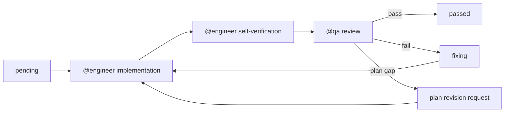

# Plan: Knowledge Ontology Operations and Enterprise Concept Map

> Created: 2026-06-02
> Status: draft
> Project: /Users/paulaan/PycharmProjects/agent-os/dashboard
> Source context: sample-master-plan-mockup.html, knowledge/, fe/src/app/knowledge/

## Config

working_dir: /Users/paulaan/PycharmProjects/agent-os/dashboard

Roles: @engineer, @qa

Pipeline: engineer -> qa

Capabilities: backend, frontend, knowledge-graph, ontology, domain-pack, validation

### EPIC Lifecycle (Closed Loop)

Every Epic runs a closed lifecycle where @engineer implements and self-verifies, then @qa independently validates the work. The loop repeats until the review passes or retries are exhausted.



- Each Epic starts only after all `depends_on` Epics pass.
- @engineer must produce a done report listing files touched, tests run, and acceptance criteria self-check.
- @qa must produce a QA report with verdict, evidence, defects, and retry recommendation.
- Maximum retry loops per Epic: 3.
- If the same blocker repeats 3 times, @qa marks the Epic blocked and requests plan revision.

### Role Operating Contract

@engineer owns implementation quality:

- Read the full Epic brief and its dependencies before editing files.
- Preserve existing Knowledge namespace, ingestion, query, and Nexus explorer behavior unless the Epic explicitly changes it.
- Add tests in the same Epic as the implementation.
- Keep frontend enum choices driven by backend profile data.
- Produce a done report before handing work to @qa.
- Fix every @qa defect or explicitly document why the plan needs revision.

@qa owns independent verification:

- Verify the implementation against the Epic acceptance criteria, not only the engineer's tests.
- Run regression checks for existing Knowledge import, query, graph, and frontend behavior.
- Add focused black-box tests or fixtures when needed to prove a defect.
- Fail the Epic when behavior is missing, undocumented, unstable, or incompatible.
- Produce a QA report with evidence and concrete reproduction steps.

### Done Report Template (@engineer -> @qa)

````markdown
## DONE: EPIC-XXX - <title>

### What changed
- <backend/frontend/schema/test/doc changes>

### Files touched
| Path | Action | Reason |
|---|---|---|
| `path/to/file` | added/modified/deleted | <why> |

### Tests run
```bash
<commands and result summary>
```

### Acceptance criteria self-check
- [x] <criterion> - verified by <test/command/manual evidence>

### Known limits
- <deferred behavior or risk, if any>
````

### QA Report Template (@qa -> lifecycle)

````markdown
## QA REPORT: EPIC-XXX - <title>

### Verdict
PASS | FAIL | BLOCKED

### Acceptance criteria verification
| Criterion | Result | Evidence |
|---|---|---|
| <criterion> | pass/fail | <test, command, screenshot, or repro> |

### Regression checks
- [ ] Existing namespace loads
- [ ] Existing import flow works
- [ ] Existing query modes work
- [ ] Existing Nexus explorer renders

### Defects
1. [severity] <description> - repro: <steps> - expected: <expected> - actual: <actual>

### Recommendation
- <pass, fix required, or plan revision required>
````

### Global Design Principles

- Keep the current Knowledge namespace model. Ontology profiles are per namespace and must not break existing namespaces.
- Keep Kuzu's physical `RELATES` edge table. Semantic relation types live in `relation_label` and `relation_properties`.
- Treat `prerequisite` as an alias, not a first-class canonical type. Canonical relation is `depends_on`.
- Distinguish inverse convenience labels from authored edges. `enables` may be derived from `depends_on` but can also be authored explicitly when product planning needs it.
- Model `produces` only when the target is an artifact, data object, event, or output concept.
- Separate `layer`, `abstraction_level`, `concept_type`, and `relationship_type`.
- Frontend enums must come from backend ontology profile APIs, not hardcoded TypeScript constants.
- Unknown extracted concepts and relationships become candidates for review, not automatically approved ontology.

### Canonical Relationship Seed Set

| Canonical Type | Family | Typical Meaning | Inverse | Notes |
|---|---|---|---|---|
| `depends_on` | dependency | Source cannot be delivered or reasoned about without target | `enables` | Replaces `prerequisite`. |
| `consumes` | flow | Source reads, uses, or requires target data/service/artifact at runtime | `feeds` | Often more operational than `depends_on`. |
| `produces` | flow | Source creates target artifact/data/event/output | `produced_by` | Target should usually be an artifact-like concept. |
| `enables` | dependency | Source unlocks or supports target | `depends_on` | Often derived for visualization. |
| `implements` | realization | Source realizes a capability, control, workflow, or interface | `implemented_by` | Useful across abstraction levels. |
| `extends` | packaging | Source extends a core platform object or base pack | `extended_by` | Key for domain packs. |
| `maps_to` | semantic | Source maps to framework, obligation, control, concept, or taxonomy | `mapped_from` | Used for crosswalks. |
| `governs` | governance | Source policy/rule controls target behavior | `governed_by` | Useful for AI, compliance, access. |
| `evidences` | traceability | Source evidence supports target fact/control/finding | `evidenced_by` | Critical for audit lineage. |
| `related_to` | generic | Weak semantic relation when no stronger type is known | `related_to` | Allowed but should be minimized. |

### Canonical Abstraction Levels

| Level | Purpose |
|---|---|
| `principle` | Strategy, operating rule, architectural rule. |
| `capability` | Business or platform capability. |
| `module` | Product module or bounded UI/backend slice. |
| `service` | Backend service or deployable component. |
| `data_object` | Persistent or exchanged data concept. |
| `workflow` | State machine or user/business process. |
| `event` | Domain event or integration event. |
| `control` | Audit, compliance, risk, or policy control. |
| `evidence` | Source artifact, cited fact, or reviewed evidence item. |
| `pack` | Domain pack, extension package, marketplace unit. |

## Goal

Develop the Knowledge system into a governed ontology operation platform that can maintain enterprise concepts, domain packs, relationship vocabularies, and graph/layer visualizations over time.

The target outcome is that different projects can define different knowledge concept metadata while sharing the same backend storage and frontend exploration model. Users must be able to create, edit, validate, review, and visualize ontology profiles without code changes.

## EPIC-001: Ontology Profile Schema and Namespace Storage

Create the canonical backend model for namespace-specific ontology profiles.

Goals:
- Define typed ontology profile models for concept types, relationship types, layers, abstraction levels, metadata fields, aliases, lifecycle state, and validation rules.
- Persist ontology profiles under each namespace without disrupting existing `manifest.json`, Kuzu graph, or vector storage.
- Provide default profile bootstrap data based on the enterprise feature map model.

### Definition of Done

- [ ] New backend models are implemented with Pydantic validation.
- [ ] Every namespace can have zero or one active ontology profile.
- [ ] Existing namespaces without ontology profiles continue to ingest and query.
- [ ] Default profile can be created deterministically.
- [ ] Unit tests cover valid profile, invalid enum, alias collision, and missing required fields.
- [ ] @qa can create a namespace and verify profile persistence survives service restart.

### Acceptance Criteria

- [ ] `OntologyProfile` supports `profile_id`, `namespace`, `version`, `status`, `concept_types`, `relationship_types`, `layers`, `abstraction_levels`, `metadata_fields`, `aliases`, and `validation_rules`.
- [ ] `RelationshipType` supports `id`, `label`, `family`, `inverse`, `description`, `allowed_source_types`, `allowed_target_types`, `weight`, `style`, `is_directed`, `is_system`, `lifecycle_state`.
- [ ] `ConceptType` supports `id`, `label`, `abstraction_level`, `description`, `metadata_schema`, `color`, `shape`, `lifecycle_state`.
- [ ] Profile files are written atomically under `{knowledge_dir}/{namespace}/ontology/profile.json`.
- [ ] Namespace manifest records active ontology profile version or leaves it null for legacy namespaces.
- [ ] Invalid relationship aliases cannot shadow canonical relationship IDs.

### Tasks

- [ ] TASK-E-001: Add `knowledge/ontology/models.py` with Pydantic models for profile, concept type, relationship type, layer, metadata field, alias, and validation issue.
- [ ] TASK-E-002: Add `knowledge/ontology/store.py` for atomic read/write/list of namespace ontology files.
- [ ] TASK-E-003: Add `knowledge/ontology/defaults.py` with default concept types, relationship types, layers, and abstraction levels.
- [ ] TASK-E-004: Extend `NamespaceMeta` with optional `ontology_profile_version` and migration-safe defaults.
- [ ] TASK-E-005: Add unit tests for model validation, default profile generation, atomic persistence, and legacy namespace compatibility.
- [ ] TASK-Q-001: Verify an old namespace manifest without ontology fields still loads.
- [ ] TASK-Q-002: Verify invalid profile writes fail with actionable error messages.
- [ ] TASK-Q-003: Verify profile persistence after creating a new `KnowledgeService` instance.

depends_on: []

## EPIC-002: Relationship Normalization and Validation Engine

Normalize relationship labels from user input, mock data, and LLM extraction into project-specific canonical enums.

Goals:
- Treat `prerequisite` as an alias for `depends_on`.
- Allow project-specific aliases without losing canonical graph semantics.
- Validate source/target concept compatibility for each relationship type.
- Support derived inverse relationships for UI without duplicating storage unless requested.

### Definition of Done

- [ ] Backend exposes a normalization service that maps aliases to canonical relationship types.
- [ ] Validation returns structured issues with severity and fix hints.
- [ ] Existing graph relations with unknown labels remain queryable.
- [ ] @qa can prove `depends_on`, `consumes`, `produces`, and `enables` are semantically distinct.

### Acceptance Criteria

- [ ] `normalize_relation("prerequisite")` returns canonical `depends_on`.
- [ ] `normalize_relation("requires_data_from")` can return canonical `consumes` when configured by namespace profile.
- [ ] `produces` validation warns when target concept is not `data_object`, `event`, `evidence`, or another configured artifact-like level.
- [ ] `enables` can be rendered as inverse of `depends_on` without creating duplicate Kuzu edges.
- [ ] Unknown relation labels are classified as `candidate` and not silently converted to `related_to`.
- [ ] Relationship weight lookup uses ontology profile config instead of hardcoded `KuzuLabelledPropertyGraph._get_relationship_weight`.

### Tasks

- [ ] TASK-E-001: Add `knowledge/ontology/normalizer.py` for relationship and concept label normalization.
- [ ] TASK-E-002: Add `knowledge/ontology/validator.py` for node, edge, profile, and pack validation.
- [ ] TASK-E-003: Refactor Kuzu relationship weighting to accept namespace profile weights with fallback to legacy defaults.
- [ ] TASK-E-004: Add structured `ValidationIssue` results with `severity`, `code`, `path`, `message`, and `suggested_fix`.
- [ ] TASK-E-005: Add tests for alias resolution, unknown labels, inverse rendering, allowed source/target checks, and profile-specific weights.
- [ ] TASK-Q-001: Build a small profile fixture that aliases `prerequisite -> depends_on`.
- [ ] TASK-Q-002: Validate that `Service produces Service` returns warning or error depending on configured rules.
- [ ] TASK-Q-003: Validate shortest-path behavior still works after profile-based weighting.

depends_on: [EPIC-001]

## EPIC-003: Ontology Profile REST API and Service Integration

Expose ontology profile operations through the Knowledge REST layer and service facade.

Goals:
- Let frontend load and mutate ontology enums dynamically.
- Keep API versioning stable and compatible with existing `/api/knowledge/namespaces/*` routes.
- Provide validation endpoints before saving destructive or incompatible changes.

### Definition of Done

- [ ] New REST endpoints exist for get, create/update, validate, reset default, and inspect profile summary.
- [ ] All writes require namespace existence and use current auth dependencies.
- [ ] API responses are typed through Pydantic models.
- [ ] Tests cover success, invalid namespace, missing profile, invalid payload, and legacy namespace behavior.

### Acceptance Criteria

- [ ] `GET /api/knowledge/namespaces/{namespace}/ontology/profile` returns active profile or default suggestion metadata.
- [ ] `PUT /api/knowledge/namespaces/{namespace}/ontology/profile` saves a validated profile.
- [ ] `POST /api/knowledge/namespaces/{namespace}/ontology/validate` validates profile, nodes, edges, or pack manifests without saving.
- [ ] `POST /api/knowledge/namespaces/{namespace}/ontology/reset-default` creates or replaces the profile with default seed data.
- [ ] `GET /api/knowledge/namespaces/{namespace}/ontology/summary` returns counts of concept types, relation types, aliases, candidates, and validation issues.
- [ ] API errors use existing Knowledge error mapping conventions.

### Tasks

- [ ] TASK-E-001: Add request/response models in `routes/knowledge_models.py`.
- [ ] TASK-E-002: Add service methods in `KnowledgeService` for profile get/save/validate/reset/summary.
- [ ] TASK-E-003: Add REST routes in `routes/knowledge.py`.
- [ ] TASK-E-004: Add route tests using existing auth/test patterns.
- [ ] TASK-E-005: Update `docs/knowledge.md` with ontology API examples.
- [ ] TASK-Q-001: Exercise endpoints with curl or API client against a temp namespace.
- [ ] TASK-Q-002: Verify validation endpoint is side-effect free.
- [ ] TASK-Q-003: Verify unauthorized or malformed requests fail consistently with existing Knowledge APIs.

depends_on: [EPIC-001, EPIC-002]

## EPIC-004: Profile-Aware Ingestion and Candidate Review Backend

Make entity and relation extraction aware of the active ontology profile and collect unapproved concepts as review candidates.

Goals:
- Feed concept and relation vocabularies into extraction prompts.
- Normalize extracted labels against the namespace profile.
- Persist candidates for unknown concept types, relationship types, and aliases.
- Keep ingestion working when no profile exists.

### Definition of Done

- [ ] `KnowledgeLLM.extract_entities()` can receive an ontology profile hint.
- [ ] `GraphRAGExtractor` normalizes extracted labels before graph write.
- [ ] Candidate records are persisted per namespace.
- [ ] Candidate review APIs exist for list, approve, map, reject.
- [ ] Ingestion metrics include candidate counts.

### Acceptance Criteria

- [ ] With a profile, extraction prompt includes allowed concept and relationship types.
- [ ] Unknown relation label is stored as candidate and written to graph with original label plus candidate metadata, or held according to configured policy.
- [ ] Candidate approval can create a new enum or map alias to an existing enum.
- [ ] Rejected candidates do not reappear for the same source hash unless source text changes.
- [ ] Legacy no-profile ingestion behaves as it does today.
- [ ] Candidate records include `source`, `original_label`, `suggested_canonical`, `confidence`, `sample_text`, `status`, `created_at`, and `reviewed_by`.

### Tasks

- [ ] TASK-E-001: Add `knowledge/ontology/candidates.py` store and models.
- [ ] TASK-E-002: Extend `KnowledgeLLM.extract_entities()` signature to accept ontology hint while preserving backward compatibility.
- [ ] TASK-E-003: Update `GraphRAGExtractor` to normalize concept/relation labels and emit candidates.
- [ ] TASK-E-004: Add service and REST APIs for candidate list, approve, map-to-existing, reject, and bulk actions.
- [ ] TASK-E-005: Add ingestion tests with fake LLM returning known, aliased, and unknown labels.
- [ ] TASK-Q-001: Verify candidate creation for unknown labels.
- [ ] TASK-Q-002: Verify approving a candidate updates the profile and future ingestion normalizes correctly.
- [ ] TASK-Q-003: Verify no-profile fallback still imports documents successfully.

depends_on: [EPIC-002, EPIC-003]

## EPIC-005: Domain Pack Manifest and Pack Lifecycle

Implement domain packs as installable knowledge modules that extend ontology profiles and graph behavior.

Goals:
- Define pack manifests for vertical domain knowledge.
- Allow Financial Services, Technology/SaaS, Retail, Public Sector, and ESG packs to extend the core profile.
- Validate pack compatibility before install.
- Track pack lifecycle state and installed version per namespace.

### Definition of Done

- [ ] Pack manifest schema is implemented and validated.
- [ ] Pack install/uninstall/list APIs exist.
- [ ] Pack concepts, relationship aliases, metadata fields, and validation rules merge into the active namespace profile.
- [ ] Compatibility checks prevent invalid ontology version changes.
- [ ] Tests cover install, upgrade, conflict, and rollback behavior.

### Acceptance Criteria

- [ ] `DomainPackManifest` includes `pack_id`, `name`, `version`, `compatible_profile_versions`, `concept_types`, `relationship_types`, `aliases`, `metadata_fields`, `validation_rules`, `fixtures`, and `migration_notes`.
- [ ] Installing a pack records it under namespace ontology state.
- [ ] Pack conflicts are reported before saving.
- [ ] A pack cannot remove core system relationship types.
- [ ] Pack uninstall disables pack-owned additions unless another installed pack depends on them.
- [ ] Seed fixtures exist for `financial-services`, `technology-saas`, `retail-consumer`, `public-sector`, and `esg`.

### Tasks

- [ ] TASK-E-001: Add `knowledge/ontology/packs.py` with manifest model, merge logic, conflict detection, and install state.
- [ ] TASK-E-002: Add seed pack JSON files under `knowledge/ontology/packs/defaults/`.
- [ ] TASK-E-003: Add service and REST endpoints for list available, list installed, validate, install, upgrade, uninstall.
- [ ] TASK-E-004: Add tests for pack merge, alias conflicts, version compatibility, uninstall safety, and fixture validation.
- [ ] TASK-E-005: Document pack authoring rules.
- [ ] TASK-Q-001: Install Financial Services pack into a clean namespace and inspect resulting profile.
- [ ] TASK-Q-002: Attempt conflicting alias install and verify API returns actionable validation issues.
- [ ] TASK-Q-003: Verify pack uninstall does not corrupt existing graph relations.

depends_on: [EPIC-003]

## EPIC-006: Explorer API Enhancements for Enterprise Concept Maps

Extend graph explorer responses so frontend can render the mock-style enterprise map with layers, abstraction levels, relation families, and metadata-driven styling.

Goals:
- Return ontology-aware graph metadata in seed, expand, search, path, and node detail responses.
- Support filtering by layer, abstraction level, concept type, relationship family, pack, lifecycle state, owner, and metadata fields.
- Preserve existing Nexus explorer behavior.

### Definition of Done

- [ ] Explorer node response includes normalized concept metadata when available.
- [ ] Explorer edge response includes canonical relation type, family, inverse, style, and validation state.
- [ ] Filter request model supports ontology-driven filters.
- [ ] Existing frontend hooks continue to work.
- [ ] Tests cover old and new response shapes.

### Acceptance Criteria

- [ ] `ExplorerNode` response can include `concept_type`, `abstraction_level`, `layer`, `pack_id`, `lifecycle_state`, `metadata`, and `validation_issues`.
- [ ] `ExplorerEdge` response can include `relationship_type`, `family`, `display_label`, `inverse_label`, `style`, `is_candidate`, and `validation_issues`.
- [ ] `explorer/seed` can include profile summary in response `meta`.
- [ ] `explorer/search` can filter by relationship family and concept type.
- [ ] `explorer/node/{id}` groups incident edges by canonical type and direction.
- [ ] Legacy graph data without profile returns sensible defaults.

### Tasks

- [ ] TASK-E-001: Add ontology enrichment helpers in `knowledge/graph/explorer.py`.
- [ ] TASK-E-002: Add optional filter fields to explorer request models.
- [ ] TASK-E-003: Ensure Kuzu relation properties preserve canonical type and original label.
- [ ] TASK-E-004: Update hooks response types in frontend without changing UI yet.
- [ ] TASK-E-005: Add backend and frontend type tests for compatibility.
- [ ] TASK-Q-001: Query explorer endpoints before and after adding a profile and compare response shape.
- [ ] TASK-Q-002: Verify legacy no-profile graph still renders in existing Nexus UI.
- [ ] TASK-Q-003: Verify relation family filters return expected edge subsets.

depends_on: [EPIC-002, EPIC-003]

## EPIC-007: Frontend Ontology Operations UI

Add UI for users to manage namespace ontology profiles, relation enums, concept types, aliases, and candidates.

Goals:
- Make enum and metadata management user-editable.
- Keep the UI consistent with existing Knowledge/Nexus experience.
- Avoid hardcoded relationship and concept options.
- Provide safe validation before save.

### Definition of Done

- [ ] `KnowledgeTabCore` exposes an `Ontology` tab for namespace detail.
- [ ] Users can edit relationship types, concept types, aliases, layers, abstraction levels, and metadata fields.
- [ ] Candidate review flow supports approve, map, reject, and bulk actions.
- [ ] UI loads enum options from backend profile APIs.
- [ ] Frontend tests cover API loading, edit validation, save error, candidate action, and no-profile bootstrap.

### Acceptance Criteria

- [ ] Namespace with no profile shows a bootstrap action to create default ontology profile.
- [ ] Relationship Studio allows editing canonical type label, family, inverse, allowed source/target types, weight, and display style.
- [ ] Concept Type Studio allows editing abstraction level, layer defaults, metadata fields, color, and shape.
- [ ] Candidate Review displays unknown extracted labels with source sample and suggested mapping.
- [ ] Save action calls validation first and blocks if errors exist.
- [ ] User can reset to default only after confirmation.

### Tasks

- [ ] TASK-E-001: Add hooks under `fe/src/hooks/` for ontology profile, validation, packs, and candidates.
- [ ] TASK-E-002: Add `OntologyPanel` under `fe/src/components/knowledge/ontology/`.
- [ ] TASK-E-003: Add `RelationshipStudio`, `ConceptTypeStudio`, `AliasManager`, `CandidateReview`, and `ProfileSummary` components.
- [ ] TASK-E-004: Wire `KnowledgeTabCore` tab navigation to include Ontology.
- [ ] TASK-E-005: Add loading, empty, error, dirty state, and validation state handling.
- [ ] TASK-E-006: Add frontend tests for hooks and key user flows.
- [ ] TASK-Q-001: Verify no-profile bootstrap workflow.
- [ ] TASK-Q-002: Verify relation edit round trip persists after reload.
- [ ] TASK-Q-003: Verify validation errors are visible and block save.
- [ ] TASK-Q-004: Verify candidate approve/map/reject updates the UI and backend state.

depends_on: [EPIC-003, EPIC-004]

## EPIC-008: Enterprise Map Frontend View

Build a mock-inspired enterprise map view that renders ontology-aware layers, filters, detail drawer, and relation semantics from backend data.

Goals:
- Follow the conceptual structure of `sample-master-plan-mockup.html`.
- Render layers as lanes and nodes as typed planning/ontology units.
- Allow users to choose which dimensions define lanes, colors, shapes, and filters.
- Support relation visibility by family and canonical type.

### Definition of Done

- [ ] New `Enterprise Map` tab exists for each namespace.
- [ ] View renders lane-based graph using backend explorer data and ontology profile.
- [ ] Filters are generated from profile and graph metadata.
- [ ] Detail drawer shows node purpose, metadata, incoming/outgoing relationships, candidates, validation issues, and source citations where available.
- [ ] Works for mock fixture, profile-enabled namespace, and legacy no-profile namespace.

### Acceptance Criteria

- [ ] User can switch lane mode between `layer`, `abstraction_level`, `concept_type`, and `pack`.
- [ ] User can filter by industry/domain pack, layer, abstraction level, concept type, relationship family, lifecycle state, owner, and candidate state.
- [ ] Edge visual style comes from relationship type profile: color, dash, weight, direction.
- [ ] `depends_on`, `consumes`, `produces`, and `enables` are visually distinguishable.
- [ ] Selecting a node focuses immediate incoming/outgoing edges and shows inverse labels where relevant.
- [ ] Detail drawer groups relationships by canonical type and direction.
- [ ] Mobile layout hides side filters and keeps the detail drawer accessible.

### Tasks

- [ ] TASK-E-001: Add `EnterpriseMapPanel` and route it into Knowledge tab navigation.
- [ ] TASK-E-002: Add lane layout algorithm based on selected lane dimension.
- [ ] TASK-E-003: Add dynamic filter sidebar generated from graph/profile metadata.
- [ ] TASK-E-004: Add detail drawer with grouped relationship inspector.
- [ ] TASK-E-005: Add style mapping from ontology profile to node and edge rendering.
- [ ] TASK-E-006: Add fixture import path or test fixture that mirrors the mock's core spine and domain packs.
- [ ] TASK-E-007: Add Playwright or component tests for desktop and mobile rendering.
- [ ] TASK-Q-001: Verify the mock-like fixture renders all lanes, filters, and detail drawer fields.
- [ ] TASK-Q-002: Verify changing relationship enum style changes edge rendering without code change.
- [ ] TASK-Q-003: Verify focus mode distinguishes incoming, outgoing, derived inverse, and unrelated edges.
- [ ] TASK-Q-004: Verify no text overlap or unusable controls at desktop and mobile widths.

depends_on: [EPIC-006, EPIC-007]

## EPIC-009: Ontology Governance, Audit Trail, and Migration Safety

Add lifecycle governance so ontology operations can be maintained over time in enterprise environments.

Goals:
- Track who changed ontology profiles, packs, aliases, and candidates.
- Support profile versioning and migration notes.
- Provide diff/preview before applying changes.
- Prevent graph corruption when enum definitions evolve.

### Definition of Done

- [ ] Ontology writes produce audit events.
- [ ] Profile history can be listed and read.
- [ ] Profile diff endpoint returns added, removed, changed concept and relation definitions.
- [ ] Dangerous changes require validation override metadata.
- [ ] Tests cover version history, rollback preview, and audit event content.

### Acceptance Criteria

- [ ] Every profile save records actor, timestamp, reason, previous version, new version, and changed paths.
- [ ] Removing or deprecating a relationship type warns if graph edges still use it.
- [ ] Renaming a canonical type creates an alias or migration entry instead of silently orphaning graph data.
- [ ] Candidate approval is auditable.
- [ ] Pack install/uninstall is auditable.
- [ ] Frontend shows profile status: draft, active, deprecated.

### Tasks

- [ ] TASK-E-001: Add `knowledge/ontology/audit.py` and profile history store.
- [ ] TASK-E-002: Add diff engine for profile versions and pack changes.
- [ ] TASK-E-003: Add migration validation rules for rename, removal, deprecation, and alias changes.
- [ ] TASK-E-004: Add REST endpoints for history, diff, and migration preview.
- [ ] TASK-E-005: Surface audit/history in Ontology UI.
- [ ] TASK-E-006: Add backend and frontend tests.
- [ ] TASK-Q-001: Verify profile save history includes actor and changed paths.
- [ ] TASK-Q-002: Verify deleting an in-use relation type is blocked or requires explicit deprecation path.
- [ ] TASK-Q-003: Verify rollback preview does not mutate current profile.

depends_on: [EPIC-005, EPIC-007]

## EPIC-010: End-to-End Hardening, Documentation, and Release Gate

Stabilize the full ontology operations workflow and produce the final documentation needed for long-term maintenance.

Goals:
- Verify full loop from profile creation to ingestion, candidate review, pack install, graph exploration, and enterprise map visualization.
- Document backend and frontend extension points.
- Ensure performance remains acceptable for enterprise-scale namespaces.

### Definition of Done

- [ ] End-to-end tests cover the core ontology operations lifecycle.
- [ ] Documentation exists for profile schema, relation taxonomy, pack authoring, frontend extension, and QA operations.
- [ ] Performance baseline is recorded.
- [ ] Existing Knowledge import/query/explorer flows pass regression tests.
- [ ] @qa signs off with no P0/P1 defects.

### Acceptance Criteria

- [ ] E2E scenario: create namespace -> bootstrap profile -> install Financial Services pack -> ingest fixture -> review candidates -> render enterprise map.
- [ ] Existing raw, graph, and summarized query modes still work.
- [ ] Existing Nexus explorer still works with legacy and profile-enabled namespaces.
- [ ] Docs explain when to use `depends_on` vs `consumes` vs `produces` vs `enables`.
- [ ] Docs explain how different projects can define different metadata profiles.
- [ ] Performance baseline includes profile load, validation, candidate listing, explorer seed, and enterprise map render.

### Tasks

- [ ] TASK-E-001: Add E2E fixture folder and deterministic fake extraction path for tests.
- [ ] TASK-E-002: Add integration tests for full ontology lifecycle.
- [ ] TASK-E-003: Update `docs/knowledge.md` and add `docs/knowledge-ontology-operations.md`.
- [ ] TASK-E-004: Add frontend documentation for ontology-driven UI extension.
- [ ] TASK-E-005: Add performance measurement script or test report.
- [ ] TASK-Q-001: Run full backend test suite for Knowledge.
- [ ] TASK-Q-002: Run frontend tests for Knowledge UI.
- [ ] TASK-Q-003: Run manual E2E checklist and capture evidence.
- [ ] TASK-Q-004: Verify docs match implemented API and UI behavior.
- [ ] TASK-Q-005: Produce final QA release report with residual risks.

depends_on: [EPIC-008, EPIC-009]

## Cross-Epic QA Gates

@qa must apply these gates across all Epics:

- [ ] Backward compatibility: existing namespaces still load and query.
- [ ] No hardcoded ontology enums in frontend except fallback defaults.
- [ ] No destructive profile operation without validation.
- [ ] Unknown LLM labels become candidates, not silent canonical ontology.
- [ ] Domain packs cannot mutate core system definitions without explicit migration.
- [ ] Graph explorer and Enterprise Map work when ontology profile is absent.
- [ ] Relationship semantics are explainable in UI and API responses.
- [ ] All tests are deterministic without requiring external LLM calls.

## Suggested Implementation Order

1. EPIC-001 establishes persistent schema.
2. EPIC-002 makes relation semantics safe.
3. EPIC-003 exposes backend APIs.
4. EPIC-004 connects ingestion and candidate review.
5. EPIC-005 adds domain packs.
6. EPIC-006 enriches graph responses.
7. EPIC-007 adds ontology operations UI.
8. EPIC-008 adds enterprise map UI.
9. EPIC-009 adds governance/history.
10. EPIC-010 hardens, documents, and releases.

## Estimated Delivery

| Scope | Estimate |
|---|---|
| Backend MVP through EPIC-004 | 5 to 7 engineering days |
| Frontend MVP through EPIC-008 | 5 to 7 engineering days |
| Governance and hardening through EPIC-010 | 4 to 6 engineering days |
| Total production-ready path | 14 to 20 engineering days |

## Initial Files Expected To Change

| Area | Expected Files |
|---|---|
| Backend ontology models | `knowledge/ontology/*.py` |
| Backend service integration | `knowledge/service.py`, `knowledge/namespace.py` |
| Backend graph integration | `knowledge/graph/explorer.py`, `knowledge/graph/index/kuzudb.py`, `knowledge/graph/core/graph_rag_extractor.py` |
| Backend API | `routes/knowledge.py`, `routes/knowledge_models.py` |
| Frontend hooks | `fe/src/hooks/use-knowledge-ontology.ts`, related hook files |
| Frontend UI | `fe/src/components/knowledge/ontology/*`, `fe/src/components/knowledge/EnterpriseMapPanel.tsx` |
| Frontend navigation | `fe/src/components/knowledge/KnowledgeTabCore.tsx` |
| Tests | `tests/`, `knowledge/tests/`, `fe/src/components/knowledge/**/__tests__`, `fe/src/hooks/__tests__` |
| Docs | `docs/knowledge.md`, `docs/knowledge-ontology-operations.md` |
