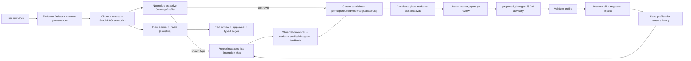

# Ontology Plan Latest - PO Review Master

> Generated from docs/ontology-visual-alignment-build-plan.md for PO review.
> Source SHA-256 at generation: 4b823d3fa9666c829ee3f048dd083ad2a543ab282aa5eed4898586b518556daf
> Generated on: 2026-06-03
> Output set: docs/ontology-epics/*.md plus this merged master file.
> Merged 2026-06-03: the architectural backbone from docs/ontology-visual-alignment-build-plan.md was folded into this master so it is the single comprehensive plan — added the six-plane Architecture Foundations (DM-01…DM-12 decisions, plane-reconciliation, visual-object-model, and projection-contract tables, growth-loop diagram), the User-to-Master-Agent development flow, the raw-docs requirements, the plan self-review, the user-outcome Final Definition of Done, and a per-epic Engineering Baseline Appendix (roles, DoD checklists, tasks with ids/status).

## Executive Summary For PO Team

This plan expands the 16 ontology visual alignment epics into a PO-review package. The product direction is a company-scale ontology workbench: people contribute knowledge through documents, conversations, and review decisions; teams shape that material into domain ontology; the company governs the full ontology through evidence, candidates, facts, graph instances, packs, visual views, history, and release gates.

The key promise is that ontology can summarize itself. One governed ontology contract should render as graph, object detail, histogram, roadmap, workflow, plan, pack preview, time panel, and audit history without domain-specific frontend rewrites.

## Top Ontology Product Features

- Ontology Unit: one namespace-scoped company knowledge product with active profile, lifecycle, packs, and policy.
- Six-plane architecture: Spec, Graph, Evidence, Observation, Analysis, and View stay separate so the model remains safe as it scales.
- Evidence-first growth: raw documents and user conversations become evidence anchors, candidates, facts, and reviewed graph/profile changes.
- Candidate pipeline: unknown vocabulary and discovered objects become visible review items instead of being rejected or silently accepted.
- Facts plane: assistant and extraction can summarize claims before those claims become approved graph relationships.
- Visual workbench: users develop ontology through object cards, relationships, lenses, docks, styling, search, and time panels.
- Master Agent co-builder: AI proposes structured changes but never bypasses review, validation, diff, and save.
- Packs and templates: reusable vocabulary bundles let companies start from domains and industries without hardcoding core product behavior.
- Governance and release gates: validation, diff overlay, history, undo/redo, observability, QA evidence, and pack compatibility protect company-scale rollout.

## Company-Scale Ontology Development Narrative

1. Person knowledge enters through uploaded files, notes, messages, manual input, or conversation with the Master Agent.
2. The system records sources as Evidence Artifacts and Anchors, including read coverage and limitations.
3. Extraction and assistant workflows produce Candidates and Facts, clearly marked as unreviewed or assistive.
4. Domain experts approve, map, reject, or promote those items into the Spec plane or Graph plane.
5. The company ontology becomes a governed Ontology Unit with versioned profiles, reviewed instances, reusable packs, events, views, and release evidence.
6. The ontology summarizes itself across lenses and views: schema graph, enterprise map, object workbench, histograms, workflows, roadmap-like plan views, and audit history.

## Architecture Foundations (Six-Plane Data Model)

> Folded in from docs/ontology-visual-alignment-build-plan.md so the PO master also carries the architectural backbone the epics build against. The full field-level contract — every entity, field, enum, lifecycle state machine, projection read-model, referential-integrity rule, and per-namespace storage layout — lives in [`docs/ontology-data-model.md`](./ontology-data-model.md) and is the implementation contract for EPIC-001 → EPIC-008.

The ontology system is a visual, governed workbench for developing ontology from raw user documents and user conversation with `master_agent.py`, founded on a **clean six-plane data model** that separates schema from data, data from evidence, evidence from events, events from analysis, and analysis from presentation.

**Product rule:** Ontology is not a form and not only a graph. Ontology is a governed object model that can be authored, reviewed, projected, observed, simulated, and grown from evidence — across six separated planes. The rule of thumb enforced everywhere: *schema ≠ data ≠ evidence ≠ events ≠ analysis ≠ presentation.*

### The Six Planes

| Plane | User question | Owns | Visual surface in the workbench |
|---|---|---|---|
| **Spec** | What kinds of things can exist? | types, relationships, fields, rules, render defaults | Model Config + schema graph + object-type cards |
| **Graph** | What things exist? | nodes, edges (typed, reviewable) | object selector + central object graph + selection detail |
| **Evidence** | Why do we believe this? | artifacts, anchors, provenance links | source panel on candidate/object; Info tab |
| **Observation** | What happened or changed? | events, measurements, time-series | badges + bottom Series/Time panel |
| **Analysis** | What does it mean or predict? | flows, state machines, scenarios, simulations | Simulation rail + flow/state overlays |
| **View** | How should it appear? | layout, styling, filters, saved views | Layers tab + styling options + saved views |

### Plane Reconciliation: What Exists vs. Net-New

The current system already implements the Spec, partial Instance, Candidate, and View planes; the value of the six-plane model is that it **names the three missing planes (Evidence, Observation, Analysis) as first-class** and adds a **Facts** staging layer.

| Plane | Generic model entity | Status in codebase | Anchor / delta |
|---|---|---|---|
| **Spec** | `OntologyProfile`, `ConceptType`, `RelationshipType`, `MetadataField`, `Layer`, `AbstractionLevel`, `ValidationRule`, `GraphInstruction` | ✅ Mature | `knowledge/ontology/models.py`, `graph_instruction.py`. Persisted as one active `profile.json`/namespace (`OntologyProfileStore`). |
| **Graph (Instance)** | `OntologyNode`, `OntologyEdge` with `review_state`, `lifecycle_state`, `confidence`, `provenance_refs`, `external_ref` | ✅ EPIC-004 implemented | Kuzu graph remains the store of record. `knowledge/ontology/instances.py` provides typed read adapters; `knowledge/ontology/approval.py` and `KnowledgeService.approve_ontology_candidate` provide the reviewed candidate → confirmed Kuzu instance write path with provenance and ObservationEvent emission. |
| **Evidence** | `EvidenceArtifact`, `EvidenceAnchor`, `ProvenanceLink` | ❌ Net-new | Today only chunk `file_hash`/`content_hash` (`ingestion.py`) + candidate `sample_text`/`source_hash`. No artifact/anchor/provenance stores. |
| **Observation** | `ObservationEvent`, `TimeSeries` | ❌ Net-new | Only `profile_history` (schema-change audit). No instance-level event log or metric history. |
| **Facts** | `OntologyFact` (reviewed claims) | ❌ Net-new | `graph_rag_extractor.py` emits raw entities/relations, not reviewed facts. |
| **Candidate** | `OntologyCandidate` (broadened types + `proposed_payload`) | ⚠️ Exists, narrower | `candidates.py`: types limited to `concept_type|relationship_type|alias`; carries `source/confidence/sample_text/source_hash/metadata`. |
| **Analysis** | `FlowDefinition`, `StateMachine`, `SimulationScenario` | ❌ Net-new | Mockup describes "Workflow Blueprints / State Machines / Event Catalog" but no data model exists. |
| **View** | `GraphInstruction`, `SavedView` | ✅ Exists, enrich | `GraphInstruction.default_views` exists; generic `SavedView` adds `group_by/color_by/layout/selected_node_ids`. |
| **Packs** | `DomainPack` (+ node/edge fixtures) | ✅ Mature | `packs/core.py`, 8 default packs. |
| **Unit** | `OntologyUnit` (namespace product + `active_profile_id`) | ❌ Net-new (implicit) | Namespace is the boundary today; no Unit entity or multi-version pointer. |

### Resolved Data-Model Decisions (DM-01 … DM-12)

These are the feedback on the six-plane proposal, made actionable. The epics reference them by id.

- **DM-01 — Adopt the six planes as the canonical separation.** Verdict: accepted. The epic structure is organized by plane. Rule of thumb enforced everywhere: *schema ≠ data ≠ evidence ≠ events ≠ analysis ≠ presentation.*

- **DM-02 — `OntologyUnit` is namespace-derived, not a new key.** Introduce `OntologyUnit` as a thin descriptor whose `id` derives from `namespace`, with `active_profile_id` pointing at the active profile. Do **not** break the namespace-keyed APIs. This unlocks multi-version / draft-vs-active profiles (the proposal's `version` + `status`) without a disruptive re-key. Migration: synthesize a Unit for every existing namespace on first read.

- **DM-03 — `RelationshipFamily` divergence is breaking; reconcile deliberately.** The proposal drops `validation`, `assurance`, `synchronization` and adds `classification`, `causality`, `temporal`. **7 shipped pack entries already use `"family": "validation"`**, so swapping the `Literal` would fail strict profile/pack load. Decision: treat `family` as an **open vocabulary with a recommended core set** (union the current + proposed values), or version the enum. Never silently replace it. Recommended union core: `composition, dependency, flow, ownership, classification, traceability, causality, temporal, semantic, validation, assurance, synchronization`. @database-architect owns the migration note.

- **DM-04 — Visual render belongs to the View plane only.** The proposal embeds `visual: {color, shape, icon}` on `ConceptType`, which violates its own "presentation from domain logic" principle. Decision: render concerns live in `GraphInstruction.concept_type_defaults` / `relationship_type_defaults`. Keep `ConceptType.color/shape` as a **deprecated fallback** for legacy profiles, but the workbench and projection must prefer `GraphInstruction`. Object Workbench edits styling *through the View plane*, not the type.

- **DM-05 — Distinguish "candidate" the entity from `lifecycle_state: candidate` the instance.** These collide in the proposal. Decision and definitions:
  - **`OntologyCandidate`** = a proposed *change to the Spec or Graph* sitting in a review queue (pre-commit). Status: `pending|approved|mapped|rejected`.
  - **`OntologyNode.lifecycle_state = candidate`** = an *instance that exists in the graph but is unverified* (post-commit, unreviewed). Different lifecycle.
  Promotion of a candidate may *create* a node whose `lifecycle_state` then progresses `candidate -> active`. The two vocabularies are documented as distinct in EPIC-001.

- **DM-06 — Facts stage *into* edges; they are not redundant with edges.** Decision: an `OntologyFact` is an unstructured/semi-structured claim (typically from `graph_rag_extractor.py` / the assistant) that may not yet map to a typed relationship. Facts graduate to typed `OntologyEdge`s through review, mirroring `Candidate -> Spec`. Keep them separate so raw extraction never silently becomes canonical structure.

- **DM-07 — Two history stores, never merged.** `profile_history` (governance audit of *schema* changes) stays separate from `observation_events` (operational telemetry of *instances*). The proposal's `ObservationEvent.subject_type: "profile"` is permitted only for cross-referencing, not as the governance audit of record.

- **DM-08 — `TimeSeries.points[]` inline is an MVP shape, not the production store.** Embedding all points in one document will not scale. Decision: keep the inline shape for the JSON-store MVP and the demo Series panel; flag an append/columnar store (or external series backend, à la the Vertex "Open in Quiver" affordance) as the production path. No production behavior may depend on mock series data.

- **DM-09 — Broaden candidates as proposed, additively.** Extend `candidate_type` to also include `metadata_field, node, edge, validation_rule` and add `proposed_payload` + `source_evidence_ref`. Keep existing fields. Existing `concept_type|relationship_type|alias` flows are unchanged; new types are opt-in producers.

- **DM-10 — Rename intent: "DomainPack" is a vocabulary bundle.** The entity is fine to keep named `DomainPack` for compatibility, but document it as a reusable *vocabulary/content bundle* (software-lifecycle, supply-chain, compliance, research-knowledge, …), not a domain hardcode. No code rename required; the doc and UI copy use "pack / vocabulary bundle."

- **DM-11 — `external_ref` and `provenance_refs` on instances: adopt.** Both are good additions for system-of-record linkage and traceability. Add them to the typed node/edge model (EPIC-004) as optional, additive fields.

- **DM-12 — Instances are *discovered*, not hand-modeled; Kuzu stays the sole store of record.** Nodes/edges are discovered by document ingestion (`graph_rag_extractor.py`) or by a user *broadcast* of data to `master_agent.py`, processed through the ontology layer (`normalizer.py` + active profile), and surfaced as **node/edge candidates** for human-in-the-loop review. Approval writes the confirmed instance into Kuzu and emits an `ObservationEvent`. Therefore `OntologyNode`/`OntologyEdge` (EPIC-004) is a **typed read adapter over Kuzu + the approve-write path**, not a parallel instance store; pending instances reuse the candidate queue (EPIC-005) and provenance reuses Evidence (EPIC-003). Auto-confirm is **confidence-thresholded**: discovered instances with `confidence ≥ OntologyUnit.auto_confirm_threshold` (per-namespace tunable; `1.0` disables) auto-write into Kuzu as `lifecycle_state: candidate` — machine-trusted, human-unverified, flagged and reversible (`ObjectAutoConfirmed`) — and a human later promotes to `active` or rejects; everything below queues. See `docs/ontology-data-model.md` §3.0.

### Residual Data-Model Risks

- Plane proliferation can over-engineer the MVP. Mitigation: Evidence/Candidate/Instance ship first (the growth loop); Observation/Analysis ship as **foundations with real-but-minimal data**, never faked.
- Strict models (`extra: forbid`) mean every additive field must be declared in the Pydantic models or load fails. All schema changes go through @database-architect + migration notes.
- The assistant must remain advisory; broadened candidate types (`node`, `edge`) increase the surface for unintended graph mutation — every promotion still flows through validate → diff → save history.

### Managed Ontology Unit

An Ontology is a namespace-scoped product (`OntologyUnit`, DM-02) with these canonical parts, each owned by exactly one plane: object types, relationship types, layers, abstraction levels, properties, render rules, aliases, validation rules, packs, candidates, instances (nodes/edges), evidence/provenance, facts, observation events/series, and analysis flows/state-machines/scenarios.

### Open-World Growth Loop (Evidence-First)



Open-world means unknown objects are **not silently rejected** — they become visible candidates, facts, and quality signals. Governed means every promoted change still flows validate → diff → migration preview → save history. Evidence-first means **nothing reaches the graph without a provenance trail** when a source exists.

### Visual Object Model

The workbench uses the Palantir-like visual grammar from the attachments, mapped to plane-owned contracts:

| Visual element | Meaning | Owning plane | Backing contract |
|---|---|---|---|
| Object selector chip | selected instance, object type, or template scope | Graph/Spec | namespace + selected id |
| Node card | object instance or object type | Graph/Spec | `OntologyNode` / `ConceptType` |
| Edge label pill | relationship type + display label | Spec/View | `RelationshipType` + `RelationshipGraphInstruction` |
| Left histogram | distribution of types, properties, validation/candidate/event states | Graph/Observation | projected nodes/edges + metadata + events |
| Selection tab | selected object detail | Graph | Object Workbench / Enterprise Map detail |
| Info tab | provenance + source evidence | Evidence | `EvidenceArtifact`/`Anchor`/`ProvenanceLink` |
| Layers tab | layer lanes + saved views | View | `Layer`, `GraphInstruction.default_views` |
| Styling options | color by type/property/state/time | View | `GraphInstruction` render defaults |
| Badge | event, validation issue, candidate count, lifecycle state | Observation/Graph | `validation_issues`, candidates, events |
| Time selection | filter facts/events over a window | Observation | `ObservationEvent`, `TimeSeries` |
| Series panel | metric/event traces for selection | Observation/Analysis | `TimeSeries` + simulation output |
| Model Config rail | profile, packs, validation rules, instruction | Spec/View | ontology profile APIs |
| Simulation rail | what-if / scenario analysis | Analysis | `SimulationScenario`, `StateMachine`, `FlowDefinition` |

### Visual Projection Contract

`project_enterprise_map` emits a shared, additive-only `OntologyVisualNode`/`OntologyVisualEdge` shape (EPIC-002). Render concerns come from `GraphInstruction` (DM-04), never from the instance, and legacy maps must still render when the optional fields are absent.

- **Projected node**: `id, label, concept_type, concept_label, concept_color, concept_shape, layer_id, layer_label, abstraction_level, map_group, ontology_path, owner, lifecycle_state, quality_state, metadata, properties, validation_issues, candidate_state`.
- **Projected edge**: `id, source, target, relationship_type, display_label, inverse_label, family, style, color, weight, map_source, map_target, map_direction, map_group, review_state, validation_issues, candidate_state`.
- **Optional Observation fields** (named, not required): `event_count, active_event_count, time_range, series_refs`.
- **Optional Analysis fields** (named, not required): `flow_refs, state, simulation_state`.
- **Optional delivery/extension fields**: `phase, track, priority, effort, prerequisites, acceptance`.
- Frontend reads choices from profile/projected data, never literal concept/relationship names.

---

## Epic Dependency Table

| Epic | Title | Plane / Product Area | Depends On | Split File |
|---|---|---|---|---|
| EPIC-001 | Canonical Six-Plane Data Model and Ontology Unit | Unit plus all six planes | None. This epic starts the sequence. | EPIC-001-canonical-six-plane-data-model-and-ontology-unit.md |
| EPIC-002 | Spec Plane Hardening and Visual Projection Contract | Spec and View projection contract | EPIC-001 | EPIC-002-spec-plane-hardening-and-visual-projection-contract.md |
| EPIC-003 | Evidence and Provenance Backbone (net-new plane) | Evidence | EPIC-002 | EPIC-003-evidence-and-provenance-backbone.md |
| EPIC-004 | Instance Graph - Typed Nodes/Edges with Review State | Graph | EPIC-003, EPIC-002 | EPIC-004-instance-graph-typed-nodes-edges-with-review-state.md |
| EPIC-005 | Candidate Pipeline (broadened, evidence-linked) | Candidate plus Spec and Graph promotion paths | EPIC-004 | EPIC-005-candidate-pipeline.md |
| EPIC-006 | Facts Plane (reviewed claims, net-new) | Facts | EPIC-005 | EPIC-006-facts-plane.md |
| EPIC-007 | Observation Plane - Events and Time Series (net-new) | Observation | EPIC-006 | EPIC-007-observation-plane-events-and-time-series.md |
| EPIC-008 | Analysis Plane - Flows, State Machines, Simulation Foundations (net-new) | Analysis | EPIC-007 | EPIC-008-analysis-plane-flows-state-machines-simulation-foundations.md |
| EPIC-009 | Visual Workbench Shell | View plus Workbench shell across all planes | EPIC-008 | EPIC-009-visual-workbench-shell.md |
| EPIC-010 | Object Workbench for Developing Ontology Objects | Spec and View editing through Object Workbench | EPIC-009 | EPIC-010-object-workbench-for-developing-ontology-objects.md |
| EPIC-011 | Master Agent Conversational Co-Builder | Assistant-governed Spec, Candidate, Fact, and Evidence workflows | EPIC-010 | EPIC-011-master-agent-conversational-co-builder.md |
| EPIC-012 | Search Around, Grouping, Layout, and Styling | View with Graph and Observation filters | EPIC-011 | EPIC-012-search-around-grouping-layout-and-styling.md |
| EPIC-013 | Spec Lens, Map Lens, and Selection Synchronization | Spec and Graph lens synchronization | EPIC-012 | EPIC-013-spec-lens-map-lens-and-selection-synchronization.md |
| EPIC-014 | Vocabulary / Domain Packs and Templates | Packs plus Spec, View, Graph fixtures, and Analysis extensions | EPIC-013 | EPIC-014-vocabulary-domain-packs-and-templates.md |
| EPIC-015 | Governance, History, Diff Overlay, and Undo/Redo | Governance, View diff, Spec history, and local draft state | EPIC-014 | EPIC-015-governance-history-diff-overlay-and-undo-redo.md |
| EPIC-016 | Release Gate, Observability, and Quality Audits | Release, observability, QA across all planes | EPIC-015 | EPIC-016-release-gate-observability-and-quality-audits.md |

## Full Expanded Epics

## EPIC-001: Canonical Six-Plane Data Model and Ontology Unit

### PO Summary

Establish the product foundation for company-scale ontology management. This epic turns a namespace into an Ontology Unit with clear ownership of schema, graph data, evidence, events, analysis, and presentation, so the rest of the product can grow without mixing responsibilities.

### Product Goal

Give PO, architecture, and engineering a single shared definition of what an ontology is in this product: a governed company knowledge unit, not a form, isolated graph, or static taxonomy.

### Company / User Value

- Companies get one durable boundary for managing ontology per namespace, business area, or tenant.
- Personal and team knowledge can be promoted into a company ontology without losing source, status, or version context.
- Future features can add evidence, observations, analysis, and visual views without forcing a model rewrite.
- PO review becomes easier because every later epic can point back to a known plane and contract.

### Ontology Role

- Plane ownership: Unit plus all six planes.
- Defines OntologyUnit as the aggregate root for a namespace-derived ontology product.
- Locks the six-plane separation: Spec, Graph, Evidence, Observation, Analysis, and View.
- Protects existing namespace-keyed APIs while introducing active profile versioning.
- Makes candidate entities distinct from graph instances whose lifecycle state is candidate.

### Scope

In scope:

- OntologyUnit model and store with active_profile_id, lifecycle, installed packs, and auto-confirm threshold.
- RelationshipFamily reconciliation as an open or union vocabulary that keeps shipped packs loading.
- Strict model-safe additive fields documented before storage or API exposure.
- Migration behavior that synthesizes a Unit for legacy namespaces on first read.

Out of scope:

- No visual redesign work belongs in this epic beyond documenting plane ownership.
- No parallel graph database or replacement of namespace APIs.
- No production time-series backend; that is only framed here as future-safe separation.

### Core Capabilities

- Namespace-to-Unit synthesis for old and new workspaces.
- Active profile pointer so draft, active, and deprecated profiles can coexist safely.
- Open vocabulary handling for relationship families used by existing packs.
- Explicit lifecycle and candidate terminology documented for PO, QA, and engineers.
- Data-model map that every epic can reference during implementation review.

### User Experience

- Users should experience this epic indirectly: stable namespaces, clear profile status, and no broken existing ontology screens.
- PO-facing copy should describe the ontology as a company knowledge unit that can be authored, reviewed, observed, and presented.
- Admin and model-config surfaces should show namespace, active version, lifecycle, and installed pack state once later UI epics expose them.

### Data / API / Model Impact

- Add OntologyUnit persisted beside existing ontology profile storage.
- Keep namespace as the natural key and avoid changing existing route shapes.
- Declare all additive fields in strict Pydantic models before writing them.
- Reconcile RelationshipFamily to include current and proposed families, including validation, assurance, and synchronization.
- Document invariants in docs/ontology-data-model.md and use that document as the implementation contract.

### Governance And Trust Requirements

- No hidden migration should alter current profiles or packs without validation.
- A Unit must point to a valid profile in the same namespace.
- Strict models continue rejecting unknown fields so accidental schema drift is visible.
- Candidate entity status and instance lifecycle state must be tested separately.

### Dependencies

- Source plan dependency: None. This epic starts the sequence.
- Implementation dependency rule: complete upstream data/model contracts before relying on this epic in production flows.
- PO dependency rule: review this epic with the prior epic's acceptance criteria visible, because every epic carries forward the governed ontology growth loop.

### Detailed Implementation Plan

1. Create or complete the OntologyUnit model, lifecycle enum, and JSON store using existing ontology storage conventions.
2. Add first-read synthesis for namespaces that already have profile.json but no unit.json.
3. Wire active_profile_id resolution into profile loading without breaking existing namespace routes.
4. Update RelationshipFamily validation to accept the union core or open vocabulary strategy selected in the data-model note.
5. Add migration notes and tests that load all default packs plus legacy sample profiles.
6. Add assertions or validation helpers that prevent confusing OntologyCandidate with OntologyNode.lifecycle_state.
7. Document the final model decisions in the latest plan and keep docs/ontology-data-model.md authoritative for fields.

Source-plan commitments to preserve during implementation:

- Keep the original epic title and dependency order from docs/ontology-visual-alignment-build-plan.md.
- Preserve the source plan's Goals, Definition of Done, Acceptance Criteria, and Tasks as the engineering baseline.
- Treat this expanded file as PO-review detail, not a replacement for field-level model specs in docs/ontology-data-model.md.

### Acceptance Criteria

- Every existing namespace can be read as an OntologyUnit without manual migration.
- Existing namespace-keyed APIs continue to work unchanged for current clients.
- All eight default packs load after family reconciliation.
- OntologyProfile.status and version are honored by the Unit active profile pointer.
- Strict model validation still rejects undeclared fields.
- PO can explain which plane owns schema, graph data, evidence, events, analysis, and presentation.
- Engineering can identify where each later epic persists data.
- QA can test candidate entity status separately from graph instance lifecycle state.

### QA / Test Plan

- Unit test OntologyUnit creation, serialization, and first-read synthesis.
- Regression test legacy namespaces with no unit.json.
- Pack-load test every shipped pack, especially audit-risk and esg.
- Model validation test unknown fields are rejected.
- Contract test active_profile_id cannot point outside the namespace.
- Documentation review with PO and architecture against the six-plane language.

### PO Review Checklist

- Is OntologyUnit the correct product boundary for company-scale management?
- Can PO explain the six planes without engineering translation?
- Does the person-to-team-to-company ontology story fit the target market?
- Are existing packs and namespaces protected from breaking changes?
- Is auto-confirm threshold acceptable as a namespace-level policy?
- Are any terms too technical for product-facing surfaces?

### Open Questions / Risks

- The six-plane model may feel abstract unless later UI surfaces make it visible through simple language.
- RelationshipFamily migration can break packs if implemented as a replacement instead of an additive/open strategy.
- OntologyUnit could become a disruptive re-key if routes are changed too early.
- Strict model behavior means any missed field declaration will fail loads; this is good for safety but needs careful migration review.

---

## EPIC-002: Spec Plane Hardening and Visual Projection Contract

### PO Summary

Define the shared visual projection contract that lets ontology summarize itself across workbench, enterprise map, details, filters, and future plan views. The epic hardens the bridge between governed profile data and every visual surface.

### Product Goal

Make one ontology definition render consistently everywhere, without hardcoding domain names or visual rules into the frontend.

### Company / User Value

- PO can review one object model and know how it will appear in graph, lists, histograms, summaries, and detail panels.
- Companies can add domain vocabulary without asking engineering to create custom visual components.
- The product can reuse the sample-master-plan-mockup pattern: one structured data contract drives many views.
- Legacy maps remain functional while richer fields are added gradually.

### Ontology Role

- Plane ownership: Spec and View projection contract.
- Owns the contract between OntologyProfile, GraphInstruction, backend projection, and frontend surfaces.
- Keeps render defaults in the View plane while domain definitions remain in the Spec plane.
- Defines optional future fields for observations and analysis without requiring them in early namespaces.

### Scope

In scope:

- Document and implement OntologyVisualNode and OntologyVisualEdge shape.
- Prefer GraphInstruction render defaults over deprecated ConceptType color and shape.
- Add optional lifecycle, quality, candidate, observation, and analysis fields to projections.
- Keep existing project_enterprise_map output backward compatible.

Out of scope:

- No new canvas shell or major workbench redesign; that starts in EPIC-009.
- No new evidence or observation storage; this epic only names projected fields.
- No hardcoded treatment for a specific company or industry pack.

### Core Capabilities

- Profile-driven node cards with concept label, type, layer, abstraction, metadata, and ontology path.
- Profile-driven relationship labels, direction, family, style, weight, and validation state.
- Optional badges for candidate state, quality state, validation issues, event counts, and lifecycle.
- Projection extension fields for delivery planning, flows, and series without requiring those planes to be populated.
- Shared rendering adapter that later Spec Lens and Map Lens can use.

### User Experience

- Users see the same object identity and visual grammar whether they are editing the spec or exploring instances.
- Filters and histograms are populated from projected fields rather than hand-maintained options.
- If optional fields are absent, the UI should degrade to a clean legacy display instead of empty broken labels.
- PO review should confirm the projected fields are enough for real object inspection and summary cards.

### Data / API / Model Impact

- Audit knowledge/ontology/projection.py for additive fields.
- Use GraphInstruction.concept_type_defaults and relationship_type_defaults as the preferred source of styling.
- Keep ConceptType.color and shape only as fallback for existing profiles.
- Document optional observation fields: event_count, active_event_count, time_range, series_refs.
- Document optional analysis fields: flow_refs, state, simulation_state.

### Governance And Trust Requirements

- Projection must not mutate profiles, graph data, or view definitions.
- Rendering choices should be reviewable View-plane configuration, not hidden frontend constants.
- Legacy profiles with missing new fields must remain readable.
- Strict models should declare any new persisted view configuration before save.

### Dependencies

- Source plan dependency: EPIC-001
- Implementation dependency rule: complete upstream data/model contracts before relying on this epic in production flows.
- PO dependency rule: review this epic with the prior epic's acceptance criteria visible, because every epic carries forward the governed ontology growth loop.

### Detailed Implementation Plan

1. Write the OntologyVisualNode and OntologyVisualEdge contract into the data-model documentation and this PO plan.
2. Update projection code to emit the additive fields where data exists and omit or default them where absent.
3. Refactor frontend consumers to read from projection fields rather than literal concept or relationship names.
4. Add compatibility tests for a legacy namespace with no new observation, analysis, or candidate data.
5. Add profile-enabled tests proving GraphInstruction styling wins over deprecated type-level styling.
6. Prepare shared frontend type definitions for later workbench and lens epics.

Source-plan commitments to preserve during implementation:

- Keep the original epic title and dependency order from docs/ontology-visual-alignment-build-plan.md.
- Preserve the source plan's Goals, Definition of Done, Acceptance Criteria, and Tasks as the engineering baseline.
- Treat this expanded file as PO-review detail, not a replacement for field-level model specs in docs/ontology-data-model.md.

### Acceptance Criteria

- Projected nodes include identity, type, layer, abstraction, group, ontology path, owner, lifecycle, metadata, properties, validation, and candidate state where available.
- Projected edges include identity, endpoints, relationship type, display labels, family, style, color, weight, direction, review state, validation, and candidate state where available.
- Observation and analysis fields are optional and do not block legacy rendering.
- Frontend reads choices from profile and projection data rather than hardcoded domain strings.
- Render defaults prefer GraphInstruction and fall back to legacy ConceptType fields only when needed.
- PO can identify how an ontology object becomes a graph card, histogram bucket, detail section, and summary row.
- No existing Enterprise Map view regresses when new fields are absent.
- Projection remains additive-only and side-effect free.

### QA / Test Plan

- Snapshot projected output for legacy and profile-enabled namespaces.
- Unit test style precedence: GraphInstruction first, ConceptType fallback second.
- Frontend test missing optional fields and validation issue display.
- Regression test EnterpriseMapPanel loads old projected maps.
- Contract review projected node and edge fields against PO summary requirements.
- Accessibility check that projected labels remain readable when fields are long or absent.

### PO Review Checklist

- Does the projected contract support the self-summarizing ontology experience?
- Are PO-critical fields visible without opening raw JSON?
- Are styling controls clearly View-plane concerns?
- Can a new industry pack render without frontend code changes?
- Do optional fields give us future room without overcommitting MVP?
- Are delivery fields intentionally extension fields rather than core ontology fields?

### Open Questions / Risks

- Projection can become a dumping ground if plane ownership is not enforced.
- Frontend may still contain hidden literal names; those must be audited before claiming pack independence.
- Too many optional fields may confuse PO review unless grouped by user-facing purpose.
- Legacy fallback styling could live too long if not documented as deprecated.

---

## EPIC-003: Evidence and Provenance Backbone (net-new plane)

### PO Summary

Make raw documents, imported sources, and extracted snippets first-class evidence. This epic creates the trust backbone that lets ontology grow from personal/company material while preserving where every concept, fact, and relationship came from.

### Product Goal

Ensure ontology development is evidence-backed by default and honest about unread, partial, sampled, or failed source processing.

### Company / User Value

- Companies can trust ontology suggestions because each suggestion can point to source evidence.
- Individual documents and conversations become safe inputs to company knowledge development.
- PO teams can review import limitations instead of discovering after the fact that a claim came from unread content.
- Evidence can support many downstream objects without copying excerpts into every model.

### Ontology Role

- Plane ownership: Evidence.
- Owns EvidenceArtifact, EvidenceAnchor, and ProvenanceLink.
- Connects source files and extracted anchors to candidates, facts, nodes, edges, and events.
- Separates source truth from candidate metadata so provenance is reusable and inspectable.

### Scope

In scope:

- Evidence artifacts for documents, spreadsheets, rows, messages, logs, APIs, images, manual entries, and external systems.
- Fine-grained anchors such as page, section, heading, row, column, line, chunk, and timestamp.
- Provenance links from anchors to candidate, fact, node, edge, or event subjects.
- Visible source processing states and limitations.

Out of scope:

- No claim that OCR or unsupported conversion exists unless configured and verified.
- No automatic promotion of evidence into approved ontology without candidate/fact review.
- No replacement of the existing ingestion pipeline; extend it with artifact and anchor recording.

### Core Capabilities

- Artifact registry with checksum, source URI, source type, ingest actor, read coverage, and limitations.
- Anchor creation during ingestion and GraphRAG extraction.
- Provenance reuse so one excerpt can support multiple candidates or facts.
- Info-tab and review-panel source inspection.
- Import warnings for partial, sampled, OCR-needed, conversion-needed, and failed states.

### User Experience

- Users should see source badges wherever candidate, fact, node, or edge confidence is shown.
- Unread or partially read sources should display clear limitation badges and should not generate evidence claims.
- Review panels should show a compact excerpt plus enough locator detail to return to the original source.
- PO should be able to test the story: a company document enters the system and every proposed ontology change stays traceable.

### Data / API / Model Impact

- Add EvidenceArtifact, EvidenceAnchor, and ProvenanceLink models and stores under namespace ontology storage.
- Wire ingestion.py file_hash and content_hash into artifact creation.
- Record extraction method such as manual, parser, api, ocr, or llm.
- Keep sample_text as a cached review excerpt only; source truth is the anchor and provenance link.
- Attach provenance to candidates, facts, approved nodes, approved edges, and observation events when a source exists.

### Governance And Trust Requirements

- No candidate, fact, or extracted instance should claim evidence if the source was unread or failed.
- Provenance links should be append-only or auditable so source support cannot be silently rewritten.
- Evidence limitations must survive downstream promotion.
- Manual entries must be marked as manual, not disguised as parsed source evidence.

### Dependencies

- Source plan dependency: EPIC-002
- Implementation dependency rule: complete upstream data/model contracts before relying on this epic in production flows.
- PO dependency rule: review this epic with the prior epic's acceptance criteria visible, because every epic carries forward the governed ontology growth loop.

### Detailed Implementation Plan

1. Add models and stores for artifacts, anchors, and provenance links with strict validation.
2. Extend ingestion to create one artifact per source and anchors per readable unit or chunk.
3. Update GraphRAG extraction to carry anchor ids into candidate and fact creation.
4. Update candidate storage to reference source_evidence_ref and provenance links while preserving existing sample_text compatibility.
5. Add source rendering to Info tab, Candidate Review, Fact Review, and Object Workbench detail areas.
6. Create mixed source fixtures for txt, md, spreadsheet-like rows, image-only limitation, and failed parsing.
7. Add docs explaining supported source states and PO review expectations.

Source-plan commitments to preserve during implementation:

- Keep the original epic title and dependency order from docs/ontology-visual-alignment-build-plan.md.
- Preserve the source plan's Goals, Definition of Done, Acceptance Criteria, and Tasks as the engineering baseline.
- Treat this expanded file as PO-review detail, not a replacement for field-level model specs in docs/ontology-data-model.md.

### Acceptance Criteria

- Artifacts record source type, URI or label, checksum, ingest actor, ingest time, read coverage, and limitations.
- Anchors support page, section, heading, row, column, line, chunk, and timestamp locator fields.
- ProvenanceLink can connect evidence anchors to candidate, fact, node, edge, or event subjects.
- Text, markdown, common office formats, structured files, and images record file type and extraction method accurately.
- Image-only or unsupported sources are marked OCR-needed or conversion-needed and do not produce evidence claims unless processed.
- Candidate and fact review surfaces show excerpt plus locator, not only a vague filename.
- One anchor can support multiple subjects through multiple provenance links.
- PO can trace a sample ontology proposal back to a concrete source anchor.

### QA / Test Plan

- Import mixed fixtures and verify artifact, anchor, and provenance counts.
- Test unsupported and image-only files produce limitation states without claims.
- Test candidate creation preserves provenance through approve, map, and reject flows.
- Test fact promotion to edge carries source evidence.
- Test UI empty and limitation states for Info tab and Candidate Review.
- Regression test existing imports still complete when evidence stores are empty or newly initialized.

### PO Review Checklist

- Are source states understandable to PO and non-technical reviewers?
- Does the product clearly avoid summarizing unread content?
- Is the evidence level fine-grained enough for company audit needs?
- Should manual conversation input become manual evidence, candidate input, or both?
- Do review panels show enough source context without overwhelming users?
- Does provenance satisfy the trust promise for company-scale ontology?

### Open Questions / Risks

- Overly detailed locators can slow implementation; MVP should anchor at chunk or page/section when finer detail is unavailable.
- Users may expect OCR for images; product copy must distinguish supported processing from OCR-needed state.
- Duplicating excerpts into many models can create drift; anchors should be the source of truth.
- Large evidence stores need future compaction/indexing, but the MVP should keep the model honest first.

---


### EPIC-004 implementation note — Kuzu as store of record

Confirmed graph instances are not duplicated into a JSON instance store. Node and edge candidates are reviewed in the candidate queue; approval uses `KnowledgeService.approve_ontology_candidate` for `candidate_type=node|edge`, marks the candidate approved, then delegates to `OntologyApprovalService` to validate against the active profile, write through `KuzuGraphInstanceStore`, attach EPIC-003 provenance refs, and append ObservationEvents (`ObjectConfirmed`, `RelationshipConfirmed`, plus state-specific events). `OntologyNode` and `OntologyEdge` are strict adapters over Kuzu-like rows with safe legacy defaults and strip View-plane fields such as layout coordinates, color, shape, and style from persisted instance payloads.

## EPIC-004: Instance Graph - Typed Nodes/Edges with Review State

### PO Summary

Define typed ontology nodes and edges as reviewed company knowledge instances. This epic keeps Kuzu as the confirmed graph source of record while adding review state, lifecycle state, provenance references, and external references to projected instances.

### Product Goal

Let the product distinguish the ontology schema from actual company objects and relationships that have been discovered, reviewed, and confirmed.

### Company / User Value

- Users can see what really exists in a company, not only what the schema allows.
- Discovered objects can be trusted progressively through candidate, active, deprecated, and retired states.
- Company systems can connect ontology instances to system-of-record ids.
- The Enterprise Map becomes a governed digital twin rather than an unreviewed extraction graph.

### Ontology Role

- Plane ownership: Graph.
- Owns typed read adapters for OntologyNode and OntologyEdge over Kuzu rows.
- Defines the approve-write primitive from reviewed candidate to confirmed graph instance.
- Connects Graph plane subjects to Evidence and Observation without creating a second graph store.

### Scope

In scope:

- OntologyNode and OntologyEdge models with lifecycle/review state, confidence, provenance refs, and external refs.
- Projection updates that carry typed metadata into visual maps.
- Approve-write path for node and edge candidates.
- ObservationEvent emission on confirmed writes.

Out of scope:

- No parallel JSON instance store for confirmed nodes and edges.
- No direct UI write into Kuzu without review path.
- No visual layout fields stored in graph instances.

### Core Capabilities

- Typed node projection enriched by active ontology profile.
- Typed edge projection with relationship type, direction, review state, confidence, and validation issues.
- Lifecycle styling for unverified candidate instances versus active instances.
- External reference field for CRM, ERP, ticketing, code, document, or other system ids.
- Confirmed instance writes that also create provenance and observation records.

### User Experience

- Users should recognize the difference between a schema type, an unverified discovered instance, and an active trusted instance.
- Detail panels should show review state, confidence, external reference, and source provenance.
- Canvas styling should make candidate instances visually different from pending candidate entities.
- PO should be able to follow the path from candidate approval to visible instance on the map.

### Data / API / Model Impact

- Map Kuzu rows into strict OntologyNode and OntologyEdge adapters rather than duplicating confirmed data.
- Persist review/lifecycle metadata in Kuzu-compatible properties or associated metadata strategy selected by engineering.
- Carry provenance_refs and external_ref as optional additive fields.
- Emit ObservationEvent for object confirmed, relationship confirmed, auto-confirmed, deprecated, rejected, or retired transitions.
- Keep visual render defaults in GraphInstruction, not instance records.

### Governance And Trust Requirements

- Confirmed graph writes must come from approved candidate or approved fact flows.
- Review state should be visible and filterable before users rely on a relationship.
- Auto-confirmed instances remain lifecycle_state candidate and reversible.
- External refs should not override ontology identity; they link to outside systems.

### Dependencies

- Source plan dependency: EPIC-003, EPIC-002
- Implementation dependency rule: complete upstream data/model contracts before relying on this epic in production flows.
- PO dependency rule: review this epic with the prior epic's acceptance criteria visible, because every epic carries forward the governed ontology growth loop.

### Detailed Implementation Plan

1. Create typed OntologyNode and OntologyEdge models or adapters in the ontology layer.
2. Map current Kuzu query results into the typed adapters and preserve legacy projection behavior.
3. Add approve-write service that accepts a reviewed node or edge candidate, validates it against the active profile, writes to Kuzu, creates provenance links, and emits observation events.
4. Thread review_state, lifecycle_state, confidence, provenance_refs, and external_ref through project_enterprise_map.
5. Update Enterprise Map and Object Workbench detail panels to display state, provenance, and external reference.
6. Add tests for legacy graph rows that do not yet have typed metadata.
7. Document Kuzu-as-store-of-record in the latest plan so PO understands this is not a second source of truth.

Source-plan commitments to preserve during implementation:

- Keep the original epic title and dependency order from docs/ontology-visual-alignment-build-plan.md.
- Preserve the source plan's Goals, Definition of Done, Acceptance Criteria, and Tasks as the engineering baseline.
- Treat this expanded file as PO-review detail, not a replacement for field-level model specs in docs/ontology-data-model.md.

### Acceptance Criteria

- OntologyNode and OntologyEdge models exist and project safely from Kuzu rows.
- Edges carry review_state candidate, approved, or rejected plus optional confidence.
- Nodes carry lifecycle_state candidate, active, deprecated, or retired plus optional external_ref and provenance_refs.
- Approving a node or edge candidate writes a confirmed Kuzu instance and creates provenance plus observation records.
- Projection does not embed visual layout fields in graph data.
- Unverified instances render differently from pending candidate entities.
- Legacy namespaces with untyped graph metadata still load and project safely.
- PO can inspect a relationship and know whether it is approved, source-backed, and externally linked.

### QA / Test Plan

- Adapter tests for Kuzu rows with full, partial, and missing metadata.
- Candidate-to-instance integration test for node and edge approval.
- Regression test Enterprise Map renders legacy graph data.
- UI test review state filters and detail panels.
- Observation test confirmed writes emit expected events.
- Negative test direct unreviewed mutation paths are blocked or unavailable.

### PO Review Checklist

- Is the product language clear between schema object type and real object instance?
- Should PO approve auto-confirm behavior before it is enabled by default?
- Which external systems are most important for external_ref demos?
- Do review states match company trust expectations?
- Should lifecycle candidate be named unverified in user-facing copy?
- Does Kuzu as source of record align with architecture expectations?

### Open Questions / Risks

- If review state storage is bolted on inconsistently, projections may drift between old and new rows.
- Users may confuse candidate entity with candidate instance unless visual language is explicit.
- Auto-confirm can feel like silent approval; keep it visibly flagged and reversible.
- External refs can create privacy or permission issues if displayed without access checks.

---

## EPIC-005: Candidate Pipeline (broadened, evidence-linked)

### PO Summary

Turn unknown labels, concepts, relationships, and discovered objects from documents or Master Agent conversations into reviewable candidates. This epic makes ontology open-world: the product notices what it does not yet understand and asks users to govern it.

### Product Goal

Create a visible, evidence-linked pipeline for proposed ontology growth instead of rejecting unknown language or silently mutating the schema and graph.

### Company / User Value

- Companies can grow ontology from real documents and user conversations without losing control.
- Domain experts can map company-specific words to canonical vocabulary.
- PO can demo ghost nodes and review queues as the main path from personal/team knowledge into company ontology.
- Rejected noise can be remembered so review work does not repeat unnecessarily.

### Ontology Role

- Plane ownership: Candidate plus Spec and Graph promotion paths.
- Owns OntologyCandidate as a proposed change to Spec or Graph.
- Routes concept, relationship, metadata field, alias, and validation rule candidates to the Spec plane.
- Routes node and edge candidates to the Graph plane approve-write path.
- Links candidates to Evidence and later Observation events.

### Scope

In scope:

- Broaden candidate_type to concept_type, relationship_type, metadata_field, node, edge, alias, and validation_rule.
- Add proposed_payload and source_evidence_ref while keeping existing fields compatible.
- Candidate ghost nodes and edges on the canvas.
- Approve, map, reject, and bulk review flows.
- Ingestion and Master Agent candidate producers normalized against the active profile.

Out of scope:

- No candidate should be saved directly as canonical schema or graph without review.
- No broad ontology rewrite from a single assistant response.
- No reappearance of rejected candidates for the same source hash unless policy explicitly permits re-review.

### Core Capabilities

- Unknown vocabulary detection from extraction and conversation broadcasts.
- Suggested canonical id, confidence, source excerpt, source ref, and proposed payload display.
- Map-to-existing flow for aliases and relationship aliases.
- Approve-to-Spec or approve-to-Graph based on candidate type.
- Auto-confirm threshold for high-confidence node/edge instances, leaving them unverified but visible.

### User Experience

- Pending candidates should appear as dashed ghost cards or edges with confidence and source badges.
- Histogram rows should show candidate counts so users can review by type, source, or confidence.
- Review actions should show impact before apply: create new type, add alias, create instance, or reject.
- After each action, counts, profile summary, canvas, and review queue should refresh.

### Data / API / Model Impact

- Extend OntologyCandidate model additively with broadened type values, proposed_payload, and source_evidence_ref.
- Use Evidence provenance links instead of relying only on sample_text.
- Store reviewed metadata for rejected candidates keyed by source hash or evidence anchor.
- Use active profile normalizer before queueing so known terms map instead of duplicating vocabulary.
- Emit ObservationEvent for candidate created, approved, mapped, rejected, and auto-confirmed instance.

### Governance And Trust Requirements

- Candidate promotion must validate, preview diff, and save history for Spec changes.
- Node and edge promotion must use the EPIC-004 approve-write primitive.
- Assistant and ingestion producers are advisory producers only.
- Bulk actions require clear scope and reversible review metadata.

### Dependencies

- Source plan dependency: EPIC-004
- Implementation dependency rule: complete upstream data/model contracts before relying on this epic in production flows.
- PO dependency rule: review this epic with the prior epic's acceptance criteria visible, because every epic carries forward the governed ontology growth loop.

### Detailed Implementation Plan

1. Broaden CandidateType enum or validator while preserving existing concept_type, relationship_type, and alias values.
2. Add proposed_payload and source_evidence_ref fields with migration-safe defaults.
3. Update ingestion and GraphRAG extraction to emit node/edge and vocabulary candidates after normalization.
4. Wire Master Agent broadcast or assistant context to create candidates through the same store, not a special path.
5. Add candidate projection fields to visual graph and histogram data.
6. Render ghost nodes and edges with candidate badges and review controls.
7. Implement approve, map, reject, and bulk actions with correct Spec versus Graph routing.
8. Apply auto_confirm_threshold for instance candidates and flag auto-confirmed graph instances as lifecycle_state candidate.

Source-plan commitments to preserve during implementation:

- Keep the original epic title and dependency order from docs/ontology-visual-alignment-build-plan.md.
- Preserve the source plan's Goals, Definition of Done, Acceptance Criteria, and Tasks as the engineering baseline.
- Treat this expanded file as PO-review detail, not a replacement for field-level model specs in docs/ontology-data-model.md.

### Acceptance Criteria

- Unknown extracted labels create candidates instead of generic discarded relations.
- Candidate types include concept_type, relationship_type, metadata_field, node, edge, alias, and validation_rule.
- Candidates carry proposed_payload, source_evidence_ref, confidence, and provenance.
- Concept and relationship candidates promote into valid profile changes with validation and history.
- Node and edge candidates promote into graph instances through the approve-write path.
- Mapping concept or relationship candidates updates alias collections instead of creating duplicates.
- Auto-confirmed instances are flagged, reversible, and still human-unverified.
- Rejected same-source candidates do not reappear in normal import review.

### QA / Test Plan

- Lifecycle test import -> candidate -> approve/map/reject -> profile or graph update -> projected map refresh.
- Test candidate type routing for every supported candidate_type.
- Test rejected candidate suppression by source hash or anchor.
- Test ghost rendering and histogram count updates.
- Test auto-confirm threshold at below, equal, and above threshold values.
- Security/governance test assistant cannot bypass candidate review.

### PO Review Checklist

- Does the open-world candidate story feel central enough for PO demo?
- Are ghost nodes understandable as suggestions rather than truth?
- Which candidate actions require bulk support in MVP?
- Should auto-confirm default be disabled for customer trust?
- Is the candidate review vocabulary clear for non-technical domain experts?
- Does the review queue help companies scale ontology curation?

### Open Questions / Risks

- Candidate queues can become noisy without good grouping, deduplication, and suppression.
- Auto-confirm may undermine trust if default thresholds are too permissive.
- Broad candidate types increase mutation surface; every action must route through governance.
- Users may approve schema changes that should have been aliases; review UI should make mapping easy.

---

## EPIC-006: Facts Plane (reviewed claims, net-new)

### PO Summary

Add a reviewed-claims staging plane so AI, extraction, and user conversations can summarize meaning without directly creating canonical graph edges. Facts are useful, cited claims that may later graduate into typed ontology relationships.

### Product Goal

Protect trust by separating assistive statements from approved ontology structure.

### Company / User Value

- AI can help summarize company concepts while remaining visibly advisory.
- Domain experts can review claims before turning them into reusable company knowledge.
- Facts give PO a clean explanation for the gap between raw extraction and approved graph edges.
- Unsupported claims can raise missing relationship-type candidates rather than being forced into bad structure.

### Ontology Role

- Plane ownership: Facts.
- Owns OntologyFact as a semi-structured or natural-language claim.
- Connects Evidence, Candidate, Graph, and Assistant workflows.
- Stages claims before they become typed OntologyEdges.

### Scope

In scope:

- OntologyFact model and store with statement, subject_ids, confidence, review_state, evidence refs, and metadata.
- Fact producers from GraphRAG extraction and assistant outputs.
- Fact review panel with approve, reject, and promote-to-edge actions.
- Relationship-type candidate creation when a fact has no valid relationship type.

Out of scope:

- No automatic conversion of every extracted relation into an approved edge.
- No claim without evidence where a source exists.
- No using facts as a substitute for canonical graph relationships in downstream product logic.

### Core Capabilities

- Assistive facts created from source-backed extraction or bounded assistant context.
- Review states such as draft, assistive, reviewed, approved, and rejected where supported by model policy.
- Subject linking to candidate or existing nodes.
- Promote approved fact to typed edge with provenance.
- Raise relationship candidate when the ontology lacks the needed relationship type.

### User Experience

- Users should see facts as claims with evidence and confidence, not as graph truth.
- Fact review should show statement, subjects, source anchors, confidence, and suggested relationship mapping.
- Approved facts should visibly become reusable structure only after promotion.
- PO should be able to demo how the ontology summarizes a document through facts before becoming schema or graph.

### Data / API / Model Impact

- Add OntologyFact store under namespace ontology storage.
- Reference Evidence anchors through provenance links.
- Link fact subjects to known node ids, candidate ids, or extracted labels based on availability.
- Promoted facts create OntologyEdge through EPIC-004 and preserve fact provenance.
- Fact review events emit ObservationEvent entries once EPIC-007 is available.

### Governance And Trust Requirements

- Facts are not canonical graph edges until reviewed and promoted.
- Fact promotion should validate relationship type and source/target constraints.
- Facts without evidence should be visibly manual or assistant-only and not over-trusted.
- Rejected facts should remain auditable enough to avoid repeated bad suggestions.

### Dependencies

- Source plan dependency: EPIC-005
- Implementation dependency rule: complete upstream data/model contracts before relying on this epic in production flows.
- PO dependency rule: review this epic with the prior epic's acceptance criteria visible, because every epic carries forward the governed ontology growth loop.

### Detailed Implementation Plan

1. Create OntologyFact model, review states, and store with strict validation.
2. Update extraction outputs to create assistive facts instead of raw canonical edges where relationship typing is uncertain.
3. Update assistant proposed output handling to optionally create fact proposals with evidence refs.
4. Build Fact Review surface in Info or Selection dock with statement, subjects, evidence, confidence, and actions.
5. Implement promote-to-edge action that validates against active RelationshipType and uses the graph approve-write primitive.
6. Implement fact-to-relationship-candidate action when no valid type exists.
7. Add tests for fact creation, review, rejection, promotion, and missing relationship flow.

Source-plan commitments to preserve during implementation:

- Keep the original epic title and dependency order from docs/ontology-visual-alignment-build-plan.md.
- Preserve the source plan's Goals, Definition of Done, Acceptance Criteria, and Tasks as the engineering baseline.
- Treat this expanded file as PO-review detail, not a replacement for field-level model specs in docs/ontology-data-model.md.

### Acceptance Criteria

- OntologyFact model and store exist with review states and evidence refs.
- GraphRAG and assistant can create assistive facts without touching canonical graph data.
- Fact review panel lists statement, subjects, confidence, evidence, and review state.
- Promoting an approved fact creates a typed edge with approved review state and provenance.
- Facts without matching relationship type can raise a relationship-type candidate.
- No fact becomes canonical edge without review.
- PO can distinguish draft, assistive, reviewed, and approved fact meanings.
- Fact provenance remains inspectable after promotion.

### QA / Test Plan

- Unit test OntologyFact validation and persistence.
- Integration test extraction creates assistive facts with evidence.
- UI test fact review actions and empty states.
- Promotion test approved fact -> typed edge -> projected map.
- Negative test unreviewed fact cannot create edge.
- Test missing relationship type creates candidate instead of invalid edge.

### PO Review Checklist

- Is the distinction between fact and edge clear enough for PO and customers?
- Which fact states should be user-facing in MVP?
- Should facts appear on canvas, side panel, or both?
- How much natural language should be stored in statement fields?
- Do facts help the ontology summarize concepts in a trustworthy way?
- What is the expected PO demo from document -> facts -> approved relationships?

### Open Questions / Risks

- Facts may be perceived as truth if visual badges are weak.
- Too many low-confidence facts can overwhelm review queues.
- Promotion logic can duplicate edges without dedupe checks.
- Assistant-generated facts need bounded context and clear evidence references.

---

## EPIC-007: Observation Plane - Events and Time Series (net-new)

### PO Summary

Record what happened to ontology instances, candidates, facts, imports, and validations over time. This epic powers badges, event counts, time filters, and the bottom Series/Time panel with real signals instead of mock analytics.

### Product Goal

Make company ontology observable so users can understand change, activity, quality, and lifecycle over time.

### Company / User Value

- PO can show ontology as a living product with visible history of imports, approvals, and validation issues.
- Companies can monitor how knowledge evolves across people, teams, and domains.
- Users can filter current views by time window, latest import, or active profile version.
- Future analytics and simulation can build on a real event foundation.

### Ontology Role

- Plane ownership: Observation.
- Owns ObservationEvent and TimeSeries.
- Keeps operational events separate from profile_history governance audit.
- Feeds badges, histograms, bottom panel, and future analysis overlays.

### Scope

In scope:

- ObservationEvent model and store for instance, candidate, fact, import, validation, and profile cross-reference events.
- TimeSeries MVP model for selected object or group metrics.
- Projection fields for event counts and time ranges.
- Series/Time panel wired to selection with honest empty states.

Out of scope:

- No production-scale columnar or append-only series backend in MVP.
- No fake metrics just to fill the panel.
- No merging operational events with schema profile history.

### Core Capabilities

- Event badges on object cards for candidate, validation issue, lifecycle, and active event state.
- Time selection modes: none, fixed range, latest import, and current profile version.
- Series panel with metric keys, event counts, candidate counts, validation counts, and empty state.
- Lifecycle event emission from candidate, fact, graph, import, and validation workflows.
- Extension point for future production series backend.

### User Experience

- Users should see whether an object is quiet, recently changed, event-heavy, or affected by validation issues.
- Bottom panel should update when selection changes and should never imply data exists when it does not.
- Time filters should be clear enough for PO demos: latest import and current profile version are especially useful.
- Observation should feel optional but valuable, not a blocker for first-time empty namespaces.

### Data / API / Model Impact

- Add ObservationEvent with event_type, subject_type, subject_id, occurred_at, actor, value, evidence_refs, and metadata.
- Add TimeSeries with subject_id, metric_id, unit, points, and optional evidence refs for MVP.
- Keep profile_history as the schema audit source; ObservationEvent may cross-reference profile but not replace history.
- Thread event counts and active windows into projection where available.
- Record production-scale note for append/columnar or external series backend.

### Governance And Trust Requirements

- Observation events should not be edited silently because they explain operational state.
- Schema history and operational event history must remain visibly separate.
- TimeSeries MVP storage should not be marketed as high-scale analytics.
- Events tied to evidence should preserve provenance refs.

### Dependencies

- Source plan dependency: EPIC-006
- Implementation dependency rule: complete upstream data/model contracts before relying on this epic in production flows.
- PO dependency rule: review this epic with the prior epic's acceptance criteria visible, because every epic carries forward the governed ontology growth loop.

### Detailed Implementation Plan

1. Create ObservationEvent and TimeSeries models and stores.
2. Emit events from import, candidate created/reviewed, fact reviewed/promoted, node/edge approved, validation issue, pack install, and assistant proposal flows where those flows exist.
3. Add projection support for event_count, active_event_count, time_range, and series_refs.
4. Add bottom Series/Time panel with selection binding and honest empty/loading/error states.
5. Add badges to Spec and Map cards driven by real event and validation data.
6. Add time selection state and pass selected window into projection or frontend filtering.
7. Document production-scale path and test that no view depends on mock series.

Source-plan commitments to preserve during implementation:

- Keep the original epic title and dependency order from docs/ontology-visual-alignment-build-plan.md.
- Preserve the source plan's Goals, Definition of Done, Acceptance Criteria, and Tasks as the engineering baseline.
- Treat this expanded file as PO-review detail, not a replacement for field-level model specs in docs/ontology-data-model.md.

### Acceptance Criteria

- ObservationEvent and TimeSeries models and stores exist.
- Bottom Series/Time panel binds to selection and shows real data or honest empty state.
- Time selection can filter events or lifecycle windows.
- Profile history remains separate from observation events.
- Object cards render badges for candidate, validation issue, active event, and lifecycle state when available.
- Series panel shows selected object or group metrics, event counts, candidate counts, and validation counts.
- No production behavior depends on mock series data.
- PO can see how ontology changes over time from a selected object.

### QA / Test Plan

- Unit test ObservationEvent and TimeSeries validation.
- Integration test event emission from candidate, fact, graph, import, and validation flows.
- UI test Series/Time panel empty, populated, loading, and error states.
- Test time filters for no filter, fixed range, latest import, and current profile version.
- Regression test profile_history output remains unchanged and separate.
- Test badges render without overlap at desktop and mobile widths.

### PO Review Checklist

- Which events are required for the first PO demo?
- Is the bottom panel useful before rich time series exists?
- Should event names be technical or business-readable in UI?
- Do PO and QA agree that empty states are acceptable for MVP?
- Which metrics should be shown for company-scale ontology health?
- Does Observation help explain ontology as a living product?

### Open Questions / Risks

- Inline TimeSeries points will not scale; keep it clearly MVP-only.
- Events can become noisy without filtering and grouping.
- Users may confuse profile history with observation history if labels are weak.
- Backfilling old events may be hard; legacy namespaces should show graceful empty states.

---

## EPIC-008: Analysis Plane - Flows, State Machines, Simulation Foundations (net-new)

### PO Summary

Add foundations for workflows, state machines, and future simulations without pretending the product already has full predictive analytics. This epic gives ontology a way to explain meaning, process, and state transitions from real definitions.

### Product Goal

Prepare ontology to support company workflows and what-if analysis while keeping analysis provider-backed and honest.

### Company / User Value

- PO can connect ontology to business processes such as evidence-to-finding, issue closure, and pack lifecycle.
- Companies can model how objects move through states and which evidence or events are required.
- Simulation can be introduced as an extension point instead of a fake dashboard.
- The product can summarize not just what objects exist, but how they behave and change.

### Ontology Role

- Plane ownership: Analysis.
- Owns FlowDefinition, StateMachine, and SimulationScenario.
- Links Analysis to Observation through required_event_type and transition events.
- Links Analysis to Evidence through evidence_required guards.
- Provides optional overlays to visual workbench and map surfaces.

### Scope

In scope:

- Minimal model and store for flow definitions, state machines, and simulation scenarios.
- Flow and state overlays on canvas where real definitions exist.
- Simulation rail extension point with clear provider requirements.
- State-machine guards that can feed validation rules when configured.

Out of scope:

- No unsupported predictions, optimization, or generated metrics.
- No full simulation engine in first release.
- No hardcoded domain workflow baked into the core product.

### Core Capabilities

- Flow steps referencing node ids, concept types, and required event types.
- State transitions with event type, guard rule, and evidence requirement.
- Simulation scenario capture for assumptions, input nodes, input series, and output metrics.
- Canvas overlays for flow path and state color/status where configured.
- Provider interface or placeholder contract for future analytics packs.

### User Experience

- Users should see flows as explainable paths through ontology, not as separate diagrams detached from objects.
- Simulation tab should clearly say when no provider or scenario exists.
- State machine overlays should help users understand lifecycle readiness and blocked transitions.
- PO should be able to review workflows like the mockup: steps click back to graph nodes.

### Data / API / Model Impact

- Add FlowDefinition, StateMachine, and SimulationScenario models and stores.
- Reference concept types, node ids, event types, time series ids, and evidence requirements explicitly.
- Keep analysis data optional so namespaces without analysis still render.
- Expose flow_refs, state, and simulation_state through projection when available.
- Document provider-pluggable analysis rather than coupling to one engine.

### Governance And Trust Requirements

- Simulation outputs should never appear unless backed by a model provider or saved scenario result.
- State machine guards should be inspectable and testable before enforcement.
- Analysis definitions installed by packs must still pass pack validation and governance.
- Evidence-required transitions should not be completed without supporting evidence where enforcement is enabled.

### Dependencies

- Source plan dependency: EPIC-007
- Implementation dependency rule: complete upstream data/model contracts before relying on this epic in production flows.
- PO dependency rule: review this epic with the prior epic's acceptance criteria visible, because every epic carries forward the governed ontology growth loop.

### Detailed Implementation Plan

1. Define minimal Analysis-plane models and stores with strict validation.
2. Add provider interface or contract for future simulation execution without building the engine now.
3. Render flow and state overlays in the visual workbench using existing canvas selection and relationship grammar.
4. Add Simulation rail tab with scenario list, empty state, provider missing state, and future run result placeholder.
5. Wire configured state-machine guards into validation rule evaluation where safe.
6. Add sample real-but-minimal flow/state data for tests, not fake production metrics.
7. Document how packs can include analysis definitions in later releases.

Source-plan commitments to preserve during implementation:

- Keep the original epic title and dependency order from docs/ontology-visual-alignment-build-plan.md.
- Preserve the source plan's Goals, Definition of Done, Acceptance Criteria, and Tasks as the engineering baseline.
- Treat this expanded file as PO-review detail, not a replacement for field-level model specs in docs/ontology-data-model.md.

### Acceptance Criteria

- FlowDefinition, StateMachine, and SimulationScenario models and stores exist.
- Flow steps reference nodes or concept types and required event types.
- State transitions carry event type, optional guard rule, and evidence_required flag.
- SimulationScenario captures assumptions, input nodes, optional series, and output metric definitions.
- Simulation rail is present as an extension point and clearly indicates provider requirements.
- State machine guards can feed validation when configured.
- Analysis surfaces render only real saved definitions or honest empty states.
- PO can review the first workflow blueprint without believing full simulation has shipped.

### QA / Test Plan

- Model tests for valid and invalid flow, state machine, and scenario definitions.
- UI test empty, configured, and provider-missing Simulation rail states.
- Overlay test flow paths map back to graph nodes or concept types.
- Validation test state-machine guard enforcement where enabled.
- Negative test no fake metrics appear without saved output.
- Pack fixture test future analysis definitions remain optional.

### PO Review Checklist

- Which workflow should be the first PO demo?
- Is Simulation language clearly future/provider-backed?
- Should state machines be visible to all users or only advanced users?
- Which transitions require evidence in company-scale workflows?
- Can flows help the ontology summarize business process concepts?
- Does Analysis feel optional enough for MVP but strong enough for roadmap?

### Open Questions / Risks

- Simulation can be oversold if UI copy is not strict.
- Flow definitions can duplicate workflow engine logic unless scoped as analysis overlays.
- State-machine enforcement may block users unexpectedly; start advisory where uncertain.
- Pack-provided analysis could create governance risk if not reviewed like other pack content.

---

## EPIC-009: Visual Workbench Shell

### PO Summary

Replace form-first ontology editing with a graph-first visual workbench shell. This epic creates the main product surface where users can select scope, inspect layers, search, review candidates, configure models, use the assistant, and see time/series context.

### Product Goal

Make ontology development feel like a governed visual workbench rather than a set of disconnected forms.

### Company / User Value

- PO gets a product surface that communicates company ontology at a glance.
- Domain experts can review objects visually before diving into advanced configuration.
- Existing governance tools remain available while the canvas becomes the default entry point.
- The UI can later support person/team/company ontology views without changing the overall shell.

### Ontology Role

- Plane ownership: View plus Workbench shell across all planes.
- Owns the primary workbench layout and navigation model.
- Brings Spec, Graph, Evidence, Observation, Analysis, and View affordances into one visual frame.
- Keeps advanced studios available as inspectors or drawers rather than the first screen.

### Scope

In scope:

- OntologyPanel opens to visual workbench by default.
- Top selector and toolbar with namespace/profile version, lens toggle, validate, diff, save, undo/redo, and help.
- Left dock tabs for Layers, Selection, Search, Histogram, and Info.
- Central canvas for schema and map objects.
- Right dock for Object Workbench, AI co-builder, Model Config, Governance, and optional Simulation.
- Bottom Series/Time panel wired to selection.

Out of scope:

- No removal of existing studios or governance actions.
- No full implementation of every dock feature; some panels can use existing components or honest empty states.
- No marketing landing page; this is a working product surface.

### Core Capabilities

- Graph-first default view with object cards, relationships, layers, metadata nodes, candidates, and selected emphasis.
- Persistent governance actions always visible in the top rail.
- Responsive shell for desktop, tablet, and mobile without text overlap.
- Keyboard and accessible-label basics for navigation and controls.
- Stable data-testid hooks for frontend and E2E tests.

### User Experience

- The first screen should show the actual ontology workbench, not explanatory cards or a landing page.
- The top selector should keep current scope visible: namespace, document, candidate, fact, type, relationship, layer, or instance.
- Left dock should support exploration; right dock should support editing and review; bottom panel should support time context.
- Toolbars should use icon buttons with labels/tooltips where appropriate and avoid dense text-only controls.

### Data / API / Model Impact

- Use existing OntologyProfile draft state and projected visual node/edge contract.
- Mount OntologySchemaBuilder as central canvas inside OntologyPanel.
- Pass selection state, validation state, candidate counts, and profile summary through shell components.
- Keep save/validate/diff wired to existing backend routes.
- Do not store layout-only UI state in Spec or Graph unless it is an explicit View-plane saved view.

### Governance And Trust Requirements

- Validate, preview diff, save, reset, pack install, and candidate review must remain accessible.
- Unsaved draft state must be obvious.
- Dangerous actions should stay behind existing migration preview and override rules.
- Workbench shell should never create a hidden path around existing governance.

### Dependencies

- Source plan dependency: EPIC-008
- Implementation dependency rule: complete upstream data/model contracts before relying on this epic in production flows.
- PO dependency rule: review this epic with the prior epic's acceptance criteria visible, because every epic carries forward the governed ontology growth loop.

### Detailed Implementation Plan

1. Refactor OntologyPanel into a workbench shell while retaining current data loading and save handlers.
2. Mount OntologySchemaBuilder as the main canvas and connect it to the same draft profile state.
3. Move current studios into right-dock tabs or an advanced drawer.
4. Move validate, diff, save, reset, undo/redo, and help into the persistent top rail.
5. Add left dock tab structure and wire existing selection, candidate, and info data where available.
6. Add bottom Series/Time panel container with EPIC-007 data or honest empty state.
7. Add responsive CSS constraints, stable dimensions, and no-overlap checks for desktop/tablet/mobile.
8. Add data-testid hooks for shell areas and critical actions.

Source-plan commitments to preserve during implementation:

- Keep the original epic title and dependency order from docs/ontology-visual-alignment-build-plan.md.
- Preserve the source plan's Goals, Definition of Done, Acceptance Criteria, and Tasks as the engineering baseline.
- Treat this expanded file as PO-review detail, not a replacement for field-level model specs in docs/ontology-data-model.md.

### Acceptance Criteria

- OntologyPanel opens to visual workbench by default and forms remain reachable.
- Top rail includes namespace/profile version, object selector, lens toggle, validate, preview diff, save, undo/redo, and help.
- Left dock includes Layers, Selection, Search, Histogram, and Info tabs.
- Central canvas renders object types, relationships, layers, metadata nodes, candidates, and selected emphasis.
- Right dock includes Object Workbench, AI co-builder, Model Config, Governance, and optional Simulation.
- Bottom panel is wired to selection even when it shows an honest empty state.
- Existing GraphInstructionStudio, RelationshipStudio, ConceptTypeStudio, AliasManager, and CandidateReview remain usable.
- No text overlaps at desktop, tablet, or mobile review sizes.

### QA / Test Plan

- Frontend test workbench loads with profile data and legacy namespace data.
- Interaction test validate, diff, save, reset, pack install, and candidate review still work.
- Responsive screenshot test desktop, tablet, and mobile.
- Accessibility check keyboard focus order and button labels/tooltips.
- Regression test existing studios are reachable and still edit draft state.
- Visual smoke test canvas is nonblank and selected-state emphasis is visible.

### PO Review Checklist

- Does this become the main PO demo surface?
- Are forms correctly demoted to advanced tools rather than removed?
- Is the left/center/right/bottom mental model easy for domain experts?
- Which dock tabs must be functional in MVP versus placeholder?
- Does the shell support company-scale review without feeling too complex?
- Does the visual language match the desired Palantir/Vertex-style workbench?

### Open Questions / Risks

- A large shell can become visually noisy; keep panels purposeful and not card-heavy.
- Responsive layout can break with long ontology labels unless stable dimensions and wrapping are tested.
- Moving existing studios can regress save flows if draft state is duplicated.
- If bottom/right panels show fake data, trust will suffer; use honest empty states.

---

## EPIC-010: Object Workbench for Developing Ontology Objects

### PO Summary

Make each ontology object type a full development workspace. Users can edit identity, properties, links, rules, aliases, and rendering in one place while visual styling remains owned by the View plane.

### Product Goal

Help PO and domain experts develop ontology objects as complete product artifacts, not just names in a form.

### Company / User Value

- Companies can model people, teams, systems, documents, risks, controls, products, or any domain object in a repeatable way.
- Users understand how a concept will behave, relate, validate, and appear before saving it.
- Personal and team vocabulary can be shaped into reusable company concepts.
- The object preview reinforces the self-summarizing ontology contract.

### Ontology Role

- Plane ownership: Spec and View editing through Object Workbench.
- Owns the primary editing experience for ConceptType and related profile sections.
- Coordinates Spec-plane identity/properties/rules with View-plane rendering defaults.
- Surfaces relationship constraints and aliases as part of object development.

### Scope

In scope:

- Object Workbench opened from selecting an object-type node.
- Identity editing: label, description, abstraction level, default layer, lifecycle state.
- Property editing using reusable metadata fields and per-type schema.
- Relationship source/target editing through allowed type constraints.
- Rendering editing through GraphInstruction concept defaults.
- Validation rules and concept aliases connected to the selected object.

Out of scope:

- No direct graph instance editing unless Map Lens routes to appropriate instance detail.
- No storage of color, shape, or layout as primary domain fields.
- No bypass of profile validation, diff, and save.

### Core Capabilities

- Full object identity panel with lifecycle and ownership context.
- Property table editor for field id, label, type, required flag, allowed values, and description.
- Relationship list showing where the object can be source or target.
- Drag-to-relate or controlled relationship editing that updates constraints safely.
- Live preview card using the same Enterprise Map rendering adapter.
- Rules and aliases sections scoped to the selected object.

### User Experience

- Selecting a node should make the right dock feel like the object home base.
- Users should see edit impact immediately in draft preview without saving automatically.
- Invalid fields should show inline validation and block save through existing validation rules.
- Rendering controls should be visually intuitive: swatches, icons, shape choices, label templates, and preview.

### Data / API / Model Impact

- Edit OntologyProfile draft sections: concept_types, metadata_fields, relationship_types, validation_rules, concept_aliases, and graph_instruction.
- Route rendering edits into GraphInstruction.concept_type_defaults.
- Use existing validation rules to ensure field ids, relationship constraints, and references are valid.
- Keep changes local to draft until user validates, previews diff, and saves.
- Reuse shared projected node rendering adapter for preview consistency.

### Governance And Trust Requirements

- Object edits are draft-only until validated and saved.
- Rendering changes must be reviewable in diff as View-plane changes.
- Relationship constraint changes can be migration-sensitive and should appear in diff/migration preview.
- Alias edits should not create hidden duplicate concept ids.

### Dependencies

- Source plan dependency: EPIC-009
- Implementation dependency rule: complete upstream data/model contracts before relying on this epic in production flows.
- PO dependency rule: review this epic with the prior epic's acceptance criteria visible, because every epic carries forward the governed ontology growth loop.

### Detailed Implementation Plan

1. Expand SchemaInspector or replace it with ObjectWorkbench in the right dock.
2. Reuse existing ConceptTypeStudio, RelationshipStudio, AliasManager, GraphInstructionStudio, and validation utilities where practical.
3. Add property-table editor with type-safe fields and enum-safe allowed values.
4. Add links section that shows inbound/outbound relationship eligibility and lets users modify allowed_source_types and allowed_target_types.
5. Add rendering section that edits GraphInstruction concept defaults and shows live preview.
6. Add rules and aliases sections scoped to selected concept type.
7. Wire all edits into draft history stack once EPIC-015 undo/redo is available.
8. Add tests for valid edits, invalid edits, style routing, and preview consistency.

Source-plan commitments to preserve during implementation:

- Keep the original epic title and dependency order from docs/ontology-visual-alignment-build-plan.md.
- Preserve the source plan's Goals, Definition of Done, Acceptance Criteria, and Tasks as the engineering baseline.
- Treat this expanded file as PO-review detail, not a replacement for field-level model specs in docs/ontology-data-model.md.

### Acceptance Criteria

- Selecting an object-type node opens a full Object Workbench.
- Identity edits include label, description, abstraction_level, default_layer, and lifecycle_state.
- Properties edit reusable metadata fields with id, label, field_type, required, allowed_values, and description.
- Links list relationship types where the object is allowed source or target.
- Rendering edits color, shape, label template, group, and default layer through GraphInstruction, not ConceptType visual fields.
- Rules and aliases can be reviewed and edited for the selected object.
- Live preview matches Enterprise Map rendering behavior.
- Invalid edits are blocked by validation before save.

### QA / Test Plan

- Frontend test selecting concept type opens Object Workbench with correct data.
- Edit test identity, property, relationship constraint, alias, rule, and rendering sections.
- Validation test invalid identifiers, missing references, invalid field types, and bad relationship constraints.
- Diff test View-plane rendering changes appear separately from Spec changes.
- Preview test rendered card matches projected adapter output.
- Regression test save, reset, and reload preserve object edits.

### PO Review Checklist

- Does the Object Workbench expose enough detail for PO review without feeling like raw JSON?
- Are property fields the right level of modeling detail?
- Should relationship editing support drag-to-relate in MVP or later?
- Are rendering controls clearly separate from business meaning?
- Does the preview help users trust what will appear on maps?
- Can this workflow support person/team/company ontology development?

### Open Questions / Risks

- Trying to edit too many profile sections in one panel can become overwhelming; group sections with clear tabs or accordions.
- Relationship constraint edits can have broad migration impact and need diff clarity.
- Rendering controls may accidentally reintroduce visual fields into ConceptType if not enforced.
- Property schema editing needs careful validation to avoid breaking existing instances.

---

## EPIC-011: Master Agent Conversational Co-Builder

### PO Summary

Make master_agent.py a conversational ontology co-builder that proposes changes, candidates, facts, mappings, and explanations without saving directly. The assistant helps users compose ontology from documents and selected context while governance remains mandatory.

### Product Goal

Let users build and refine ontology through natural conversation, with every proposed change reviewable before it affects company knowledge.

### Company / User Value

- Domain experts can describe what they mean instead of manually filling every model field.
- PO can demo ontology creation from docs, selected objects, gaps, and candidate review.
- Companies get AI acceleration without losing validation, evidence, diff, and save controls.
- The ontology can summarize selected concepts through natural language plus structured proposed changes.

### Ontology Role

- Plane ownership: Assistant-governed Spec, Candidate, Fact, and Evidence workflows.
- Coordinates Master Agent advisory output with Spec draft changes, Candidate queues, Facts, and Evidence refs.
- Preserves governance by requiring proposed_changes JSON review before apply.
- Uses bounded context from selected namespace, object, candidate, fact, evidence, and recent history.

### Scope

In scope:

- Use ontology assistant endpoint and conversation id ontology-schema:{namespace}:{actor}.
- Parse strict fenced JSON proposed_changes while preserving natural-language answer.
- Apply allowed changes to draft only after user action.
- Context controls for selected object, candidate, evidence, fact, pack, or namespace.
- Assistant tasks for creating ontology from docs, reviewing selected object, adding relationships, mapping candidates, drafting packs, and explaining validation issues.

Out of scope:

- No direct persistence by the assistant.
- No unbounded raw document stuffing into prompts.
- No acceptance of arbitrary JSON outside approved profile sections and candidate/fact actions.

### Core Capabilities

- Natural language answer plus optional structured proposed_changes block.
- Proposal review panel with Apply to Draft, Validate, Preview Diff, Save, and Discard.
- Failed JSON parse state that shows answer but applies nothing.
- Evidence-aware responses when selected docs, candidates, facts, or anchors are in scope.
- Assistant guardrail prompt that restricts fields to valid ontology models.

### User Experience

- Users should see clear states: suggested, applied to draft, validated, diffed, saved, or discarded.
- Proposal cards should group changes by concept types, relationships, fields, aliases, rules, and graph instruction.
- Assistant should prefer small valid next steps over huge rewrites.
- PO should be able to ask: Build starter ontology from these docs, then review and apply suggestions safely.

### Data / API / Model Impact

- Frontend sends message, profile or bounded summary, selected scope, history, and optional evidence/candidate/fact refs.
- Backend calls master_chat from master_agent.py through routes/knowledge.py.
- Parsed proposals are validated against allowed OntologyProfile sections before draft patching.
- Assistant-created facts or candidates should use the same stores and provenance patterns as EPIC-005 and EPIC-006.
- Conversation id remains stable per namespace and actor.

### Governance And Trust Requirements

- Assistant output is advisory only and cannot bypass validate, diff, save, candidate review, or fact review.
- Prompt context must be bounded and provenance-aware.
- Invalid proposed changes should be explainable but not applied.
- Security review should confirm raw content and sensitive context are constrained.

### Dependencies

- Source plan dependency: EPIC-010
- Implementation dependency rule: complete upstream data/model contracts before relying on this epic in production flows.
- PO dependency rule: review this epic with the prior epic's acceptance criteria visible, because every epic carries forward the governed ontology growth loop.

### Detailed Implementation Plan

1. Add frontend parser for strict fenced JSON containing proposed_changes, rationale, and evidence_refs.
2. Build proposal review UI that groups changes and supports apply/discard actions.
3. Implement draft patch utilities that only update allowed profile sections and never mutate saved profile directly.
4. Add selected-context controls for object, candidate, evidence, fact, pack, or namespace scope.
5. Update backend system prompt to request valid JSON for allowed ontology model fields and to label assistant output as advisory.
6. Add validation and diff flow integration after applying a proposal to draft.
7. Add tests for invalid JSON, unsupported fields, dangerous changes, and advisory-only behavior.
8. Document example prompts and expected review flow in the latest plan.

Source-plan commitments to preserve during implementation:

- Keep the original epic title and dependency order from docs/ontology-visual-alignment-build-plan.md.
- Preserve the source plan's Goals, Definition of Done, Acceptance Criteria, and Tasks as the engineering baseline.
- Treat this expanded file as PO-review detail, not a replacement for field-level model specs in docs/ontology-data-model.md.

### Acceptance Criteria

- Assistant responses are parsed for compact proposed_changes JSON when present.
- Proposed changes preview before apply, then apply to draft, validate, preview diff, and save through normal governance.
- Context includes selected object, profile summary, candidate/evidence/fact refs, and recent history where bounded.
- UI clearly distinguishes suggested, applied-to-draft, and saved states.
- System prompt restricts output to valid ontology model fields and approved sections.
- Assistant supports create-from-docs, review selected object, add relationship, map candidate, design pack template, and explain validation issue workflows.
- Failed JSON parse keeps the natural-language answer but applies nothing.
- Assistant cannot bypass validate, diff, save, candidate review, or fact review.

### QA / Test Plan

- Parser tests for valid JSON, invalid JSON, extra fields, missing proposed_changes, and natural-language-only answers.
- Frontend flow test proposal -> apply draft -> validate -> diff -> save.
- Security test prompt context is bounded and does not include entire raw docs unless explicitly supported.
- Negative test assistant cannot call persistence path directly.
- Regression test conversation id scoping by namespace and actor.
- Evidence test selected anchors appear in proposal rationale or evidence refs.

### PO Review Checklist

- Does PO want assistant as a central co-builder or supporting panel?
- Which assistant prompts are must-have for first review?
- Is advisory-only behavior strong enough in UI copy?
- How much source context can safely be sent?
- Should assistant propose candidates/facts as well as profile changes in MVP?
- Does the flow help non-technical users compose ontology confidently?

### Open Questions / Risks

- Large assistant proposals can be hard to review; guide toward small changes.
- Invalid JSON may frustrate users unless natural-language answer remains useful.
- Prompt context can leak sensitive source content if not bounded.
- Users may assume assistant suggestions are approved; state labels must be explicit.

---

## EPIC-012: Search Around, Grouping, Layout, and Styling

### PO Summary

Add visual analysis controls that keep large ontology maps readable: search around, grouping, layout, styling, histograms, and saved views. This epic turns the canvas into a practical exploration surface for company-scale knowledge.

### Product Goal

Help users find, simplify, and style ontology neighborhoods without mutating company knowledge accidentally.

### Company / User Value

- PO can demo how the same ontology summarizes itself by type, layer, owner, lifecycle, quality, event state, or custom view.
- Companies can manage large maps by focusing on a selected object neighborhood.
- Users can save visual configurations as View-plane rules instead of creating one-off screenshots.
- Domain experts can compare candidate, validation, and event states visually.

### Ontology Role

- Plane ownership: View with Graph and Observation filters.
- Owns View-plane controls for saved view, group_by, color_by, layout, filters, and styling defaults.
- Uses Graph fields for type, owner, lifecycle, and relationships.
- Uses Observation fields for event and time-state styling where available.

### Scope

In scope:

- Search Around controls for direction, relationship family, and depth.
- Grouping by layer, abstraction level, concept type, pack, owner, lifecycle, quality, and event state.
- Layout modes such as layered, force, hierarchical, dependency-flow, timeline, table, and series where available.
- Styling by type, property, lifecycle, candidate, validation, event state, and fallback.
- Histogram interactions with label, count, binning, selected count, filter to, and filter out.
- Saved styling in GraphInstruction default views and render defaults.

Out of scope:

- No irreversible graph or profile mutation from temporary visual filters.
- No guarantee every layout mode has a full engine in MVP; unavailable modes should be hidden or disabled honestly.
- No hardcoded colors for domain names when profile data exists.

### Core Capabilities

- Selected-neighborhood view that expands incoming, outgoing, or bidirectional related nodes.
- Histogram-driven filtering across type, property, validation, candidate, lifecycle, and event states.
- Segmented controls for group and layout choices tied to SavedView.
- Styling editor with live preview and save-to-View-plane action.
- Filter state that can be reset, saved, or kept as temporary draft visual state.

### User Experience

- Users should be able to click one object and ask what is around it without reading the whole map.
- Histogram rows should be actionable, compact, and clear about counts and selected counts.
- Saved view changes should feel deliberate: temporary filter first, explicit save to profile/view second.
- Visual controls should use familiar controls: menus, segmented buttons, toggles, swatches, and sliders where appropriate.

### Data / API / Model Impact

- Persist saved group_by, color_by, layout, selected_node_ids, concept_type_defaults, and relationship_type_defaults in GraphInstruction.
- Read type, property, owner, lifecycle, quality, validation, candidate, and event fields from projection.
- Keep temporary visual state local until user saves a View-plane change.
- Support fallback styling for missing fields without crashing legacy namespaces.
- Record saved view changes in profile diff/history through EPIC-015.

### Governance And Trust Requirements

- Temporary filters and visual state must not mutate saved profile.
- Saved styling is a View-plane change and should appear in diff.
- Deleted or hidden visual nodes should not delete graph data unless a separate governed delete action exists.
- Profile-driven styling protects pack and company extensibility.

### Dependencies

- Source plan dependency: EPIC-011
- Implementation dependency rule: complete upstream data/model contracts before relying on this epic in production flows.
- PO dependency rule: review this epic with the prior epic's acceptance criteria visible, because every epic carries forward the governed ontology growth loop.

### Detailed Implementation Plan

1. Audit visual reference assets and current canvas controls against the required workbench grammar.
2. Implement Search Around state and query/filter logic for direction, family, and depth.
3. Add Group and Layout controls wired to projected fields and SavedView configuration.
4. Build Styling editor with swatches, property selectors, state selectors, fallback rules, and live preview.
5. Add histogram row interactions for filter to, filter out, clear, and selected count.
6. Add save-to-view action that updates GraphInstruction draft and participates in validation/diff/save.
7. Add regression tests across profile-enabled and legacy namespaces.
8. Add no-overlap visual checks for labels, counts, and control text.

Source-plan commitments to preserve during implementation:

- Keep the original epic title and dependency order from docs/ontology-visual-alignment-build-plan.md.
- Preserve the source plan's Goals, Definition of Done, Acceptance Criteria, and Tasks as the engineering baseline.
- Treat this expanded file as PO-review detail, not a replacement for field-level model specs in docs/ontology-data-model.md.

### Acceptance Criteria

- Styling supports object types, properties, layers, abstraction levels, candidates, validation states, and event states where available.
- Search Around supports outgoing, incoming, bidirectional, relationship family, and depth.
- Group supports layer, abstraction level, concept type, pack, owner, lifecycle, quality state, and event state.
- Layout supports available SavedView modes and hides or disables unavailable modes honestly.
- Histogram rows show label, count, optional binning, selected count, Filter to, and Filter out.
- Saved styling maps to GraphInstruction default views and concept/relationship defaults.
- Visual state changes do not mutate profile unless explicitly saved.
- Filtering, grouping, and styling work for profile-enabled and legacy namespaces.

### QA / Test Plan

- Frontend tests for Search Around direction, family, and depth.
- UI tests for grouping and layout controls across supported dimensions.
- Styling persistence test temporary vs saved View-plane changes.
- Histogram interaction tests filter to, filter out, clear, and selected count.
- Regression test legacy namespace with missing optional fields.
- Screenshot tests for dense labels and responsive dock sizes.

### PO Review Checklist

- Which visual dimensions matter most for PO demo?
- Should saved views be per user, per namespace, or profile-owned in MVP?
- Which layout modes are actually available for first release?
- Are event and validation state colors clear but not alarming?
- Can Search Around explain company-scale ontology without overwhelming users?
- Should PO approve a default saved view per pack?

### Open Questions / Risks

- Too many controls can make the workbench feel complex; start with highest-value defaults.
- Temporary and saved state confusion can cause accidental profile changes.
- Layout engines can be expensive on large graphs; performance tests should use realistic sizes.
- Color-by-property can create inaccessible palettes unless contrast is checked.

---

## EPIC-013: Spec Lens, Map Lens, and Selection Synchronization

### PO Summary

Connect the schema graph and instance map through a lens toggle and shared selection model. Users can move between what can exist and what does exist while preserving context, draft state, and visual grammar.

### Product Goal

Make ontology validation practical by letting PO and domain experts compare object types with real company instances.

### Company / User Value

- Users can select a concept type and immediately see matching instances.
- Companies can test whether their ontology reflects actual documents, systems, teams, and workflows.
- Empty namespaces can still teach the model through examples or pack fixtures.
- The same object selector supports person, team, and company knowledge scopes.

### Ontology Role

- Plane ownership: Spec and Graph lens synchronization.
- Coordinates Spec Lens using OntologySchemaBuilder and Map Lens using EnterpriseMapPanel or shared projection adapter.
- Owns shared selection shape across type, relationship, instance, candidate, fact, and source scopes.
- Uses View-plane grammar so both lenses feel like the same product.

### Scope

In scope:

- Spec <-> Map lens toggle in top rail.
- Shared selection model with kind, id, concept_type, instance_id, and source.
- Type selection filters or highlights matching instances.
- Instance selection jumps back to Object Workbench for its type.
- Pack fixtures or GraphInstruction examples for empty Map Lens states.

Out of scope:

- No separate product page for Map Lens; it lives inside the workbench shell.
- No production dependence on demo fixtures when live data exists.
- No loss of unsaved draft state when switching lenses.

### Core Capabilities

- Object selector chip showing current type, instance, candidate, fact, source, or namespace scope.
- Lens-preserving selection and detail dock state.
- Spec-to-instance filtering and instance-to-type navigation.
- Shared badges for validation, candidate, lifecycle, and event states.
- Example map seeded by pack fixtures or GraphInstruction examples when no instances exist.

### User Experience

- Users should experience lens switching as changing altitude, not changing products.
- Spec Lens answers what kinds of things can exist; Map Lens answers what things actually exist.
- Selection should remain understandable when moving from a type to instances or from an instance back to type.
- Empty states should teach with examples but clearly label them as examples.

### Data / API / Model Impact

- Use shared projected node/edge contract from EPIC-002.
- Maintain selection state in OntologyPanel shell and pass it to both canvas implementations.
- Filter Map Lens by selected concept_type or relationship type when applicable.
- Use GraphInstruction examples and pack fixtures only as fallback source for empty namespaces.
- Do not write selection-only state to saved profile unless user saves a view.

### Governance And Trust Requirements

- Lens switching must not save or discard drafts implicitly.
- Example fixtures must not be mistaken for confirmed company data.
- Instance navigation should respect review state and permissions.
- Candidate and validation badges should remain visible in both lenses where applicable.

### Dependencies

- Source plan dependency: EPIC-012
- Implementation dependency rule: complete upstream data/model contracts before relying on this epic in production flows.
- PO dependency rule: review this epic with the prior epic's acceptance criteria visible, because every epic carries forward the governed ontology growth loop.

### Detailed Implementation Plan

1. Add lens state and shared selection model to OntologyPanel.
2. Wire Spec Lens to OntologySchemaBuilder and Map Lens to EnterpriseMapPanel or shared map adapter.
3. Update object selector to display and clear current scope.
4. Implement concept type selection -> Map Lens filter/highlight.
5. Implement instance selection -> Object Workbench type selection and instance detail context.
6. Implement empty namespace fallback using GraphInstruction examples or installed pack fixtures.
7. Add tests that switch lenses after unsaved profile edits and preserve draft state.
8. Add visual checks that badges and selection emphasis are consistent across lenses.

Source-plan commitments to preserve during implementation:

- Keep the original epic title and dependency order from docs/ontology-visual-alignment-build-plan.md.
- Preserve the source plan's Goals, Definition of Done, Acceptance Criteria, and Tasks as the engineering baseline.
- Treat this expanded file as PO-review detail, not a replacement for field-level model specs in docs/ontology-data-model.md.

### Acceptance Criteria

- Lens toggle swaps schema graph and projected instance map while docks persist selection.
- Selected concept type filters or highlights matching instances.
- Selected instance can jump back to its concept type in Object Workbench.
- Object selector shows selected object/type chip and can clear or switch scope.
- Pack fixtures or GraphInstruction examples seed demo cards for empty namespaces.
- Validation, candidate, and event badges appear in both lenses when applicable.
- Lens switching preserves unsaved draft state.
- PO can explain Spec Lens and Map Lens as what can exist versus what exists.

### QA / Test Plan

- Frontend test lens toggle with and without live instance data.
- Selection sync test type -> instances and instance -> type.
- Draft preservation test edit profile, switch lenses, return, and save.
- Empty namespace test examples are labeled and not persisted as live data.
- Badge consistency test candidate, validation, and event states in both lenses.
- Regression test EnterpriseMapPanel still works outside the new shell if used elsewhere.

### PO Review Checklist

- Is the lens language clear for PO and company users?
- Should Map Lens default to live data or examples when both exist?
- Which selection kinds belong in the top object selector for MVP?
- Can users understand when they are viewing examples versus company data?
- Does synchronized selection help validate ontology design?
- Should lens state be saved in views or remain local by default?

### Open Questions / Risks

- Two lenses can feel like two separate products if visual grammar diverges.
- Example fixtures can mislead users if labels are not explicit.
- Selection model can become overloaded; keep kind and source fields clear.
- Unsaved draft and live map data can conflict unless draft state is handled carefully.

---

## EPIC-014: Vocabulary / Domain Packs and Templates

### PO Summary

Make vocabulary/domain packs first-class visual starting points. Packs let companies begin with reusable domain ontology and extend horizontally into vertical industry needs without hardcoding core product behavior.

### Product Goal

Let PO and customers install, preview, review, and govern reusable ontology bundles for domains, industries, workflows, and company templates.

### Company / User Value

- Companies do not start from a blank ontology; they can adopt and customize curated vocabulary bundles.
- Industry depth arrives through configuration and content, not custom frontend code.
- PO can demo horizontal core plus vertical packs, matching the sample mockup strategy.
- Partners or internal teams can eventually contribute certified packs safely.

### Ontology Role

- Plane ownership: Packs plus Spec, View, Graph fixtures, and Analysis extensions.
- Owns DomainPack as a vocabulary bundle and template vehicle.
- Installs Spec-plane concepts, relationships, layers, metadata, validation, and View-plane graph instruction.
- Can include fixtures for Map Lens examples and future analysis definitions.

### Scope

In scope:

- Pack tray with available, installed, version, migration notes, and affected counts.
- Pack badges on schema nodes, relationships, fixtures, and templates.
- Install/uninstall preview with diff overlay.
- Assistant action to draft a pack from docs or description.
- Validation that audit-risk and esg render without frontend code changes.

Out of scope:

- No marketplace or external certification process in MVP.
- No pack bypass of profile validation, evidence, lineage, or governance.
- No hardcoded industry logic in core workbench components.

### Core Capabilities

- Pack manifest review with id, name, version, installed state, migration notes, dependencies, and affected counts.
- Pack-owned visual markings on canvas and details.
- Fixture preview in Map Lens for empty or template namespaces.
- merge_graph_instruction behavior preserved for pack styles.
- Draft vocabulary pack proposal through Master Agent with reviewable structured output.

### User Experience

- Users should be able to browse packs, preview what they add, install them, and see resulting objects on the canvas.
- Disabling or uninstalling a pack should preview removed, retained, or orphaned elements before save.
- Pack badges should be subtle but clear enough to explain origin and ownership.
- PO should be able to show a company starting from core ontology, then adding a vertical pack.

### Data / API / Model Impact

- Use existing DomainPack manifests and installed pack state.
- Merge pack concept types, relationship types, layers, metadata fields, validation rules, aliases, graph instruction, and fixtures into draft profile.
- Track pack_id or provenance for installed elements where supported.
- Preserve migration notes and merge_graph_instruction semantics.
- Support assistant-drafted pack shape with concepts, relationships, layers, fields, graph instruction, fixtures, and migration notes.

### Governance And Trust Requirements

- Pack install/uninstall must go through validate, diff, migration preview, and save.
- Invalid packs are blocked before installation.
- Pack content cannot bypass evidence, candidate, fact, or graph approval paths.
- RelationshipFamily reconciliation from EPIC-001 must protect shipped pack values.

### Dependencies

- Source plan dependency: EPIC-013
- Implementation dependency rule: complete upstream data/model contracts before relying on this epic in production flows.
- PO dependency rule: review this epic with the prior epic's acceptance criteria visible, because every epic carries forward the governed ontology growth loop.

### Detailed Implementation Plan

1. Add pack tray to the workbench dock with available/installed states and detail panel.
2. Add pack badges to schema nodes, relationships, fixtures, and detail panels.
3. Implement install/uninstall preview that feeds profile diff overlay before save.
4. Preserve and test merge_graph_instruction for View-plane pack styles.
5. Add assistant action to draft vocabulary pack from selected docs, source description, or current ontology gaps.
6. Add fixture preview path for Map Lens examples.
7. Test audit-risk and esg packs after RelationshipFamily migration.
8. Document pack as vocabulary bundle in PO-facing language.

Source-plan commitments to preserve during implementation:

- Keep the original epic title and dependency order from docs/ontology-visual-alignment-build-plan.md.
- Preserve the source plan's Goals, Definition of Done, Acceptance Criteria, and Tasks as the engineering baseline.
- Treat this expanded file as PO-review detail, not a replacement for field-level model specs in docs/ontology-data-model.md.

### Acceptance Criteria

- Available packs list name, id, version, installed state, migration notes, and affected counts.
- Installed elements show pack ownership or provenance where supported.
- Disabling or uninstalling previews removed and retained elements before save.
- New pack draft includes concept types, relationships, layers, metadata fields, graph instruction, fixtures, and migration notes.
- Pack styles merge through merge_graph_instruction.
- audit-risk and esg render without frontend code changes.
- Packs cannot bypass governance and lineage rules.
- PO can explain packs as reusable vocabulary bundles, not hardcoded domains.

### QA / Test Plan

- Pack list and install/uninstall UI tests.
- Diff test pack installation and removal impacts.
- Regression test all shipped packs load after family reconciliation.
- Visual test pack badges and fixture preview.
- Assistant test draft pack proposal remains advisory and reviewable.
- Negative test invalid pack is blocked and reports validation errors.

### PO Review Checklist

- Which pack is the flagship PO demo?
- Is vocabulary bundle better wording than domain pack in customer-facing UI?
- What pack metadata must PO review before install?
- Should pack fixtures be shown by default in empty namespaces?
- How should custom company packs be governed?
- Does the pack story support horizontal spine plus vertical expansion?

### Open Questions / Risks

- Pack uninstall can create orphaned references; diff preview must make this clear.
- Pack badges can clutter the canvas if too prominent.
- Assistant-drafted packs may be too broad; require small, reviewable proposals.
- RelationshipFamily migration remains a release blocker for shipped pack compatibility.

---

## EPIC-015: Governance, History, Diff Overlay, and Undo/Redo

### PO Summary

Make ontology management safe for real organizations with validation, diff overlays, separate histories, override metadata, and local undo/redo. This epic ensures no surface can bypass governance as the workbench becomes more powerful.

### Product Goal

Give PO and customers confidence that ontology changes are reviewable, reversible locally, auditable after save, and separated from operational events.

### Company / User Value

- Companies can govern ontology like a serious knowledge asset.
- PO can show visual diff before save, not just raw JSON changes.
- Users can experiment locally with undo/redo without risking saved ontology.
- Security and compliance teams can audit who changed schema and why.

### Ontology Role

- Plane ownership: Governance, View diff, Spec history, and local draft state.
- Owns workbench governance flow across Spec, View, Candidate, Fact, Pack, Assistant, and Graph promotion actions.
- Keeps profile_history as schema governance audit separate from observation_events.
- Adds draft history stack for local undo/redo.

### Scope

In scope:

- Validate-before-save enforcement across all workbench actions.
- JSON diff plus graph diff overlay for added, changed, and removed objects.
- Dangerous migration override metadata with ticket and approver.
- Local undo/redo for draft edits and reset after save/refresh.
- History panel grouped by changed paths and visual impact.

Out of scope:

- No global rollback system beyond existing profile history unless already supported.
- No undo/redo for persisted external graph changes unless explicitly implemented by graph workflows.
- No merging observation events into profile history.

### Core Capabilities

- Added types pulse or highlight before save.
- Removed types and relationships show removal styling in pre-save overlay.
- Changed properties, styles, aliases, constraints, and validation rules are inspectable.
- Save reason required or defaulted to governed reason.
- Bypass tests for assistant, candidate, fact, pack, visual, and graph actions.

### User Experience

- Users should always know whether they are editing local draft or saved ontology.
- Diff overlay should make visual impact understandable before reading JSON.
- Undo/redo should feel local and safe, then clear after save or refresh.
- Dangerous changes should require intentional override metadata, not a casual click.

### Data / API / Model Impact

- Use existing diffProfile and profile_history contracts where available.
- Record actor, timestamp, reason, versions, changed paths, diff, migration issues, and override metadata in profile_history.
- Keep observation_events for operational telemetry only.
- Store draft undo/redo stack in frontend local state, not persisted profile.
- Represent View-plane changes in diff just like Spec-plane changes.

### Governance And Trust Requirements

- All saves validate first.
- Dangerous migration issues require override ticket and approver.
- No assistant/candidate/fact/pack/visual action can persist without governance.
- Profile history and observation events remain separate audit stories.

### Dependencies

- Source plan dependency: EPIC-014
- Implementation dependency rule: complete upstream data/model contracts before relying on this epic in production flows.
- PO dependency rule: review this epic with the prior epic's acceptance criteria visible, because every epic carries forward the governed ontology growth loop.

### Detailed Implementation Plan

1. Add draft history stack around all workbench draft patch operations.
2. Integrate undo/redo controls in top rail and reset stack after save, reset, or reload.
3. Extend diff preview with graph overlay that highlights added, removed, and changed nodes/edges/styles.
4. Build history panel with visual changed-path grouping and profile version metadata.
5. Ensure save flow requires validation and reason or governed default reason.
6. Add dangerous migration override metadata capture where migration preview requires it.
7. Add bypass-prevention tests for assistant proposals, candidate promotion, fact promotion, pack install, visual styling save, and object edits.
8. Document two-history-store rule in the latest PO plan.

Source-plan commitments to preserve during implementation:

- Keep the original epic title and dependency order from docs/ontology-visual-alignment-build-plan.md.
- Preserve the source plan's Goals, Definition of Done, Acceptance Criteria, and Tasks as the engineering baseline.
- Treat this expanded file as PO-review detail, not a replacement for field-level model specs in docs/ontology-data-model.md.

### Acceptance Criteria

- All saves validate before persistence.
- Diff preview includes JSON details and graph overlay.
- Dangerous migration issues require override ticket and approver metadata.
- Local undo/redo affects draft only and resets after save or refresh.
- Added, removed, and changed objects are visually inspectable before save.
- profile_history records actor, timestamp, reason, versions, changed paths, diff, migration issues, and override metadata.
- profile_history never mixes operational observation events.
- No assistant, candidate, fact, pack, or visual action bypasses governance.

### QA / Test Plan

- Unit test draft history stack operations and reset behavior.
- Integration test validate -> diff -> override -> save -> history record.
- Graph overlay test added, changed, and removed visual states.
- Bypass negative tests for every mutation surface.
- Regression test observation_events remain separate from profile_history.
- Frontend test undo/redo across object edit, styling edit, assistant proposal, and pack install draft changes.

### PO Review Checklist

- What save reason policy should PO approve?
- Which migration issues are dangerous enough for override?
- Is graph diff overlay required for MVP or PO review only?
- Should undo/redo include assistant proposal apply/discard?
- Are history labels clear for schema history versus operational events?
- Does governance feel protective without blocking normal work?

### Open Questions / Risks

- Governance can feel heavy if every minor View change requires too much ceremony; defaults should reduce friction.
- Graph diff overlay can be complex for large maps; provide grouped summaries.
- Undo/redo bugs can corrupt draft state if patch operations are inconsistent.
- Bypass paths can appear as new epics add features; tests must become release gates.

---

## EPIC-016: Release Gate, Observability, and Quality Audits

### PO Summary

Define the release gate for the full visual ontology builder. This epic proves the complete loop works: raw docs become evidence, evidence becomes candidates and facts, review creates schema and graph updates, the workbench renders them, and events/metrics prove system health.

### Product Goal

Make readiness measurable before PO approves company-scale rollout.

### Company / User Value

- PO gets clear evidence that the product promise works end to end.
- Engineering and QA share one release checklist across backend, frontend, assistant, governance, and visual workflows.
- Company buyers can trust that source lineage, review, packs, and release gates are not just concepts.
- Quality audits catch degraded retrieval, missing provenance, visual overlap, and governance bypasses before launch.

### Ontology Role

- Plane ownership: Release, observability, QA across all planes.
- Owns final verification across Unit, Spec, Graph, Evidence, Candidate, Facts, Observation, Analysis, View, Packs, Assistant, and Governance.
- Connects product acceptance to automated tests, manual QA evidence, and observability metrics.
- Confirms release blockers are explicit before shipping.

### Scope

In scope:

- Backend tests for models, stores, projection, evidence, candidates, facts, graph approval, events, and assistant advisory behavior.
- Frontend tests for workbench shell, object editing, candidates, facts, assistant review, diff overlay, lenses, and series panel.
- E2E test for raw-doc-to-ontology lifecycle.
- Observability for candidate/fact/validation counts, extraction warnings, profile version, event counts, assistant errors, and pack load results.
- Manual QA screenshots for desktop and mobile plus accessibility and security review signoff.

Out of scope:

- No new product feature unless required to close a release blocker.
- No release based only on unit tests without visual and E2E evidence.
- No ignoring degraded knowledge retrieval or pack migration failures.

### Core Capabilities

- End-to-end evidence-grade workflow test.
- Release-gate docs that PO, QA, and engineering can review together.
- Observability dashboard or report for ontology health signals.
- Pack compatibility verification for all shipped packs.
- Manual visual QA artifacts attached to release signoff.

### User Experience

- The release should be reviewable from the user journey: import docs, inspect evidence, review candidates/facts, save ontology, view map, inspect history.
- Manual QA should capture screenshots that demonstrate no overlap and clear states across desktop and mobile.
- PO should have a concise acceptance story and a detailed evidence appendix.
- Failures should identify whether the issue is source processing, ontology model, assistant, governance, projection, or UI.

### Data / API / Model Impact

- Track profile version, active Unit, pack ids, candidate counts, fact counts, validation issues, event counts, extraction warnings, assistant parse errors, and test fixture ids.
- Use real fixtures for txt, md, mixed docs, pack profiles, candidates, facts, and graph instances.
- Preserve test evidence in QA report or release gate document.
- Validate source plan contracts against generated latest plan and implementation state.
- Keep all release observations separate from profile history unless a schema change occurs.

### Governance And Trust Requirements

- No critical accessibility, security, or governance gap can remain open.
- Pack migration and RelationshipFamily compatibility are release blockers.
- Assistant advisory-only behavior is a release blocker.
- Evidence/provenance preservation is a release blocker for document-driven ontology.

### Dependencies

- Source plan dependency: EPIC-015
- Implementation dependency rule: complete upstream data/model contracts before relying on this epic in production flows.
- PO dependency rule: review this epic with the prior epic's acceptance criteria visible, because every epic carries forward the governed ontology growth loop.

### Detailed Implementation Plan

1. Write backend unit and integration tests for each model/store/projection/promotion path added by earlier epics.
2. Write frontend tests for workbench loading, object editing, ghost candidates, fact review, assistant proposal review, graph diff, lens toggle, and Series/Time panel.
3. Write E2E test that imports raw docs, creates evidence and anchors, emits candidates/facts, reviews them, saves profile or graph updates, refreshes map, and verifies observation events.
4. Add observability hooks or report generation for candidate, fact, validation, extraction warning, profile version, event, assistant error, and pack load metrics.
5. Run pack compatibility tests across all default packs including audit-risk and esg.
6. Run manual QA screenshot capture on desktop and mobile widths.
7. Update release gate docs with supported source types, six-plane model, assistant workflow, and governance guarantees.
8. Produce final QA report with pass/fail evidence and open residual risks.

Source-plan commitments to preserve during implementation:

- Keep the original epic title and dependency order from docs/ontology-visual-alignment-build-plan.md.
- Preserve the source plan's Goals, Definition of Done, Acceptance Criteria, and Tasks as the engineering baseline.
- Treat this expanded file as PO-review detail, not a replacement for field-level model specs in docs/ontology-data-model.md.

### Acceptance Criteria

- Backend, frontend, and E2E tests cover the six-plane lifecycle.
- Release-gate docs are updated with supported source types, six-plane model, assistant workflow, and governance guarantees.
- Observability covers candidate/fact/validation counts, extraction warnings, profile version, event counts, assistant errors, and pack load results.
- Integration test covers import -> evidence -> extraction -> candidates/facts -> review -> profile save or graph update -> enterprise projection -> observation events.
- Frontend tests cover workbench loading, object editing, candidate ghost nodes, fact review, assistant proposal review, diff overlay, lens toggle, and series panel.
- E2E proves a user can create or update ontology from raw docs through validation and save.
- Manual QA captures desktop and mobile screenshots and verifies no critical overlap.
- No critical accessibility, security, governance, provenance, or pack compatibility gap remains open.

### QA / Test Plan

- Run complete backend test suite for ontology models, stores, projection, candidates, facts, evidence, observation, analysis, and assistant contracts.
- Run frontend component and interaction tests for every workbench surface.
- Run E2E raw-doc-to-ontology workflow with real fixtures.
- Run accessibility checks for keyboard navigation, labels, contrast, and responsive text.
- Run security/governance checks for assistant context bounds and mutation bypasses.
- Produce QA report with screenshots, logs, pack results, known gaps, and release recommendation.

### PO Review Checklist

- What is the minimum end-to-end demo PO must approve?
- Which source formats are officially supported at release?
- What metrics define ontology health for company-scale rollout?
- Are any Observation or Analysis limitations acceptable as MVP foundations?
- Which packs must be release blockers?
- Who signs off on governance, security, accessibility, and product readiness?

### Open Questions / Risks

- Large cross-plane release can hide failures unless each plane has explicit tests.
- E2E fixtures may be too synthetic; include realistic docs and pack profiles.
- Manual QA screenshots can miss dynamic overlap; add automated viewport checks where possible.
- Release pressure may tempt bypassing governance defects; keep those as hard blockers.


## Cross-Epic Definition Of Done

- The source plan remains intact and the 16-epic order is preserved.
- Every split epic is reviewable independently by PO, engineering, and QA.
- The merged plan preserves the six-plane model and identifies plane ownership per epic.
- The full loop is described end to end: raw docs -> evidence -> candidates/facts -> review -> profile or graph update -> visual projection -> observation events -> governance history.
- Master Agent behavior remains advisory and cannot bypass validation, diff, save, candidate review, or fact review.
- Visual workbench, Object Workbench, Search Around, lenses, packs, governance, and release gates are described as one coherent product system.
- The plan supports personal knowledge development, team/domain curation, and company-managed ontology at scale.

## PO Review Checklist

- Confirm the six-plane model is the right product framing for PO and customer communication.
- Confirm the MVP story: evidence-backed ontology growth with visual workbench and governed AI assistance.
- Confirm which pack is the flagship demo for company-scale ontology.
- Confirm which Observation and Analysis capabilities are MVP foundations versus later deep functionality.
- Confirm governance language and save/override rules are acceptable for enterprise customers.
- Confirm every epic has enough detail to enter engineering refinement.

---

## User-to-Master-Agent Development Flow

1. User selects a namespace and optionally imports raw documents.
2. Import creates **Evidence Artifacts + Anchors** (provenance), then chunks/embeds/extracts.
3. User opens the Ontology Workbench.
4. User selects scope via the object selector: whole namespace, document source, candidate, fact, object type, relationship type, layer, or instance.
5. User asks the AI co-builder for an ontology action.
6. Frontend sends bounded assistant context: `message`, draft `profile` (or summary, bounded by backend limits), `selected` scope, recent `history`, and (extension) selected candidate/fact/evidence provenance + excerpts — **not entire raw documents unless explicitly requested and supported**.
7. `routes/knowledge.py` calls `master_chat` from `master_agent.py`.
8. `master_agent.py` routes via the OpenCode session registry using `ontology-schema:{namespace}:{actor}`.
9. Assistant returns natural language plus optional fenced JSON:

```json
{
  "proposed_changes": {
    "concept_types": {},
    "relationship_types": {},
    "layers": {},
    "abstraction_levels": {},
    "metadata_fields": {},
    "aliases": {},
    "concept_aliases": {},
    "validation_rules": [],
    "graph_instruction": {}
  },
  "rationale": "Why these changes fit the selected evidence.",
  "evidence_refs": []
}
```

10. Frontend parses and shows proposed changes in a review panel.
11. User applies changes to draft or discards them.
12. Draft runs validation.
13. User previews diff/migration impact.
14. User saves with reason and override metadata if required.
15. Map lens refreshes; observation events record the change.

Assistant guardrails: advisory only; never direct persistence; small valid next step preferred over broad rewrite; strict identifiers and backend model fields only; evidence-backed when docs/candidates/facts are selected; changes remain a visible draft until validated and saved.

---

## Raw Docs to Ontology Requirements

### Supported source states

| Source state | Meaning | Required UI behavior |
|---|---|---|
| `complete` | content extracted, no known material gaps | usable for evidence and candidates |
| `partial` | some sections/pages/sheets read | show limitation badge |
| `sampled` | only part processed | show sample boundary |
| `OCR-needed` | image/scanned, unread | do not summarize or create evidence claims |
| `conversion-needed` | unsupported legacy format | show blocked/import warning |
| `failed` | parser failed | show error; exclude from evidence |

### Provenance contract (Evidence plane)

Every candidate, fact, or extracted instance preserves, where available: `source_file, source_label, source_hash, artifact_id, anchor_id, chunk_id, page_refs, section_refs, sheet_refs, row_refs, extraction_method, read_coverage, limitations, sample_text, confidence, created_at`. Anchors and provenance links are first-class (EPIC-003), not embedded copies.

### Ontology development from docs

Users can ask: "Build a starter ontology from these documents." · "Find missing object types in the selected document." · "Map these candidate labels to the existing ontology." · "Which relationship types do these documents imply?" · "What metadata fields should the selected object type have?" · "Review this ontology against the documents and show gaps." Responses always produce inspectable candidates, facts, or proposed draft changes — never hidden automatic schema mutation.

---

## Plan Self-Review Iteration

### Review Pass 1 — Data-model alignment
- [x] Six planes named and each owns a distinct entity set.
- [x] Net-new planes (Evidence, Observation, Facts, Analysis) given dedicated epics, not folded into candidates.
- [x] `OntologyUnit` introduced without re-keying namespace APIs (DM-02).
- [x] `RelationshipFamily` breakage caught and resolved (DM-03); 7 shipped `validation` family entries protected.
- [x] Candidate-entity vs instance-lifecycle collision resolved (DM-05).
- [x] Visual moved to View plane (DM-04); inline time-series flagged as MVP (DM-08).
Correction made: added EPIC-001 (data model + Unit), EPIC-003 (evidence), EPIC-006 (facts), EPIC-007 (observation), EPIC-008 (analysis) so each missing plane is real work, not decoration.

### Review Pass 2 — Visual alignment
- [x] Top selector, left dock (Layers/Selection/Search/Histogram/Info), central canvas, right rail (Model Config/Simulation/Graph History/AI), bottom Series/Time, styling options — all represented.
Correction made: EPIC-012 (histogram/search/group/layout/styling) and EPIC-007/008 ensure the lower/right rails are backed by real planes, not faked.

### Review Pass 3 — Raw-document dependence + provenance
- [x] Raw docs start the loop via dedicated Evidence artifacts/anchors.
- [x] Extraction limitations + OCR/conversion states tracked; no unsupported claims.
- [x] Provenance is first-class and reusable across subjects.
Correction made: EPIC-003 upgraded provenance from candidate-metadata to a dedicated backbone.

### Review Pass 4 — `master_agent.py` governance
- [x] Existing assistant endpoint, namespace/user-scoped conversation id, advisory-only, schema-conformant proposals, user validates/diffs/saves.
Correction made: EPIC-011 + the User-to-Master-Agent flow require `proposed_changes` parsing and draft application, never free-form mutation.

### Review Pass 5 — Ontology management + facts/observation
- [x] Ontology is a managed namespace product; objects/relationships/properties/rules/aliases/packs/candidates/instances/evidence/facts/events/analysis covered.
- [x] Governance, two-history separation, diff, undo/redo, release gates covered.
Correction made: EPIC-015 (governance, two history stores) + EPIC-016 (release gate) give operational confidence across all six planes.

### Remaining risks
- Plane proliferation vs MVP speed: ship Evidence/Candidate/Instance + Workbench first; Observation/Analysis as honest foundations.
- Strict-model additive discipline: every new field declared or load fails; @database-architect gates schema changes.
- `RelationshipFamily` migration must be union/open-vocabulary, never a silent swap.
- Inline `TimeSeries` is MVP-only; production needs an append/columnar/external series store.
- Broadened candidate types (`node`/`edge`) widen the mutation surface; promotion still must pass validate → diff → save.

---

## Final Definition of Done (User Outcomes)

- [ ] The six planes exist as separated, documented, strict-model-safe contracts with an `OntologyUnit` per namespace.
- [ ] A user can import raw docs and see Evidence artifacts/anchors + extraction/candidate/fact provenance.
- [ ] A user can develop an ontology visually from object cards, relationships, layers, properties, and rules — with rendering owned by the View plane.
- [ ] A user can ask `master_agent.py` for help and receive reviewable, schema-conformant proposed changes.
- [ ] A user can approve/map/reject candidates and promote approved facts to typed edges.
- [ ] A user can validate, preview diff, save, view schema history (separate from observation events), and recover via local undo/redo.
- [ ] A user can flip Spec ⇄ Map lens and see instances projected through the same ontology.
- [ ] A user can filter/search/group/layout/style via controls matching the visual concept, saved to the View plane.
- [ ] Observation badges/series and Analysis flows/state-machines/simulation render from real-but-minimal data, never faked.
- [ ] All 8 packs (incl. `audit-risk`, `esg`) load after the `RelationshipFamily` reconciliation.
- [ ] The system remains profile-driven, provenance-aware, and governed-open across every plane.


## EPIC-011 Implementation Note — Conversational Co-Builder Review Flow

Example prompts supported by the AI co-builder panel:

- "Build a starter ontology from the selected evidence anchors and propose only the next two object types."
- "Review the selected concept type and suggest one valid metadata field or relationship constraint."
- "Add a relationship between Feature and Risk, but keep it advisory until I apply it."
- "Map this pending candidate to an existing relationship type or propose a new candidate review action."
- "Draft a domain pack template for these concept types."
- "Explain the current validation issues and propose the smallest safe fixes."

Expected review flow: the assistant returns natural language plus an optional strict fenced `json` block with `proposed_changes`, `rationale`, and `evidence_refs`. The frontend parses the block, shows proposal cards grouped by ontology section, and does not mutate saved knowledge. Users may Apply to Draft, then run Validate, Preview Diff, and Save through the existing governance controls; candidate_actions and fact_actions remain advisory review instructions and are never applied as profile draft patches. Invalid JSON keeps the natural-language answer visible but has `parse_failed` status and cannot be applied.
