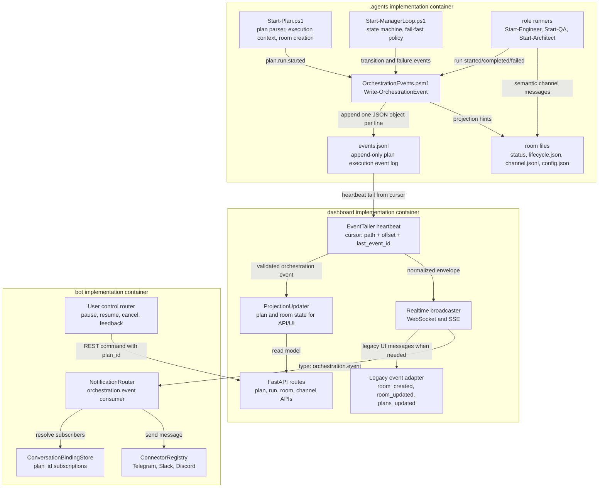
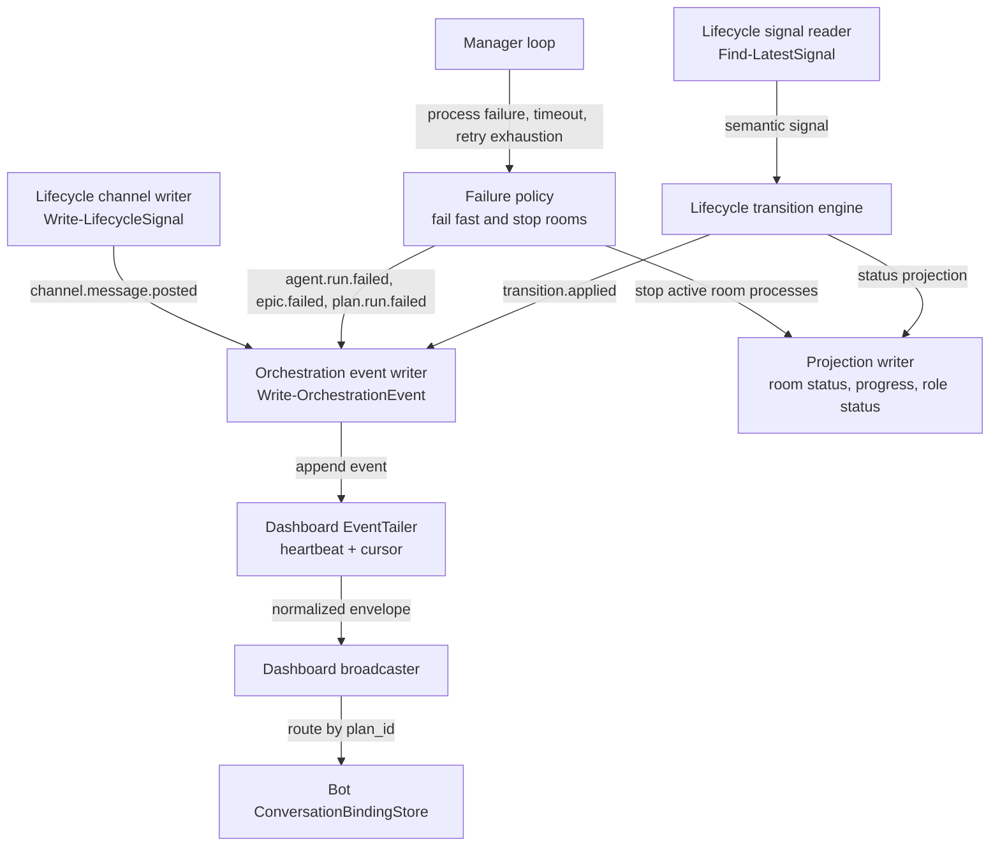
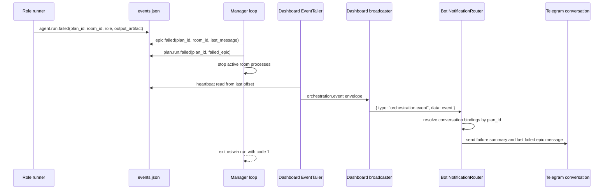

# Plan: Event-Driven Orchestration for Ostwin Agent Flow

> Created: 2026-06-06
> Status: draft
> Owner: architect

working_dir: ./

<available_roles>
@architect
@principal-engineer
@platform-engineer
@engineer
@qa
</available_roles>

## Goal

Refactor the `.agents` orchestration flow so epic planning and manager-loop runtime behavior are driven by append-only orchestration events. The target design keeps `channel.jsonl` as agent conversation history, keeps role config JSON as a status projection, and introduces a durable event stream that can be broadcast through `dashboard/` into `bot/` for Telegram-first user control, with Slack-compatible conversation binding from the start.

The design is inspired by ActiveGraph: events are the source of truth, graph/state is a projection, long-running failures are modeled as events, and dependency behavior is expressed through typed relationships between plans, epics, rooms, roles, messages, and conversations.

## Architecture Synthesis

EPIC-001 establishes the technical direction for event-driven orchestration. The C4 model below is the primary explanation of the design: `.agents` produces durable orchestration facts, `dashboard` observes and projects those facts, and `bot` routes normalized facts to plan-bound conversations. A new engineer should be able to trace a failed epic from role execution to Telegram by following the event stream and container boundaries in this section, without first reading PowerShell or TypeScript implementation code.

The implementation is organized around three containers:

| Container | Owns | Does not own |
|---|---|---|
| `.agents` | Plan run lifecycle, event append, role execution, manager fail-fast policy, room projections | Bot routing, WebSocket delivery, user conversation state |
| `dashboard` | Event tailing heartbeat, projections for API/UI, normalized WebSocket/SSE broadcast | Event source of truth, connector-specific delivery |
| `bot` | Long-lived dashboard WebSocket client, conversation bindings, Telegram/Slack delivery, user control commands | Plan execution, event log mutation except user-control requests routed through dashboard |

| Artifact | New responsibility | Not responsible for |
|---|---|---|
| `events.jsonl` | Source of truth for orchestration facts, failures, broadcast, replay, and audit | Free-form agent conversation |
| `channel.jsonl` | Per-room agent conversation history and lifecycle signal context | Runtime failure authority |
| Role config JSON | Status cache for current role-run projection | Durable event history |
| Room `status` file | Fast local projection for manager and dashboard | Causal audit trail |
| Dashboard WebSocket/SSE | Transport for normalized orchestration events | Event source of truth |
| Bot session storage | Conversation binding and active plan context | Orchestration state machine |

### Public Contracts Later Epics Must Preserve

Implementation epics must treat the following as public cross-container contracts:

| Contract | Owner | Consumers | Compatibility rule |
|---|---|---|---|
| `events.jsonl` JSONL event log | `.agents` | `dashboard`, replay tools, tests | One compact JSON object per line; append-only; event append precedes projection writes |
| Orchestration event envelope | `.agents` first, then dashboard/bot validators | all containers | Required fields are `v`, `event_id`, `event_type`, `ts`, `plan_id`, `severity`, `summary`, and `payload`; room/role scoped fields are conditional |
| Event taxonomy | `.agents` with principal review for changes | all containers | Runtime failures use `agent.run.failed`, `agent.run.timed_out`, `epic.failed`, and `plan.run.failed`; lifecycle `error` is not a target signal |
| `channel.jsonl` row extension | `.agents` | dashboard channel views, role context, failure summaries | Channel rows remain conversation history and may reference `event_id`, but they are not failure authority |
| Room status and role status projections | `.agents` | manager loop, dashboard compatibility views | Projections are caches derived from facts; they must not contradict the event log |
| Dashboard broadcast envelope | `dashboard` | `bot`, frontend realtime consumers | Normalized shape is `{ "type": "orchestration.event", "data": event }` |
| EventTailer cursor | `dashboard` | dashboard background task and tests | Cursor is event-log path + byte offset + last event ID + last mtime; advance only after projection/broadcast handoff |
| Conversation binding store | `bot` | notification router, user-control router | Bindings are keyed by `plan_id` with optional event, epic, and room filters; no global failure broadcast authority |
| User-control request events | `bot` through `dashboard`, appended by `.agents` | manager/control layer | Pause/resume/cancel/feedback requests are events and must carry `plan_id` |

### Design Principles

1. Every orchestration fact is appended as an event before projections are updated.
2. Every event and every channel message carries `plan_id`; room-scoped records also carry `room_id`. A separate run identifier is intentionally not part of the v1 public contract.
3. Lifecycle signals stay semantic: `done`, `pass`, `fail`, `escalate`, `fix`, `redesign`, `reject`.
4. Runtime failure is not a lifecycle `error` signal. It is an orchestration event such as `agent.run.failed`, `agent.run.timed_out`, `epic.failed`, or `plan.run.failed`.
5. If one epic reaches unrecoverable failure, the manager emits failure events, stops active rooms, notifies bot subscribers, and exits `ostwin run` with code `1`.
6. Bot delivery is plan-scoped. Telegram and Slack conversations bind to `plan_id` and optional epic/room filters, not to a global user list or a separate run identifier.

## Event Contract Summary

Default storage is `$WarRoomsDir/events.jsonl` for the active plan execution. If a future runtime keeps multiple historical executions for the same plan, it should partition by event log path or immutable execution directory metadata without adding a separate run identifier to the event envelope.

Every orchestration event requires `v`, `event_id`, `event_type`, `ts`, `plan_id`, `severity`, `summary`, and `payload`. Room-scoped events also require `room_id` and `epic_ref`. Role-scoped events also require `role` and `state`. The v1 public envelope intentionally has no separate run identifier: `plan_id` identifies the plan, the event log path identifies the active execution stream, `ts` and line ordering provide chronological context, and `event_id` provides idempotency and causal linking. If OSTwin later needs a historical multi-execution store, execution identity should be added as directory metadata or an event-log manifest, not forced into every v1 event and consumer.

Dashboard-to-bot broadcast uses this normalized envelope. Dashboard reads `events.jsonl` through a heartbeat tailer with a cursor, then emits this shape over the long-lived WebSocket/SSE layer:

```json
{
  "type": "orchestration.event",
  "data": {
    "event_id": "evt_01...",
    "event_type": "plan.run.failed",
    "plan_id": "pt-example"
  }
}
```
## EPIC-001: Architecture Document and C4 Model

Roles: @principal-engineer, @staff-manager

Create the architecture section for this plan and make the C4 model the primary explanation of the proposed event-driven design.

### Definition of Done

- [x] `docs/edd/PLAN.md` follows `.agents/plans/PLAN.template.md` structure.
- [x] The C4 Level 2 diagram is organized around the three implementation containers: `.agents`, `dashboard`, and `bot`.
- [x] C4 Level 1, Level 2, Level 3, and dynamic failure-flow diagrams are present as Mermaid.
- [x] The document explains the distinction between event source of truth, channel history, role status projection, and room status projection.
- [x] The document names all public contracts that later implementation epics must preserve.
- [x] The document explicitly removes a separate run identifier from v1 public contracts and explains why `plan_id` + event log path + event ordering are sufficient.
- [x] The document critiques the current design and gives @principal-engineer an alignment plan before implementation starts.

### Acceptance Criteria

- [x] A new engineer can understand how a failed epic reaches Telegram without reading PowerShell or TypeScript code first.
- [x] The architecture narrative clearly states that lifecycle `error` is not part of the target signal vocabulary.
- [x] The dashboard heartbeat/tailer is shown as the component that observes `events.jsonl` and broadcasts normalized events.
- [x] The design can be tested in layers: `.agents` event append/replay, `dashboard` tail/projection/broadcast, and `bot` binding/routing.
- [x] Mermaid blocks render without syntax errors in the docs stack.
- [x] All terminology matches existing OSTwin terms: plan, epic, room, role, lifecycle, channel, dashboard, bot.

### Tasks

- [x] Rewrite the C4 Level 2 diagram around `.agents`, `dashboard`, and `bot` containers.
- [x] Add the dashboard `EventTailer` heartbeat and cursor responsibility.
- [x] Add C4 Level 1 system context diagram.
- [x] Add C4 Level 3 component diagram for the orchestration event path.
- [x] Add dynamic sequence diagram for failed epic broadcast and fail-fast exit.
- [x] Review diagrams against `.agents`, `dashboard`, and `bot` current responsibilities.
- [x] Add a critical design review section for @principal-engineer to reconcile source-of-truth, projection, and container boundary decisions.

### Container Boundary Decision

| Container | Responsibility | Main implementation target | Public contract |
|---|---|---|---|
| `.agents` | Execute plans, append orchestration events, maintain local projections, stop failed runs | PowerShell modules and role runners | `events.jsonl`, `channel.jsonl`, room status files |
| `dashboard` | Tail event logs with heartbeat, update API/UI projections, broadcast normalized realtime messages | Python FastAPI background task and broadcaster | WebSocket/SSE `{ type: "orchestration.event", data: event }` |
| `bot` | Maintain plan-scoped conversation bindings, route events to Telegram/Slack, accept user control requests | TypeScript notification router and connector registry | Connector messages and conversation binding store keyed by `plan_id` |

### Critical Design Review for @principal-engineer

The first draft over-modeled execution identity with a separate run identifier. That adds a second correlation axis that every producer, projection, replay path, dashboard broadcast, and bot binding must preserve. For the current codebase, the durable unit is already the plan's war-room directory and the append-only `events.jsonl` file. Adding that extra identifier would make testing and migration harder because a single event stream would need cross-execution filtering before the system has a real historical execution store.

The revised design intentionally keeps v1 identity small:

| Identity | Required in envelope? | Why |
|---|---:|---|
| `event_id` | yes | Idempotency, replay, duplicate suppression, causal links |
| `plan_id` | yes | Cross-container plan correlation and bot routing |
| `room_id` / `epic_ref` | room-scoped only | Room and epic projection keys |
| `role` / `state` | role-scoped only | Role-run projection keys |
| Separate run identifier | no | Not needed until a historical multi-execution store exists; use event log path and timestamps for v1 execution context |

Principal-engineer alignment plan:

1. Freeze the public contract around `event_id`, `event_type`, `ts`, `plan_id`, `severity`, `summary`, and `payload` before EPIC-002 starts.
2. Treat `events.jsonl` as the only causal truth; `channel.jsonl`, role config, room status, dashboard API state, and bot messages are projections or transports.
3. Keep all container seams narrow and independently testable: `.agents` writes facts, `dashboard` tails/translates facts, `bot` routes facts.
4. Make future multi-execution support an additive storage concern (`execution_id` in directory metadata or event log manifest) rather than a v1 event-field obligation.
5. Reject any implementation that reintroduces lifecycle `error` or makes bot/global notification state authoritative for plan failure.

### Layered Test Strategy

| Layer | Container | Contract under test | Example tests |
|---|---|---|---|
| Source-of-truth | `.agents` | Event validation, append-before-projection, idempotent `event_id`, fail-fast event sequence | Pester tests append/replay `events.jsonl` without dashboard or bot |
| Projection/transport | `dashboard` | Cursor tailing, malformed row handling, projection updates, normalized broadcast envelope | pytest tails fixture logs and asserts WebSocket/SSE payloads |
| Notification/control | `bot` | Plan-scoped binding, subscription filtering, connector delivery, user-control request routing | TypeScript tests route mocked `orchestration.event` payloads by `plan_id` |
| Cross-container | all | Failed epic reaches Telegram/Slack-compatible binding without status inference | Integration fixture writes events, tails them, and uses mocked connector |

### C4 Level 1: System Context

```mermaid
flowchart LR
    user["User"]
    telegram["Telegram"]
    slack["Slack"]
    bot["Bot container\nbot/"]
    dashboard["Dashboard container\ndashboard/"]
    agents["Agents container\n.agents/"]
    rooms["War rooms\n.war-rooms/room-*"]
    opencode["OpenCode role agents\narchitect / engineer / qa / manager"]

    user -->|"controls plan, sends feedback"| telegram
    user -->|"controls plan, sends feedback"| slack
    telegram -->|"connector events"| bot
    slack -->|"connector events"| bot
    bot -->|"REST commands and chat context"| dashboard
    dashboard -->|"launch/resume/status"| agents
    agents -->|"creates and manages"| rooms
    rooms -->|"role prompts and artifacts"| opencode
    opencode -->|"channel messages and verdicts"| rooms
    agents -->|"append-only orchestration events"| rooms
    dashboard -->|"heartbeat tails events.jsonl"| rooms
    dashboard -->|"normalized event stream"| bot
    bot -->|"plan-scoped notifications"| telegram
    bot -->|"plan-scoped notifications"| slack
```



### C4 Level 2: Three Implementation Containers



### C4 Level 3: Orchestration Components



### Dynamic Flow: Failed Epic Stops the Run



### Implementation Plan

#### .agents

- Create the event contract and writer module in EPIC-002 before manager or role changes depend on it.
- Make `Start-Plan.ps1` establish `plan_id` and event log path for the active plan execution.
- Make role runners and manager loop call the event writer before updating projections.
- Preserve existing room files as compatibility projections.

#### dashboard

- Add an `EventTailer` background task that runs on heartbeat, reads `events.jsonl` from a cursor, validates events, and forwards them to projection and broadcast layers.
- Keep existing room polling during migration, but prefer event-derived projections when an event log is present.
- Normalize dashboard-to-bot payloads as `{ "type": "orchestration.event", "data": event }`.

#### bot

- Update notification routing to consume `orchestration.event`.
- Route event delivery through conversation bindings keyed by `plan_id`, with optional subscription filters for event type, epic, or room.
- Keep legacy notification preferences as filters, not as global routing authority.

### Other aspects

The diagrams should use C4-style structure but plain Mermaid syntax. Do not require a C4 Mermaid plugin unless the docs stack adopts one later.

depends_on: []

## EPIC-002: Orchestration Event Source of Truth

Roles: @engineer, @qa

Design and implement the append-only event stream that records orchestration facts before status projections are updated.

### Definition of Done

- [ ] `.agents` has a reusable orchestration event writer module.
- [ ] `Start-Plan.ps1` establishes `plan_id` and `events.jsonl` location for the active plan execution.
- [ ] Event envelope is enforced for every append.
- [ ] Event taxonomy covers plan, epic, room, role, lifecycle, messaging, conversation, and user-control events.
- [ ] Status files and role config JSON remain projections derived from events.
- [ ] Idempotency and replay behavior are documented and testable.

### Acceptance Criteria

- [ ] Every orchestration event includes `plan_id`; a separate run identifier is not part of the v1 event envelope.
- [ ] Every room-scoped event includes `room_id` and `epic_ref`.
- [ ] Runtime failures are represented by events, not synthetic channel messages.
- [ ] Existing `channel.jsonl` remains available for agent context and dashboard channel views.
- [ ] Event append happens before room status, progress, or role status projection updates.
- [ ] Replaying the same `event_id` twice does not duplicate projections or bot notifications.

### Tasks

- [ ] Add `.agents/events/OrchestrationEvents.psm1`.
- [ ] Add `New-OrchestrationEventId`, `Write-OrchestrationEvent`, `Read-OrchestrationEvents`, and `Test-OrchestrationEvent`.
- [ ] Add event-log resolution from `plan_id` and `WarRoomsDir`.
- [ ] Update `Start-Plan.ps1` to create or resume execution context and emit `plan.run.started`.
- [ ] Update `New-WarRoom.ps1` to carry `plan_id` and `events_path` in room config when available.
- [ ] Extend `Write-LifecycleSignal` so channel messages include `plan_id`, `room_id`, and `event_id`.
- [ ] Add Pester tests for valid event append, missing required fields, idempotent duplicate handling, and replay.

### .agents Implementation Plan

### Module layout

Create a PowerShell module:

```text
.agents/events/
  OrchestrationEvents.psm1
  README.md
```

The module owns only event log contracts. It must not spawn roles, update room lifecycle, send dashboard notifications, or call bot code.

#### Event log location

Initial implementation:

```text
<warrooms_dir>/events.jsonl
```

Future-compatible historical location:

```text
~/.ostwin/.agents/executions/<plan_id>/<execution-start-ts>/events.jsonl
```

`Start-Plan.ps1` resolves and exports the effective event log path to manager and role runners through room config or environment. Execution identity is represented by the event log path and the ordered event stream, not by a required envelope field:

| Name | Source | Purpose |
|---|---|---|
| `plan_id` | Existing plan metadata and room config | Stable plan identity |
| `events_path` | Derived from war-rooms dir and execution context | Shared append target |

### Event append behavior

`Write-OrchestrationEvent` must:

1. Validate required fields.
2. Fill `v`, `event_id`, `ts`, and `severity` defaults when omitted.
3. Reject events missing `plan_id`.
4. Reject room-scoped events missing `room_id` or `epic_ref`.
5. Serialize one compact JSON object per line.
6. Append under a file lock or atomic append guard suitable for concurrent role processes.
7. Return the appended event object to the caller.

#### Idempotency

Use `event_id` as the idempotency key. For v1, idempotency can be enforced by checking recent/tail events before append. If the same `event_id` already exists with the same payload hash, return the existing event. If the same `event_id` exists with different content, fail the append and log a contract violation.

#### Projection rule

Any caller that needs to update room `status`, `progress.json`, role config JSON, or dashboard state must append the event first. If append fails, projection update must not happen.

### Orchestration Event Envelope

```json
{
  "v": 1,
  "event_id": "evt_01...",
  "event_type": "agent.run.failed",
  "ts": "2026-06-06T00:00:00Z",
  "plan_id": "pt-example",
  "room_id": "room-003",
  "epic_ref": "EPIC-003",
  "role": "qa",
  "state": "review",
  "severity": "error",
  "caused_by": "evt_01...",
  "summary": "QA timed out after 900 seconds.",
  "payload": {
    "exit_code": 1,
    "output_file": "~/.ostwin/.agents/plans/pt-example.room-003.log"
  },
  "last_message": {
    "message_id": "qa-fail-...",
    "type": "fail",
    "body_preview": "VERDICT: FAIL..."
  }
}
```

Required fields: `v`, `event_id`, `event_type`, `ts`, `plan_id`, `severity`, `summary`, `payload`.

Room-scoped events also require `room_id` and `epic_ref`. Role-scoped events also require `role` and `state`.

### Channel Message Extension

Every `channel.jsonl` row remains a conversation message, but it must carry plan identity so dashboard and bot layers can associate messages with conversations:

```json
{
  "v": 1,
  "id": "qa-fail-...",
  "event_id": "evt_01...",
  "ts": "2026-06-06T00:00:00Z",
  "plan_id": "pt-example",
  "room_id": "room-003",
  "from": "qa",
  "to": "manager",
  "type": "fail",
  "ref": "EPIC-003",
  "body": "VERDICT: FAIL..."
}
```

### Event Taxonomy

| Category | Events |
|---|---|
| Plan authoring | `plan.created`, `plan.updated`, `plan.review.requested`, `plan.review.approved`, `plan.review.rejected`, `plan.dag.built` |
| Plan run | `plan.run.started`, `plan.run.completed`, `plan.run.failed`, `plan.run.cancelled`, `plan.run.paused`, `plan.run.resumed` |
| Epic and room | `room.created`, `room.status.changed`, `epic.started`, `epic.passed`, `epic.failed`, `epic.retrying`, `epic.blocked`, `epic.unblocked` |
| Dependencies | `dependency.created`, `dependency.satisfied`, `dependency.blocked`, `dependency.unblocked` |
| Role assignment | `role.assigned`, `role.reassigned`, `role.resolved`, `role.spawn.requested` |
| Role run | `agent.run.started`, `agent.run.completed`, `agent.run.failed`, `agent.run.timed_out`, `agent.run.respawned` |
| Lifecycle | `lifecycle.signal.posted`, `lifecycle.transition.applied`, `lifecycle.retry.exhausted`, `lifecycle.escalated` |
| Messaging | `channel.message.posted`, `bot.notification.queued`, `bot.notification.sent`, `bot.notification.failed` |
| Conversation | `conversation.bound`, `conversation.unbound`, `conversation.subscription.updated` |
| User control | `user.feedback.requested`, `user.feedback.posted`, `user.plan.cancel_requested`, `user.plan.pause_requested`, `user.plan.resume_requested` |

#### Container Hand-off

| Producer | Event examples | Consumer |
|---|---|---|
| `.agents/Start-Plan.ps1` | `plan.run.started`, `plan.dag.built`, `room.created` | Dashboard EventTailer |
| `.agents/role runners` | `agent.run.started`, `agent.run.completed`, `agent.run.failed`, `channel.message.posted` | Dashboard EventTailer |
| `.agents/manager loop` | `lifecycle.transition.applied`, `epic.failed`, `plan.run.failed`, `plan.run.completed` | Dashboard EventTailer |
| `dashboard` | `bot.notification.failed` when delivery fails and writer is available | Event log and operations |
| `bot` through dashboard | `user.feedback.posted`, `user.plan.cancel_requested`, `user.plan.pause_requested`, `user.plan.resume_requested` | `.agents` manager/control layer |

#### Other aspects

The initial implementation should prefer a simple filesystem event log before adopting a database or external queue. The design should leave room for SQLite or Postgres later without requiring them now.

depends_on: [EPIC-001]

## EPIC-003: Manager Loop Fail-Fast Semantics

Roles: @engineer, @qa

Define and implement how the manager loop handles unrecoverable epic failure, runtime process failure, retry exhaustion, and plan shutdown.

### Definition of Done

- [ ] Failure semantics distinguish semantic QA `fail` from runtime `agent.run.failed`.
- [ ] Role process failure, timeout, and crash-respawn exhaustion emit orchestration events.
- [ ] The fail-fast rule is explicit: one unrecoverable epic failure fails the plan run.
- [ ] The manager emits `epic.failed` and `plan.run.failed` before stopping active rooms.
- [ ] The manager preserves the last failed epic message in the failure event payload when available.
- [ ] `ostwin run` exits with code `1` after making the plan failure visible to the dashboard/bot path.

### Acceptance Criteria

- [ ] If a role exits nonzero, times out, or exhausts crash respawns, the event stream contains a role-run failure event.
- [ ] If retries are exhausted or a manager decision rejects the epic, the event stream contains `epic.failed`.
- [ ] When `epic.failed` is emitted, all other active room processes are stopped.
- [ ] The bot layer receives enough payload to show plan ID, epic ref, room ID, role, summary, and last failed message.
- [ ] A semantic QA `fail` still routes to retry/optimize and does not immediately fail the whole plan.

### Tasks

- [ ] Add event emission around current role status failure detection.
- [ ] Map role timeout to `agent.run.timed_out`.
- [ ] Map nonzero role exit to `agent.run.failed`.
- [ ] Map crash-respawn exhaustion to `agent.run.failed` with `reason: crash_respawn_exhausted`.
- [ ] Map lifecycle retry exhaustion to `lifecycle.retry.exhausted` and `epic.failed`.
- [ ] Map manager reject/final failed room to `epic.failed` and `plan.run.failed`.
- [ ] Define shutdown order: append events, expose/broadcast, stop room processes, update projections, exit nonzero.
- [ ] Document how resume treats an already failed run.

### .agents Implementation Plan

#### Role runner events

Role runners emit events through `Write-OrchestrationEvent`:

| Role runner outcome | Event | Projection |
|---|---|---|
| Process starts | `agent.run.started` | role config `active` |
| Exit code `0` and supported signal | `agent.run.completed`, `channel.message.posted` | role config `completed` |
| Nonzero exit | `agent.run.failed` | role config `failed` |
| Timeout | `agent.run.timed_out` | role config `failed` |
| Unsupported final verdict | `agent.run.failed` with `reason: unsupported_verdict` | role config `failed` |

The role runner must not post lifecycle `error` into `channel.jsonl`. Channel output remains semantic agent communication.

#### Manager loop events

The manager loop emits events around state-machine decisions:

| Manager condition | Event sequence |
|---|---|
| Lifecycle signal accepted | `lifecycle.signal.posted`, `lifecycle.transition.applied`, `room.status.changed` |
| QA semantic fail with retries left | `epic.retrying`, `room.status.changed` |
| Retry exhaustion | `lifecycle.retry.exhausted`, `epic.failed`, `plan.run.failed` |
| Runtime role failure in active state | `epic.failed`, `plan.run.failed` |
| Deadlock recovery exhaustion | `agent.run.failed`, `epic.failed`, `plan.run.failed` |
| All rooms passed | `plan.run.completed` |

#### Last-message capture

When emitting `epic.failed`, the manager should include:

```json
{
  "last_message": {
    "message_id": "latest-relevant-channel-id",
    "type": "fail",
    "from": "qa",
    "body_preview": "first 500 chars",
    "artifact": "~/.ostwin/.agents/plans/pt-example.room-003.log"
  }
}
```

If no channel message exists, use the per-room plan log preview instead. If neither exists, set `last_message` to `null` and include `payload.reason`.

#### Shutdown order

1. Append the most specific failure event: `agent.run.failed`, `agent.run.timed_out`, or `lifecycle.retry.exhausted`.
2. Append `epic.failed` with `plan_id`, `room_id`, `epic_ref`, role/state, and last available failed message.
3. Append `plan.run.failed` with failed epic summary.
4. Flush the event append and make the event log visible for the dashboard heartbeat tailer.
5. Stop all active room processes.
6. Update status projections.
7. Remove manager PID files.
8. Exit `ostwin run` with code `1`.

### dashboard Implementation Plan

- Treat `epic.failed` and `plan.run.failed` from the event tailer as high-priority broadcasts.
- Update plan and room projections before or alongside broadcast.
- Preserve legacy `room_updated` behavior while consumers migrate, but do not require bot notifications to infer failure from room status.
- Expose enough projection data for dashboard UI to show failed epic, failed role, reason, and artifact path.

### bot Implementation Plan

- `NotificationRouter` handles `orchestration.event`.
- `epic.failed` creates an epic failure notification scoped to the bound conversation.
- `plan.run.failed` creates a plan-level failure notification and should include last failed epic summary.
- Unknown failure reasons fall back to a generic plan-failed message while preserving `plan_id`, `room_id`, and `epic_ref`.

### Failure Semantics

| Situation | Event outcome | Lifecycle signal? | Plan outcome |
|---|---|---|---|
| QA finds implementation defects | `lifecycle.signal.posted` with `fail` | yes | retry or optimize |
| Role process exits nonzero | `agent.run.failed` | no | manager decision |
| Role process times out | `agent.run.timed_out` | no | manager decision |
| Retry limit is exhausted | `lifecycle.retry.exhausted`, `epic.failed` | no | `plan.run.failed` |
| Manager rejects escalated work | `epic.failed` | no | `plan.run.failed` |

### Resume Rule

If the active event log already has `plan.run.failed`, resume must not silently append a contradictory continuation to the same failed execution history. Resume should either:

1. create a fresh execution event log or archive the failed log and emit `plan.run.resumed`, or
2. refuse with a clear message requiring explicit retry/reset.

The default for v1 should be option 2 unless EPIC-002 has implemented explicit event-log archival. This keeps history auditable without reintroducing a separate run identifier.

### Other aspects

Do not reintroduce lifecycle `error` as a signal. The lifecycle graph should remain semantic and manager-owned runtime failures should flow through orchestration events.

depends_on: [EPIC-002]

## EPIC-004: Plan-Scoped Messages and Conversation Binding

Roles: @engineer, @qa-automation-engineer

Define and implement how Telegram and Slack conversations bind to a plan, and how bot notifications route by `plan_id`.

### Definition of Done

- [ ] Conversation binding contract is implemented in the bot container.
- [ ] Telegram conversation ID shape is supported.
- [ ] Slack conversation ID shape is supported by the same contract, even if Slack delivery remains behind current connector readiness.
- [ ] Bot routing rules are implemented for notifications and user feedback.
- [ ] Every bot-visible orchestration message is plan-scoped.
- [ ] Bot no longer broadcasts plan events only through global authorized user lists.

### Acceptance Criteria

- [ ] A Telegram user can start or follow a plan and receive only events for that bound plan.
- [ ] A Slack thread can bind to the same `plan_id` and receive equivalent events.
- [ ] If a user asks about a plan in an existing conversation, the bot can determine `plan_id` from binding before falling back to explicit user input.
- [ ] Bot notification preferences can filter by event type without losing plan context.
- [ ] Unknown `orchestration.event` types are logged and ignored without crashing.

### Tasks

- [ ] Add `ConversationBinding` types and persistence.
- [ ] Add binding helpers: `bindConversation`, `unbindConversation`, `getBindingsForPlan`, `getActiveBinding`.
- [ ] Update plan create/launch/resume command flows to create or update bindings.
- [ ] Update `NotificationRouter` to route `orchestration.event` by `plan_id` with optional event-type, epic, and room filters.
- [ ] Document and implement stale/missing binding behavior.
- [ ] Add bot tests for Telegram binding, Slack-shaped binding, event filtering, and unknown events.

### bot Implementation Plan

#### Suggested files

```text
bot/src/conversation-bindings.ts
bot/src/notifications.ts
bot/src/sessions.ts
bot/src/commands.ts
bot/src/agent-bridge.ts
bot/test/conversation-bindings.test.ts
bot/test/notifications-orchestration.test.ts
```

#### Conversation binding contract

```json
{
  "conversation_id": "telegram:chat:12345",
  "platform": "telegram",
  "plan_id": "pt-example",
  "subscriptions": [
    "plan.run.failed",
    "epic.failed",
    "user.feedback.requested"
  ],
  "last_outbound_message_id": "123",
  "created_at": "2026-06-06T00:00:00Z",
  "updated_at": "2026-06-06T00:00:00Z"
}
```

Persist bindings in `~/.ostwin/conversation-bindings.json` or extend `~/.ostwin/sessions.json` with a `bindings` field. Prefer a separate `conversation-bindings.json` for v1 so routing state is not mixed with chat history.

#### Conversation ID shapes

| Platform | Conversation ID |
|---|---|
| Telegram chat | `telegram:chat:<chat_id>` |
| Telegram topic/thread | `telegram:chat:<chat_id>:thread:<thread_id>` |
| Slack channel thread | `slack:team:<team_id>:channel:<channel_id>:thread:<thread_ts>` |
| Slack channel fallback | `slack:team:<team_id>:channel:<channel_id>` |

#### Binding lifecycle

| Input | Resolution |
|---|---|
| User creates a plan in chat | Bind conversation to new `plan_id` |
| User launches a plan | Bind or update conversation to launched `plan_id` |
| User resumes a plan | Keep `plan_id`; if the prior execution failed, follow EPIC-003 resume/reset rules |
| User selects/follows a plan | Bind conversation with default subscriptions |
| Event arrives from dashboard | Route by `plan_id`, optional epic/room filters, and subscription list |
| Binding is missing | Do not broadcast globally; log missing binding and keep event available through dashboard |

#### Notification routing

`NotificationRouter.handleDashboardEvent` should support both:

1. legacy dashboard payloads such as `room_created` or `room_updated`, and
2. normalized event payloads:

```json
{
  "type": "orchestration.event",
  "data": {
    "event_type": "plan.run.failed",
    "plan_id": "pt-example"
  }
}
```

For normalized events, routing must:

1. validate `data.plan_id`;
2. find bindings by `plan_id`;
3. filter by optional binding fields such as `epic_ref` or `room_id` when present;
4. filter by subscription list;
5. send via the connector matching the binding platform;
6. update `last_outbound_message_id` when the connector returns one.

#### User-control events

Bot commands should route user controls through dashboard APIs so `.agents` can append them as events:

| User action | Event |
|---|---|
| Pause plan | `user.plan.pause_requested` |
| Resume plan | `user.plan.resume_requested` |
| Cancel plan | `user.plan.cancel_requested` |
| Provide feedback | `user.feedback.posted` |

### dashboard Implementation Plan

- Provide APIs for bot to bind/unbind or list plan conversation bindings if binding state is centralized later.
- For v1, bot-local binding is acceptable, but dashboard broadcasts must always include `plan_id`.
- Dashboard should not broadcast plan events globally when the bot has no binding.

### .agents Implementation Plan

- User-control events that come from bot through dashboard must append to `events.jsonl`.
- Manager loop should consume supported user-control events in later implementation phases.
- Unsupported user-control events should be logged as ignored with `event_id`.

### Other aspects

Telegram is the first implementation target. Slack should use the same contract so the design does not need to change when Slack control is enabled.

depends_on: [EPIC-003]

## EPIC-005: Dashboard Event Bridge and Bot Broadcast Contract

Roles: @engineer, @qa-automation-engineer

Define and implement the dashboard bridge that tails orchestration events and broadcasts a normalized event envelope to the bot layer.

### Definition of Done

- [ ] Dashboard has an `EventTailer` heartbeat task for `events.jsonl`.
- [ ] Dashboard-to-bot event shape is implemented as `{ "type": "orchestration.event", "data": event }`.
- [ ] Event tailing has cursor semantics: event log path, byte offset, last event ID, and last seen mtime.
- [ ] Dashboard projection behavior is implemented for plan and room status.
- [ ] Backward compatibility with existing dashboard frontend event shapes is documented and preserved.
- [ ] Bot notification behavior is documented for failure, retry, pass, completion, and feedback-required events.

### Acceptance Criteria

- [ ] Dashboard does not force bot consumers to infer event type from mixed `{ event, ...data }` payloads.
- [ ] Bot receives the same normalized envelope for Telegram and Slack.
- [ ] Plan failure notifications include a short summary and linkable identifiers.
- [ ] Existing dashboard room and plan views can continue to work from status projections.
- [ ] Event tailer restart does not rebroadcast already seen events in the same dashboard process.
- [ ] If an event log is truncated or rotated, the tailer resets safely and logs the reset.

### Tasks

- [ ] Add `dashboard/orchestration_events.py` with event parsing, validation, cursor, and projection helpers.
- [ ] Add an `EventTailer` background task in `dashboard/tasks.py`.
- [ ] Wire `EventTailer` into startup alongside existing room polling.
- [ ] Add normalized `broadcaster.broadcast_orchestration_event(event)` or equivalent.
- [ ] Keep compatibility adapter for existing frontend events.
- [ ] Update bot notification mapping from event taxonomy to connector messages.
- [ ] Add pytest coverage for event tailing, cursor movement, malformed JSONL rows, and normalized broadcast.

### dashboard Implementation Plan

#### Suggested files

```text
dashboard/orchestration_events.py
dashboard/tasks.py
dashboard/global_state.py
dashboard/ws_router.py
dashboard/tests/test_orchestration_events.py
dashboard/tests/test_orchestration_event_broadcast.py
```

#### EventTailer heartbeat

The tailer runs as a background task. It discovers plan execution event logs, reads from the last cursor, validates JSONL rows, updates projections, and broadcasts normalized events.

Cursor shape:

```json
{
  "events_path": "/path/to/.war-rooms/events.jsonl",
  "byte_offset": 12345,
  "last_event_id": "evt_01...",
  "last_mtime": 1780000000.0
}
```

Heartbeat behavior:

1. Every interval, discover active event logs from plan metadata and active war-room dirs.
2. For each event log, seek to `byte_offset`.
3. Read complete lines only.
4. Parse JSON rows.
5. Skip duplicate `event_id` values already seen in memory.
6. Validate required envelope fields.
7. Update projections.
8. Broadcast normalized event.
9. Advance cursor only after projection and broadcast handoff succeeds.

Initial interval: 1 second. This matches current dashboard room polling behavior and can be tuned later.

#### Malformed and partial rows

| Row condition | Behavior |
|---|---|
| Blank line | Skip |
| Partial trailing line | Leave cursor before partial line and retry next heartbeat |
| Invalid JSON | Log warning, emit no broadcast, advance cursor only if line is complete |
| Missing required fields | Log warning, emit no broadcast, advance cursor |
| Duplicate `event_id` | Skip broadcast and projection |
| File shrank | Reset cursor to `0`, clear per-file offset, keep global seen-event IDs |

#### Projection updates

The dashboard projection layer should update read models from event types:

| Event | Projection |
|---|---|
| `plan.run.started` | plan lifecycle running |
| `room.created` | room metadata exists |
| `room.status.changed` | room status |
| `epic.passed` | epic status passed |
| `epic.retrying` | epic status retrying/fixing |
| `epic.failed` | epic status failed |
| `plan.run.failed` | plan lifecycle failed |
| `plan.run.completed` | plan lifecycle completed |

Existing status-file polling remains as a compatibility fallback while event-derived projections roll out.

### Broadcast Envelope

```json
{
  "type": "orchestration.event",
  "data": {
    "v": 1,
    "event_id": "evt_01...",
    "event_type": "epic.failed",
    "ts": "2026-06-06T00:00:00Z",
    "plan_id": "pt-example",
    "room_id": "room-003",
    "epic_ref": "EPIC-003",
    "severity": "error",
    "summary": "EPIC-003 failed after QA timeout.",
    "payload": {}
  }
}
```

### Compatibility Adapter

The dashboard currently broadcasts legacy shapes for frontend consumers. Keep those during migration:

| Event-derived state | Legacy compatibility message |
|---|---|
| `room.created` | `room_created` |
| `room.status.changed` | `room_updated` |
| `epic.passed` | `room_updated` with status `passed` |
| `epic.failed` | `room_updated` with status `failed` or `failed-final` |
| `plan.run.completed` | `plans_updated` |
| `plan.run.failed` | `plans_updated` |

The bot should prefer `orchestration.event`; legacy events remain for UI/backward compatibility.

### Notification Mapping

| Orchestration event | Bot notification |
|---|---|
| `plan.run.started` | Plan started |
| `epic.passed` | Epic passed |
| `epic.retrying` | Epic retry |
| `epic.failed` | Epic failed |
| `plan.run.failed` | Plan failed |
| `plan.run.completed` | Plan completed |
| `user.feedback.requested` | Feedback needed |

### .agents Implementation Plan

- `.agents` must append events before updating projections so the dashboard tailer can treat events as truth.
- `.agents` should avoid writing bot-specific payloads. It writes orchestration facts only.
- `.agents` can optionally emit `bot.notification.failed` only when dashboard/bot report delivery failures through a supported control path.

### bot Implementation Plan

- Bot keeps its existing long-lived WebSocket connection.
- Bot handles `type: orchestration.event` before legacy event cases.
- Bot ignores unknown orchestration event types after logging them.
- Bot routes by conversation binding, not by global authorized user list.

### Other aspects

The dashboard is a transport and projection layer, not the event source of truth. Bot notification failures should be represented as `bot.notification.failed` events when the event writer is available.

depends_on: [EPIC-004]
## EPIC-006: Verification, Migration, and Operational Readiness

Roles: @engineer, @qa-automation-engineer
Define and execute validation coverage, automated scenario tests, fix loops, migration checks, and operational readiness for the event-driven orchestration design.

### Definition of Done

- [ ] @engineer fixes all defects found while implementing EPIC-001 through EPIC-005.
- [ ] @qa-automation-engineer creates automated scenario coverage for `.agents`, `dashboard`, and `bot`.
- [ ] Test scenarios cover happy path, semantic QA failure, runtime failure, retry exhaustion, bot broadcast, resume, malformed events, and stale bindings.
- [ ] Migration guidance explains how current room status and role config projections coexist with events.
- [ ] Operational guidance covers event log inspection, failed broadcast investigation, cursor reset, and stale binding cleanup.
- [ ] Observability guidance names the minimum counters and logs required for production confidence.

### Acceptance Criteria

- [ ] Tests prove that one unrecoverable failed epic causes plan failure and nonzero run exit.
- [ ] Tests prove semantic QA `fail` retries or optimizes without immediately failing the plan.
- [ ] Tests prove every emitted event has `plan_id` and no required separate run identifier.
- [ ] Tests prove every room-scoped event has `room_id` and `epic_ref`.
- [ ] Tests prove channel messages carry `plan_id`, `room_id`, and `event_id` linkage after the migration.
- [ ] Tests prove dashboard tailer broadcasts normalized `orchestration.event` payloads.
- [ ] Tests prove bot routing uses conversation bindings and not only global notification preferences.
- [ ] Tests prove old channel history remains readable.
- [ ] Tests prove dashboard and bot can handle unknown event types without crashing.
- [ ] Tests prove malformed or partial JSONL rows do not break the tailer.

### Tasks

- [ ] Add Pester coverage for event append, required fields, manager failure handling, and fail-fast exit.
- [ ] Add Pester coverage that semantic lifecycle `fail` still routes to retry/optimize.
- [ ] Add pytest coverage for dashboard `EventTailer`, cursor movement, malformed JSONL, duplicate `event_id`, projection updates, and normalized broadcast.
- [ ] Add bot tests for Telegram conversation binding, Slack-shaped binding, event filtering, unknown events, and failure notification routing.
- [ ] Add an end-to-end dry-run fixture that writes events through `.agents`, tails them through dashboard, and routes them through a mocked bot connector.
- [ ] Add replay/projection smoke test from `events.jsonl`.
- [ ] Add runbook section for inspecting event logs and recovering stuck projections.
- [ ] @engineer fixes all implementation issues found by @qa-automation-engineer and reruns the affected tests.
- [ ] @qa signs off only after all scenario tests pass or remaining failures are explicitly marked unrelated baseline noise.

### Test Ownership

| Owner | Responsibility |
|---|---|
| @engineer | Implement tests near touched code, fix failing implementation, keep contracts aligned with docs |
| @qa-automation-engineer | Build cross-container automated scenarios, mock external Telegram/Slack delivery, capture evidence |
| @qa | Review test quality and ensure acceptance criteria are covered |
| @sre-lead | Review operational checks, logs, cursor recovery, and failure observability |
| @principal-engineer | Verify architecture conformance and no source-of-truth drift |

### Scenario Matrix

| ID | Scenario | Containers | Expected result | Test type |
|---|---|---|---|---|
| S01 | Plan run starts | `.agents`, `dashboard` | `plan.run.started` appended and projected | Pester + pytest |
| S02 | Room is created | `.agents`, `dashboard` | `room.created` event and room projection exist | Pester + pytest |
| S03 | Role completes successfully | `.agents`, `dashboard` | `agent.run.completed`, channel message, and projection update | Pester |
| S04 | Semantic QA `fail` | `.agents` | lifecycle retry/optimize path, no `plan.run.failed` | Pester |
| S05 | Role exits nonzero | `.agents`, `dashboard`, `bot` | `agent.run.failed`, `epic.failed`, `plan.run.failed`, bot receives failure | Pester + pytest + bot test |
| S06 | Role timeout | `.agents`, `dashboard`, `bot` | `agent.run.timed_out`, fail-fast broadcast, exit `1` | Pester + pytest + bot test |
| S07 | Retry exhaustion | `.agents`, `dashboard`, `bot` | `lifecycle.retry.exhausted`, `epic.failed`, `plan.run.failed` | Pester + integration |
| S08 | Last failed message exists | `.agents`, `bot` | failure notification includes `last_message.body_preview` | Pester + bot test |
| S09 | Missing last message | `.agents`, `bot` | failure notification falls back to artifact/reason | Pester + bot test |
| S10 | Dashboard tailer sees new event | `dashboard` | cursor advances and normalized event broadcasts | pytest |
| S11 | Dashboard tailer restarts | `dashboard` | already-seen `event_id` does not rebroadcast | pytest |
| S12 | Partial JSONL row | `dashboard` | cursor waits before partial row and retries | pytest |
| S13 | Invalid JSONL row | `dashboard` | warning logged, no crash, next valid event still processed | pytest |
| S14 | Duplicate `event_id` | `.agents`, `dashboard` | no duplicate projection or notification | Pester + pytest |
| S15 | Telegram binding exists | `bot` | event routes only to bound Telegram conversation | bot unit test |
| S16 | Slack-shaped binding exists | `bot` | event routes through Slack binding contract with mocked connector | bot unit test |
| S17 | Binding missing | `bot` | no global broadcast; event logged as unrouted | bot unit test |
| S18 | Unknown event type | `dashboard`, `bot` | event is logged/ignored without crash | pytest + bot unit test |
| S19 | User cancel request | `bot`, `dashboard`, `.agents` | `user.plan.cancel_requested` appended with `plan_id` and event ordering context | integration |
| S20 | Resume failed plan | `.agents`, `dashboard`, `bot` | explicit refusal or new event-log path/manifest according to EPIC-003 rule | integration |

### Test Implementation Plan

#### .agents Pester

Suggested tests:

```text
.agents/tests/events/OrchestrationEvents.Tests.ps1
.agents/tests/roles/manager/EventDrivenFailure.Tests.ps1
.agents/tests/roles/_base/LifecycleSignalEvent.Tests.ps1
```

Coverage:

- `Write-OrchestrationEvent` validates required fields.
- Event append is one JSON object per line.
- Duplicate `event_id` is idempotent.
- `Write-LifecycleSignal` stamps channel rows with `plan_id`, `room_id`, and `event_id`.
- Manager emits fail-fast events before room process shutdown.
- Manager exits nonzero on unrecoverable plan failure.

#### dashboard pytest

Suggested tests:

```text
dashboard/tests/test_orchestration_events.py
dashboard/tests/test_orchestration_event_tailer.py
dashboard/tests/test_orchestration_event_broadcast.py
```

Coverage:

- EventTailer cursor starts at correct offset.
- Complete lines are processed; partial trailing lines are retried.
- Invalid JSON and invalid envelopes are skipped with warnings.
- Duplicate `event_id` does not rebroadcast.
- Projection update maps `epic.failed` and `plan.run.failed` correctly.
- WebSocket/SSE broadcast shape is `{ "type": "orchestration.event", "data": event }`.

#### bot tests

Suggested tests:

```text
bot/test/conversation-bindings.test.ts
bot/test/notifications-orchestration.test.ts
bot/test/user-control-events.test.ts
```

Coverage:

- Binding is created when a plan is selected/launched.
- Resume preserves `plan_id` and either refuses the failed event log or binds to a new event-log path/manifest.
- Telegram and Slack-shaped bindings use the same routing logic.
- Event subscription filters work.
- Missing binding does not broadcast globally.
- Unknown events do not crash the router.
- Failure notification includes plan ID, epic ref, room ID, summary, event ID, and last message preview.

### Fix Loop

1. @qa-automation-engineer runs targeted tests for the EPIC being verified.
2. Failures are classified as implementation bug, test bug, environment issue, or existing baseline noise.
3. @engineer fixes implementation bugs and test bugs in the touched scope.
4. @qa-automation-engineer reruns the failed scenario plus adjacent scenarios.
5. @qa verifies acceptance criteria and signs off.
6. @principal-engineer reviews any contract changes that affect prior EPICs.

No EPIC is considered complete until its tests pass and the final EPIC-006 scenario matrix has no untriaged failures.

### Migration Guidance

| Existing artifact | Migration role |
|---|---|
| Room `status` | Remains fast projection; no longer source of truth for audit |
| Role config JSON | Remains role-run projection; no longer only failure record |
| `channel.jsonl` | Remains conversation context; gains `plan_id`, room, and event-link fields |
| Dashboard frontend events | Continue through compatibility adapter |
| Bot notification preferences | Continue as filters, but route through plan-scoped bindings |

### Operational Checks

- [ ] Event log can be tailed and parsed as JSONL.
- [ ] Event replay can rebuild plan and room status projections.
- [ ] Failed bot delivery is visible as `bot.notification.failed` when supported.
- [ ] Stale conversation bindings can be listed and removed.
- [ ] Unknown event types are logged and ignored by consumers that do not support them.
- [ ] Dashboard tailer logs cursor resets and malformed event rows.
- [ ] Runbook explains how to compare `events.jsonl`, room status, dashboard projection, and bot delivery logs.

### Other aspects

Treat generated local config and runtime files as environment-specific. Verification should focus on deterministic contracts and targeted regression tests before broad repo-wide checks.

depends_on: [EPIC-005]
