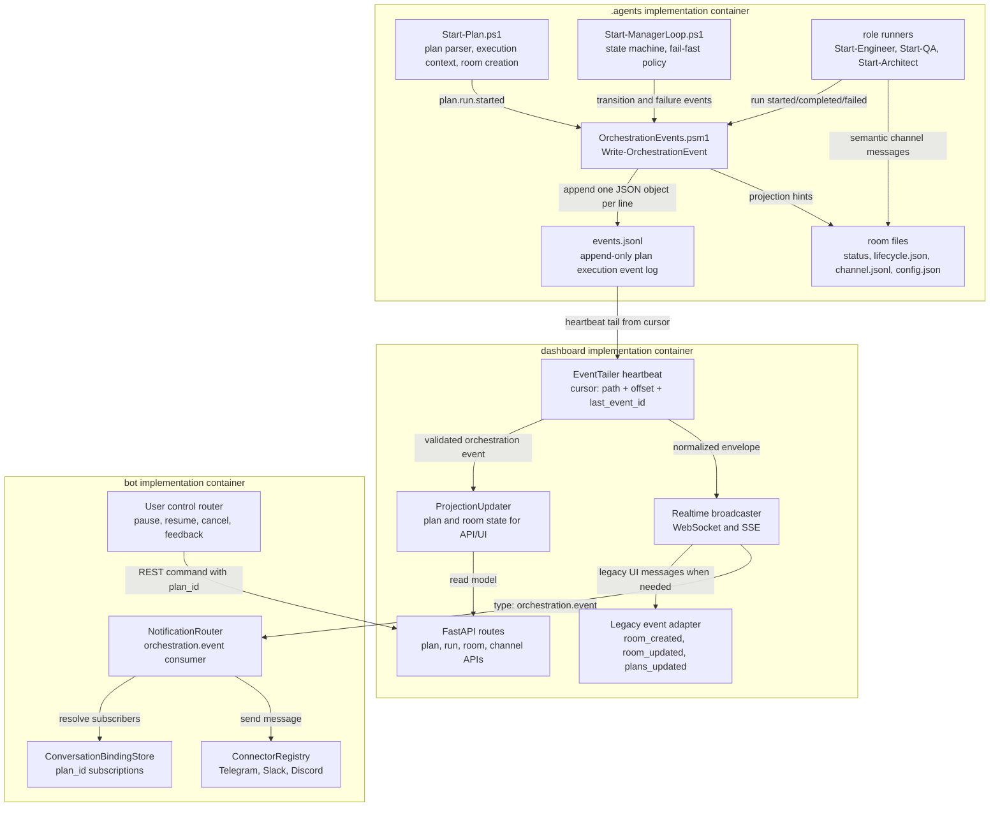
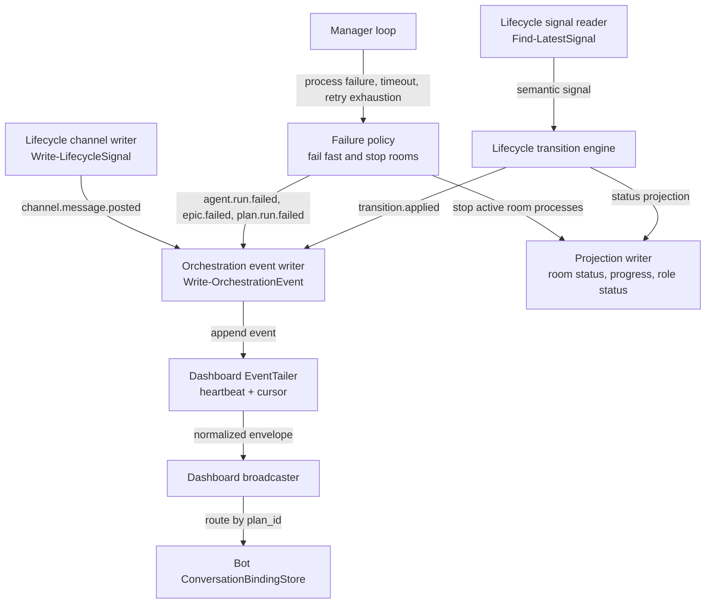
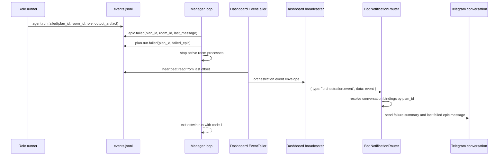

## EPIC-001: Architecture Document and C4 Model

Roles: @principal-engineer, @staff-manager

Create the architecture section for this plan and make the C4 model the primary explanation of the proposed event-driven design.

### Definition of Done

- [ ] `docs/edd/PLAN.md` follows `.agents/plans/PLAN.template.md` structure.
- [ ] The C4 Level 2 diagram is organized around the three implementation containers: `.agents`, `dashboard`, and `bot`.
- [ ] C4 Level 1, Level 2, Level 3, and dynamic failure-flow diagrams are present as Mermaid.
- [ ] The document explains the distinction between event source of truth, channel history, role status projection, and room status projection.
- [ ] The document names all public contracts that later implementation epics must preserve.
- [ ] The document explicitly removes a separate run identifier from v1 public contracts and explains why `plan_id` + event log path + event ordering are sufficient.
- [ ] The document critiques the current design and gives @principal-engineer an alignment plan before implementation starts.

### Acceptance Criteria

- [ ] A new engineer can understand how a failed epic reaches Telegram without reading PowerShell or TypeScript code first.
- [ ] The architecture narrative clearly states that lifecycle `error` is not part of the target signal vocabulary.
- [ ] The dashboard heartbeat/tailer is shown as the component that observes `events.jsonl` and broadcasts normalized events.
- [ ] The design can be tested in layers: `.agents` event append/replay, `dashboard` tail/projection/broadcast, and `bot` binding/routing.
- [ ] Mermaid blocks render without syntax errors in the docs stack.
- [ ] All terminology matches existing OSTwin terms: plan, epic, room, role, lifecycle, channel, dashboard, bot.

### Tasks

- [ ] Rewrite the C4 Level 2 diagram around `.agents`, `dashboard`, and `bot` containers.
- [ ] Add the dashboard `EventTailer` heartbeat and cursor responsibility.
- [ ] Add C4 Level 1 system context diagram.
- [ ] Add C4 Level 3 component diagram for the orchestration event path.
- [ ] Add dynamic sequence diagram for failed epic broadcast and fail-fast exit.
- [ ] Review diagrams against `.agents`, `dashboard`, and `bot` current responsibilities.
- [ ] Add a critical design review section for @principal-engineer to reconcile source-of-truth, projection, and container boundary decisions.

### Container Boundary Decision

| Container | Responsibility | Main implementation target | Public contract |
|---|---|---|---|
| `.agents` | Execute plans, append orchestration events, maintain local projections, stop failed runs | PowerShell modules and role runners | `events.jsonl`, `channel.jsonl`, room status files |
| `dashboard` | Tail event logs with heartbeat, update API/UI projections, broadcast normalized realtime messages | Python FastAPI background task and broadcaster | WebSocket/SSE `{ type: "orchestration.event", data: event }` |
| `bot` | Maintain plan-scoped conversation bindings, route events to Telegram/Slack, accept user control requests | TypeScript notification router and connector registry | Connector messages and conversation binding store keyed by `plan_id` |

### Critical Design Review for @principal-engineer

The first draft over-modeled execution identity with a separate run identifier. That adds a second correlation axis that every producer, projection, replay path, dashboard broadcast, and bot binding must preserve. For the current codebase, the durable unit is already the plan's war-room directory and the append-only `events.jsonl` file. Adding that extra identifier would make testing and migration harder because a single event stream would need cross-execution filtering before the system has a real historical execution store.

The revised design intentionally keeps v1 identity small:

| Identity | Required in envelope? | Why |
|---|---:|---|
| `event_id` | yes | Idempotency, replay, duplicate suppression, causal links |
| `plan_id` | yes | Cross-container plan correlation and bot routing |
| `room_id` / `epic_ref` | room-scoped only | Room and epic projection keys |
| `role` / `state` | role-scoped only | Role-run projection keys |
| Separate run identifier | no | Not needed until a historical multi-execution store exists; use event log path and timestamps for v1 execution context |

Principal-engineer alignment plan:

1. Freeze the public contract around `event_id`, `event_type`, `ts`, `plan_id`, `severity`, `summary`, and `payload` before EPIC-002 starts.
2. Treat `events.jsonl` as the only causal truth; `channel.jsonl`, role config, room status, dashboard API state, and bot messages are projections or transports.
3. Keep all container seams narrow and independently testable: `.agents` writes facts, `dashboard` tails/translates facts, `bot` routes facts.
4. Make future multi-execution support an additive storage concern (`execution_id` in directory metadata or event log manifest) rather than a v1 event-field obligation.
5. Reject any implementation that reintroduces lifecycle `error` or makes bot/global notification state authoritative for plan failure.

### Layered Test Strategy

| Layer | Container | Contract under test | Example tests |
|---|---|---|---|
| Source-of-truth | `.agents` | Event validation, append-before-projection, idempotent `event_id`, fail-fast event sequence | Pester tests append/replay `events.jsonl` without dashboard or bot |
| Projection/transport | `dashboard` | Cursor tailing, malformed row handling, projection updates, normalized broadcast envelope | pytest tails fixture logs and asserts WebSocket/SSE payloads |
| Notification/control | `bot` | Plan-scoped binding, subscription filtering, connector delivery, user-control request routing | TypeScript tests route mocked `orchestration.event` payloads by `plan_id` |
| Cross-container | all | Failed epic reaches Telegram/Slack-compatible binding without status inference | Integration fixture writes events, tails them, and uses mocked connector |

### C4 Level 1: System Context

```mermaid
flowchart LR
    user["User"]
    telegram["Telegram"]
    slack["Slack"]
    bot["Bot container\nbot/"]
    dashboard["Dashboard container\ndashboard/"]
    agents["Agents container\n.agents/"]
    rooms["War rooms\n.war-rooms/room-*"]
    opencode["OpenCode role agents\narchitect / engineer / qa / manager"]

    user -->|"controls plan, sends feedback"| telegram
    user -->|"controls plan, sends feedback"| slack
    telegram -->|"connector events"| bot
    slack -->|"connector events"| bot
    bot -->|"REST commands and chat context"| dashboard
    dashboard -->|"launch/resume/status"| agents
    agents -->|"creates and manages"| rooms
    rooms -->|"role prompts and artifacts"| opencode
    opencode -->|"channel messages and verdicts"| rooms
    agents -->|"append-only orchestration events"| rooms
    dashboard -->|"heartbeat tails events.jsonl"| rooms
    dashboard -->|"normalized event stream"| bot
    bot -->|"plan-scoped notifications"| telegram
    bot -->|"plan-scoped notifications"| slack
```

### C4 Level 2: Three Implementation Containers

### C4 Level 3: Orchestration Components

### Dynamic Flow: Failed Epic Stops the Run

### Implementation Plan

#### .agents

- Create the event contract and writer module in EPIC-002 before manager or role changes depend on it.
- Make `Start-Plan.ps1` establish `plan_id` and event log path for the active plan execution.
- Make role runners and manager loop call the event writer before updating projections.
- Preserve existing room files as compatibility projections.

#### dashboard

- Add an `EventTailer` background task that runs on heartbeat, reads `events.jsonl` from a cursor, validates events, and forwards them to projection and broadcast layers.
- Keep existing room polling during migration, but prefer event-derived projections when an event log is present.
- Normalize dashboard-to-bot payloads as `{ "type": "orchestration.event", "data": event }`.

#### bot

- Update notification routing to consume `orchestration.event`.
- Route event delivery through conversation bindings keyed by `plan_id`, with optional subscription filters for event type, epic, or room.
- Keep legacy notification preferences as filters, not as global routing authority.

### Other aspects

The diagrams should use C4-style structure but plain Mermaid syntax. Do not require a C4 Mermaid plugin unless the docs stack adopts one later.

depends_on: []
